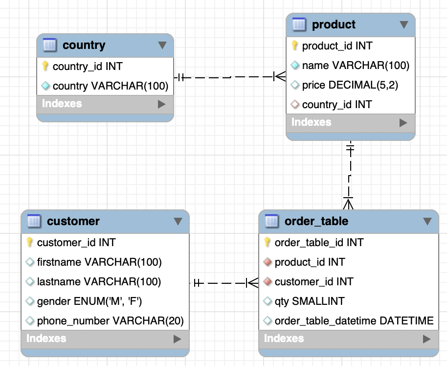

# MySQL Joins

**Preparation**:

[Primary Key](https://www.youtube.com/watch?v=kG5edDFilhw)

[Foreign Key](https://www.youtube.com/watch?v=5Rd2atcDR4s)

[Mysql Join](https://www.mysqltutorial.org/mysql-join/)

<!-- 

Tjek øvelser igennem og lav øvelserne - giv svarene så de kan selv sammenligne

Lidt mere gennemgang af et join eksempel ((-1-2 eksempler))

-->

## Peer instruction

##### 1. What does the following query obtain? 

```sql
SELECT *
FROM employees
WHERE employee_number = "NULL"
```

**A)** Retrieves all employees with an employee number called NULL

**B)** Retrieves all employees without an employee number

**C)** Retrieves all employees except employees without an employee number

**D)** Syntax Error


**2. What does the following query obtain?**

```sql
SELECT *
FROM imdb
WHERE duration > 0
AND duration IS NOT NULL;
```

**A)** Retrieves all movies from IMDB with a duration greater than zero and all NULL values

**B)** Retrieves all movies from IMDB with a duration less than 0

**C)** Retrieves all movies from IMDB with a duration greater than zero and without NULL values

**D)** Retrieves all movies from IMDB with a duration greater than zero or without NULL values


## Exercise 1: Individuelt

- Join the two tables by department_number and display all 

- Retrieve all the employees from Accounting (using joins)
- Retrieve only the names of all employees from operations and research
- Retrieve all names of all salesman from Chicago


**Advanced** **(Optional)**

- Retrieve the names of all salesmen that are not from Chicago
- Retrieve the id of all clerks from New York
- Retrieve all data from employees and their department except clerks or employees from New York with a comission


**Import dataset to database:**

```sql
DROP TABLE if exists employees;
DROP TABLE if exists departments;

CREATE TABLE departments (	
	department_number INTEGER, 
	department_name VARCHAR(30), 
	location VARCHAR(30), 
	PRIMARY KEY (department_number)
); 

CREATE TABLE employees(	
	id INTEGER, 
	employee_name VARCHAR(30), 
	job VARCHAR(30), 
	manager INTEGER, 
	hiredate DATE, 
	salary INTEGER, 
	commission INTEGER, 
	department_number INTEGER, 
	PRIMARY KEY (id),
	FOREIGN KEY (department_number) REFERENCES departments(department_number)
);
 
Insert into departments (department_number,department_name,location) values (10,'ACCOUNTING','NEW YORK');
Insert into departments (department_number,department_name,location) values (20,'RESEARCH','DALLAS');
Insert into departments (department_number,department_name,location) values (30,'SALES','CHICAGO');
Insert into departments (department_number,department_name,location) values (40,'OPERATIONS','BOSTON');

insert into employees (id,employee_name,job,manager,hiredate,salary,commission,department_number) values (7369,'SMITH','CLERK',7902,'1980-12-17',800,null,20);
insert into employees (id,employee_name,job,manager,hiredate,salary,commission,department_number) values (7499,'ALLEN','SALESMAN',7698,'1981-02-20',1600,300,30);
insert into employees (id,employee_name,job,manager,hiredate,salary,commission,department_number) values (7521,'WARD','SALESMAN',7698,'1981-02-22', 1250,500,30);
insert into employees (id,employee_name,job,manager,hiredate,salary,commission,department_number) values (7566,'JONES','MANAGER',7839,'1981-04-02',2975,null,20);
insert into employees (id,employee_name,job,manager,hiredate,salary,commission,department_number) values (7654,'MARTIN','SALESMAN',7698,'1981-09-28',1250,1400,30);
insert into employees (id,employee_name,job,manager,hiredate,salary,commission,department_number) values (7698,'BLAKE','MANAGER',7839,'1981-05-01',2850,null,30);
insert into employees (id,employee_name,job,manager,hiredate,salary,commission,department_number) values (7782,'CLARK','MANAGER',7839,'1981-06-09',2450,null,10);
insert into employees (id,employee_name,job,manager,hiredate,salary,commission,department_number) values (7788,'SCOTT','ANALYST',7566,'1987-04-19',3000,null,20);
insert into employees (id,employee_name,job,manager,hiredate,salary,commission,department_number) values (7839,'KING','PRESIDENT',null,'1981-11-17',5000,null,10);
insert into employees (id,employee_name,job,manager,hiredate,salary,commission,department_number) values (7844,'TURNER','SALESMAN',7698,'1981-09-08',1500,0,30);
insert into employees (id,employee_name,job,manager,hiredate,salary,commission,department_number) values (7876,'ADAMS','CLERK',7788,'1987-05-23',1100,null,20);
Insert into employees (id,employee_name,JOB,manager,HIREDATE,salary,commission,department_number) values (7900,'JAMES','CLERK',7698,'1981-12-03',950,null,30);
insert into employees (id,employee_name,job,manager,hiredate,salary,commission,department_number) values (7902,'FORD','ANALYST',7566,'1981-12-03',3000,null,20);
Insert into employees (id,employee_name,JOB,manager,HIREDATE,salary,commission,department_number) values (7934,'MILLER','CLERK',7782,'1982-01-23',1300,null,10);

```


## Exercise 2: Par-øvelser

**Import the dataset: https://github.com/behu-kea/dat20-classes/blob/master/SQL/assets/coffee-database.sql**



**Exercises**

**A)**

- Notice that the 'gender' datatype is an ENUM
  - **Research**: What is an enum? How does it work?


- Select the order_table id and the customers phone number for all orders of product id 3
- Select product names and order time for the espresso coffees sold between January 15th 2021 and February 14th 2021
- Select the product name and price and order time for all orders from females in February 2021
- From the products table, select the name for all products that have a price greater than 30 or a coffee origin of Sri Lanka


**B)**

- From the products table, select the name and price of all produts with a coffee origin equal to Colombia or Sverige. Ordered by name from A-Z
- From the orders table, select all the orders from February 2021 for customers with id's 2, 4, 6 or 8
- From the customers table, select the first name and phone number of all customers who's last name containing the pattern "ar"
- From the customers table, select the distinct last names and order alphabetically from A-Z
- From the orders table, select the first 3 orders placed by customer with id 1 in February 2021
- From the products table, select the name, price and cofee origin but rename the price to retail_price in the results set