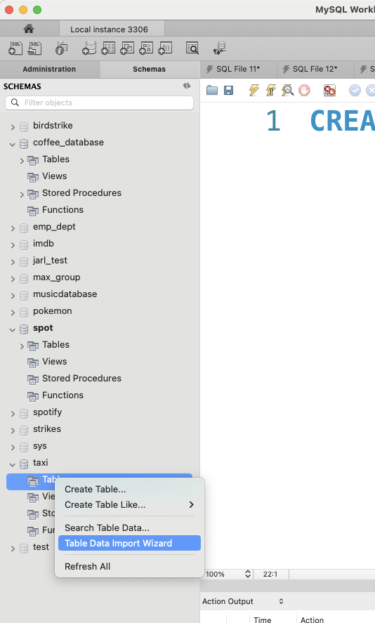

# Data Analysis

**Preparation:**

Data Literacy Fundamentals - Kapitel 5

[Aggregation](https://www.mysqltutorial.org/mysql-aggregate-functions.aspx)

[MySQL Max](https://www.mysqltutorial.org/mysql-max-function/)

[MySQL Average](https://www.mysqltutorial.org/mysql-avg/)

[MySQL Count](https://www.mysqltutorial.org/mysql-count/)

<!-- 

Mere stilladsering - nogle "medium" spørgsmål

Ændre advanced - lav nogle flere advanced

-->

## Exercise 1: Individual - Write the query

- Q1: what is the average speed of all pokemon?
  - A: 68.9338
- Q2: How many pokemon are in the dataset?
  - A: 151
- Q3: What is the maximum primary type? 
  - A: Water
- Q4: What is the minimum primary type?
  - A: Bug
- Q5: Why is water the maximum and bug the minimum? Make an informed guess
  - A: ?


- Q6: What is the max speed of all pokemon?
  - A: 140
- Q7: What is the average speed of all pokemon with 'Ground' as primary type?
  - A: 58.1250
- Q8: Display the average speed of each primary type of pokémon


## Project: Taxi Analysis

[Dataset](https://kea-fronter.itslearning.com/LearningToolElement/ViewLearningToolElement.aspx?LearningToolElementId=1301513)

[Description](https://kea-fronter.itslearning.com/LearningToolElement/ViewLearningToolElement.aspx?LearningToolElementId=1301525)

- Example: When is the busiest time of the day?

  Remember: Hours can be interpreted as a nominal scale - as a category with the categories 0-24

  To extract the hour from a DATETIME data type use: 

  ```sql
  select HOUR(tpep_pickup_datetime)
  FROM trips
  ```


- What payment type has the highest fare amount on average?

  

- At what time of day (by the hour) are the longest trips on average?
  - Remember: Hours can be interpreted as a nominal scale - as a category with the categories 0-24

    

- What are the average tip amount for each passenger count?

  - Does more passengers mean more tips?

    

**(Advanced - optional)**

- Do longer trip time mean more passengers?
- Do longer trip distance mean more passengers?


### How to import .csv to MySQL

**Create Database for the data**


**Right click > Table Data Import Wizard**



**Find File**


**Rename table (otherwise the name is very long)**


**Change tpep_pickup_datetime & tpep_dropoff_datetime to datetime datatype > next > next**


**???**


**Profit**
