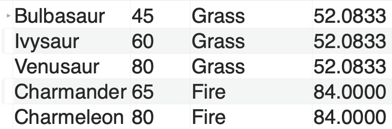
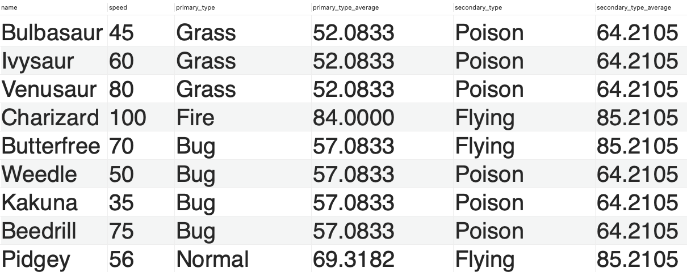

# Data Analysis: Regular Expressions & Subqueries

**Preparation:**

[Sub Queries](https://www.mysqltutorial.org/mysql-subquery/)

[Regular Expressions](https://youtu.be/FBZyVz2fSKA?si=oQJRp-PnJiH0VhU1)

## Exercise 1: Regular Expressions

Verify each regular expression at: https://regexr.com/

- Write a regular expression such that a correct input lives up to the following danish phone number standard: +45 54342355
  - +45 
  - Whitespace
  - 8 digits

Test data for regexr: **Success**

+45 12345678

+45 98765432

+45 56789012

- Write a regular expression such that a correct input lives up to the standard of a danish cpr number
  - Is a valid CPR number 451890-4455 ?

- Write a regular expression that checks if a given string is a valid email address
  - The email address must contain exactly one "@" symbol.
  - The "@" symbol should be surrounded by at least one character on each side.
  - The email address must have at least one period (".") after the "@" symbol.
  - The period (".") should be followed by at least two characters.

**Advanced (optional)**

- Write a regular expression that checks the strength of a given password
  - The password must be at least 8 characters long.
  - The password must contain at least one uppercase letter.
  - The password must contain at least one lowercase letter.
  - The password must contain at least one digit (0-9).
  - The password must contain at least one special character (e.g., !, @, #, $, etc.).

## Exercise 2: Regular Expressions in MySQL

In the **spotify** database

- How many artist have numbers in their artist name?

  

- How many distinct artists either start with a number or ends with a number?

**Advanced (Optional)**

- How many songs have features? 

## **Exerice 3 - Subqueries**

- Retrieve the average salary of all employees
- Retrieve the names of employees with a salary above the average
- Retrieve the department name and average salary of all departments
- Retrieve the department name and average salary of all departments with an average higher than the average department salary

**(Advanced - optional)**

- Employees and Departments
  - Retrieve all departments and their average salary if the department has an salary average higher than the total average department salary excluding commission?
  - Same question: Including commission?
  - Hint: IFNULL: https://www.mysqltutorial.org/mysql-ifnull/

### Very advanced queries (Optional)

**If you solve these queries below - coffee is on me**

**Pokemon**

- Retrieve a resultset of a pokemons name, their speed and the average speed of their primary_type: 

  

Hint: https://bernardoamc.github.io/sql/2015/05/04/group-by-non-aggregate-columns/

- Retrieve a resultset with pokemon whos secondary type speed is faster than their primary type speed on average. 

## The Final Boss: Project Sakila

https://kea-fronter.itslearning.com/ContentArea/ContentArea.aspx?LocationType=1&LocationID=6077

Run schema file first data file second 

- What actor has starred in most movies?
- What is the average running time of all movies?
- What is the average running time of movies by category? 
- What is the most common language in all the movies?
- What store carries the most inventory?

- What release year has the most expensive replacement costs of movies?
- What is the name of the best selling staff Mike or John?
