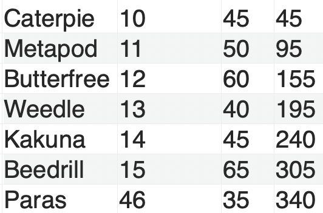
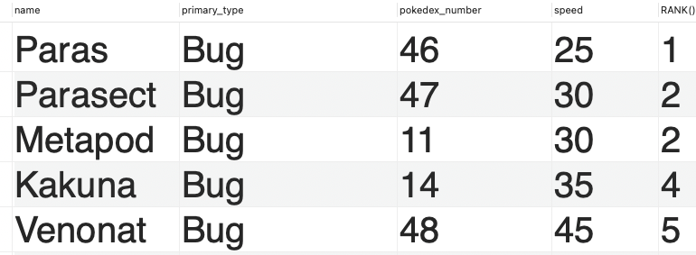
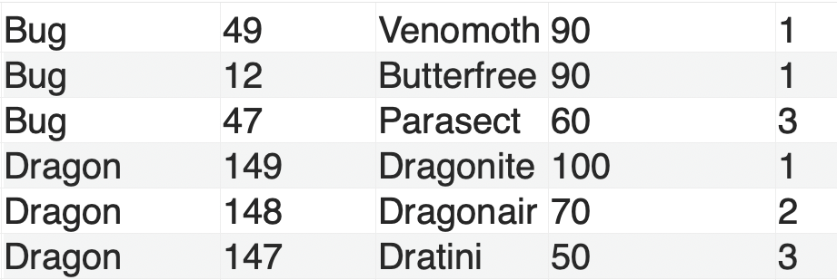
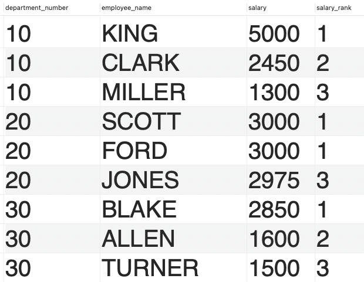
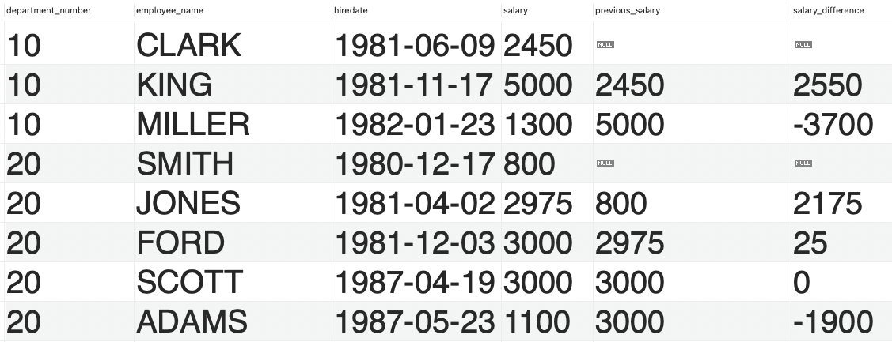

# Data Analysis: Window Functions

**Preparation:**

https://youtu.be/7NBt0V8ebGk?si=ZrUEwYFTtqYWK7Nw


# Peer instructions

If I want to fetch the sum of all salary across departments; What is the correct query?

**A)**

```sql
SELECT department_name, SUM(salary)
FROM employees
INNER JOIN departments
ON employees.department_number = departments.department_number
GROUP BY department_name 
```

**B)**

```sql
SELECT department_name, SUM(salary)
FROM employees, departments
ON employees.department_number = departments.department_number
GROUP BY department_name 
```

**C)**

```sql
SELECT department_name, SUM(salary)
FROM employees
INNER JOIN departments
ON employees.department_number = departments.department_number
GROUP BY salary
```

**D)**

None


If I want to fetch the average salary for each department ordered by average salary with the highest at the top; what is the correct query?

**A)**

```sql
SELECT AVG(salary)
FROM employees
INNER JOIN departments
GROUP BY department_name
ORDER BY DESC
```

**B)**

```sql
SELECT *
FROM employees
INNER JOIN departments
ON employees.department_number = departments.department_number
GROUP BY department_name 
ORDER BY AVG(salary) DESC
```

**C)**

```sql
SELECT department_name, AVG(salary)
FROM employees
INNER JOIN departments
ON employees.department_number = departments.department_number
GROUP BY department_name DESC
ORDER BY AVG(salary)
```

**D)**

None


## Exercises 1 (Pairs)

**A)** Describe and write down: What are the difference between Aggregate functions and window functions?

**B)** Describe and write down: What does the "Group By"- clause obtain?

- How does it affect the resulting response

**C)** What happens if we do not use a "On"- clause in a join statement?

**D)** Describe the usage of a sub query and provide and example


## **Exercises 2**

**In the pokemon dataset**

**A)** Write a query to calculate the [running total](https://learnsql.com/blog/what-is-a-running-total-and-how-to-compute-it-in-sql/) of HP for each Pokemon grouped by its primary type. Order the results by the Pokemon's `pokedex_number` within each `primary_type`.



**B)** Write a query to [rank](https://www.mysqltutorial.org/mysql-window-functions/mysql-rank-function/) Pokemon by their `speed` stat within each `primary_type`. Display the `primary_type`, `pokedex_number`, `name`, `speed`, and the rank.



**C)** Write a query to find the top 3 Pokemon by `special_attack` within each `primary_type`. Display the `primary_type`, `pokedex_number`, `name`, `special_attack`, and the rank.



**D) (Advanced optional)** Write a query to identify Pokemon whose `speed` stat is above the average speed of their `primary_type`. Display the `primary_type`, `pokedex_number`, `name`, `speed`, and the average speed of the `primary_type`.


**In the Employees & Departments dataset**

**A)** Write a query to calculate the cumulative salary of employees within each department. Display the `department_number`, `employee_name`, `salary`, and the cumulative sum of `salary` ordered by `hiredate`.

**B)** Write a query to identify employees whose salary is above the average salary of their department. Display the `department_number`, `employee_name`, `salary`, and the average salary of the department.

**C)** Write a query to calculate the year of employment (`hiredate` year) for each employee and rank them within their department based on their hire date. Display the `department_number`, `employee_name`, `hiredate`, `employment_year`, and the rank.

**D)** Write a query to find the top 3 highest earners in each department. Display the `department_number`, `employee_name`, `salary`, and their rank within the department.




**Advanced**

**E)** Write a query to calculate the difference in salary between an employee and the employee hired immediately before them within each department, ordered by `hiredate`.

- Hint: Use the LAG() function: https://www.mysqltutorial.org/mysql-window-functions/mysql-lag-function/




## Exercise 3 Project Sakila

https://kea-fronter.itslearning.com/Resources?FolderID=1303798&PlayPlanDialogView=False&ReloadTree=False

**Run schema file first data file second** 


- What actor has starred in most movies?
- What is the average running time of all movies?
- What is the average running time of movies by category? 
- What is the most common language in all the movies?
- What store carries the most inventory?
- Find the most expensive film in each film category


**Advanced**

- What release year has the most expensive replacement costs of movies?
- What is the name of the best selling staff Mike or John?
