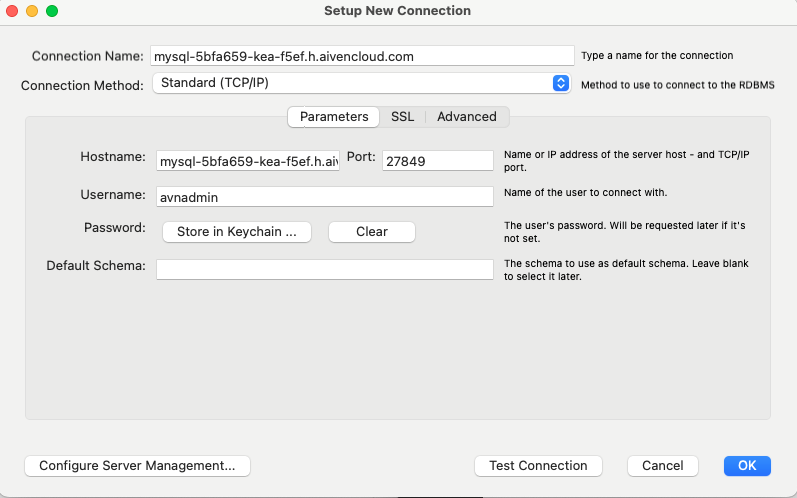

# Deploying a database

We will be deploying a database using a free service such as Aiven.io

If you wish to use aiven.io: Go to https://aiven.io/free-mysql-database

- Get started for free & Create a user.
- Create new service MySQL

- Free plan, AWS, pick a european server

**THE SERVICE IS NOT CREATED YET - CLICK Next: Secure Connection**

Click: Next: Add Data

Click: Finish setup

**When the service is running** use the following credentials in MySQL workbench:

Create the sakila database: 

https://kea-fronter.itslearning.com/Resources?FolderID=1303798&PlayPlanDialogView=False&ReloadTree=False

**Run schema file first data file second**

- Verify that you have data in your database

# Exercises

### **Exercises: Normalisation**

**Exercise:** Consider the following table that is in **Second Normal Form (2NF)**, which stores information about Pokémon battles:

| BattleID | TrainerID | TrainerName | TrainerCity   | PokémonID | PokémonName | PokémonType | BattleLocation | WinStatus |
| -------- | --------- | ----------- | ------------- | --------- | ----------- | ----------- | -------------- | --------- |
| 1        | 101       | Ash Ketchum | Pallet Town   | 201       | Pikachu     | Electric    | Viridian City  | Win       |
| 2        | 102       | Misty       | Cerulean City | 202       | Starmie     | Water       | Cerulean Gym   | Loss      |
| 3        | 101       | Ash Ketchum | Pallet Town   | 203       | Charizard   | Fire        | Saffron City   | Win       |

Identify transitive dependencies in the table.

- Check if any attributes are dependent on non-primary key attributes, creating redundancy.

**Exercise:** Consider a table used to store hotel reservation information:

| ReservationID | GuestID | GuestName  | RoomID | RoomType | RoomRate | CheckInDate | CheckOutDate | StaffID | StaffName   | ServiceProvided |
| ------------- | ------- | ---------- | ------ | -------- | -------- | ----------- | ------------ | ------- | ----------- | --------------- |
| 2001          | 501     | Jack Black | 101    | Deluxe   | 150      | 2024-05-01  | 2024-05-05   | 601     | Emma White  | Housekeeping    |
| 2002          | 502     | Jill White | 102    | Suite    | 300      | 2024-05-03  | 2024-05-06   | 602     | John Grey   | Room Service    |
| 2003          | 501     | Jack Black | 103    | Standard | 100      | 2024-05-07  | 2024-05-10   | 601     | Emma White  | Housekeeping    |
| 2004          | 503     | Alice Bob  | 101    | Deluxe   | 150      | 2024-05-09  | 2024-05-11   | 603     | Johnny Depp | Housekeeping    |

Identify transitive dependencies in the table.

- Check if any attributes are dependent on non-primary key attributes, creating redundancy.

### Exercises: Queries

In the following dataset, **run sakila-scheme first, sakila-data after:**

https://kea-fronter.itslearning.com/Resources?FolderID=1303798&PlayPlanDialogView=False&ReloadTree=False

Reverse engineer the dataset and get an overview. (You will need it)

1. Retrieve all customer names along with their email addresses.
2. List the names and phone numbers of all customers whose last name starts with 'S'.
3. Find the top 10 customers who have spent the most on rentals.
4. Retrieve the films that are in the "Family" category and have a length of less than 90 minutes.
5. Retrieve the titles of films that were rented in February.
6. Find the five most rented films.
7. Find the number of films available in the store for each rating category.

**Advanced (Optional)**

1. List the films that are available for rent, but haven't been rented yet (Hint: movies that are IN or NOT IN something?)
2. Find the customers who have rented more than 5 films in 2005.
3. List the top 5 actors who have appeared in the most films.
4. Find the average rental duration for each film category.
5. Retrieve the names and total revenue of the top 10 customers who have generated the most revenue for the store.

### Exercises: Window functions

**Exercise:** Rank films by their **rental duration** within each **film category** using the `film` and `film_category` tables.

- Use the **`RANK()`** window function to rank films based on **rental_duration**.
- Partition by **`category_id`** and order by **`rental_duration`** in descending order.

**Expected Output:** For each **film**, the output should include **film_id**, **title**, **category_id**, **rental_duration**, and the **rank** of that film in its category.

**Exercise:** Write a query to calculate the **running total** of payments for each customer in the `payment` table.

- Use the **`SUM()`** window function to calculate the cumulative amount paid by each customer.
- Partition the data by **`customer_id`** and order it by **`payment_date`**.

**Expected Output:** For each **customer**, the output should contain **customer_id**, **payment_id**, **amount**, **payment_date**, and **running total** of payments up to that date.

### Exercise: Database design

You are tasked with designing a database for the **Galactic Wildlife Preservation Society (GWPS)**, an organization dedicated to studying and protecting wildlife across different planets in the galaxy. The database must help the society store data about planets, species, research teams, and the interactions between various species and their environments.

### **Requirements:**

1. **Planets**: Each planet has a unique **planet_id**, a **name**, **climate type** (e.g., tropical, arid), **average temperature**, and **dominant terrain** (e.g., forest, desert, ocean).
2. **Species**: Each species is identified by a **species_id**, and has a **common name**, a **scientific name**, a **diet type** (e.g., carnivore, herbivore, omnivore), a **habitat type** (e.g., forest, ocean, cave), and a **planet_id** referring to the planet where the species primarily resides.
3. **Research Teams**: The GWPS has multiple research teams. Each team has a **team_id**, a **name**, a **lead researcher**, and a **base of operations**, which could be a space station, a planetary research facility, or a mobile space shuttle.
4. **Observations**: Researchers need to record their observations of species in the wild. Each **observation** should have a **record_id**, **species_id**, **team_id**, **planet_id**, **observation_date**, and **details** of the observation (e.g., behaviors observed, population count, interaction with other species).
5. **Endangered Status**: Some species are categorized based on their **endangerment status**. The endangerment information should include **species_id**, **status_level** (e.g., Least Concern, Vulnerable, Endangered, Critically Endangered), and **date_recorded**.

### **Exercise Instructions:**

Design the database schema to support these requirements. Create the entity-relationship (ER) diagram or provide the relational schema for the database. Make sure to:

1. **Identify Entities**: List the entities and their attributes.
2. **Identify Relationships**: Determine how entities are related to each other.
3. **Identify Primary and Foreign Keys**: Clearly indicate the primary keys for each entity and the foreign keys where appropriate.
4. **Normalize the Database**: Ensure the database is normalized up to **Third Normal Form (3NF)**.
5. **Include Additional Considerations**: Address any additional aspects such as ensuring that each **research team** can make **multiple observations** on different species, and each **species** may reside on **multiple planets**.
