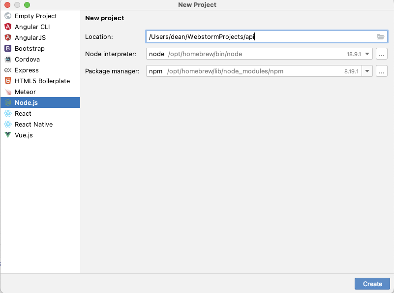

## Github Link

https://github.com/nicklasdean/nodejs-examples


## Insomnia for API testing

https://insomnia.rest/


## How to create a node.js project



In the terminal:

`npm install express --save`


## Exercises 1

```javascript
//This is boilerplate code to write a simple web-server
const http = require("http");

http.createServer((req,res)=>{
    res.write("Hello Everyone");
    res.end();
}).listen(8000);
```

In the following exercises you can create a new script for each exercise

#### A)

Create a basic API that will output "Hello World" when a user sends a request to the API.

#### B)

Create a basic API that will generate a [random number](https://www.w3schools.com/jsref/jsref_random.asp#:~:text=JavaScript%20Math.random()&text=The%20Math.random()%20method,not%20including%201%20(exclusive).) between 1-20 and output the number to the user. 

#### C)

Create a basic API that will generate a [random number](https://www.w3schools.com/jsref/jsref_random.asp#:~:text=JavaScript%20Math.random()&text=The%20Math.random()%20method,not%20including%201%20(exclusive).) between 1-4 and output "spring", "summer","fall","winter" each according to the number 1-4.

#### D)

Create a basic API that will generate 10 [random numbers](https://www.w3schools.com/jsref/jsref_random.asp#:~:text=JavaScript%20Math.random()&text=The%20Math.random()%20method,not%20including%201%20(exclusive).) between 1-20 and and output the average to the user. 

#### E)

Using the [getday function](https://www.w3schools.com/jsref/jsref_getday.asp) build a simple API that will provide the user with a string output of what day it is today

#### E.2) (Advanced - optional)

Change the API such that the API outputs YES if it is friday and NO if it is not friday. Like the service www.erdetfredag.dk


## Exercises 2

```javascript
//This is the boilerplate code to write a simple web-server with the express.js framework
const express = require('express')
const app = express()
const port = 3000

app.get('/', (req, res) => {
  res.send('Hello World!')
})

app.listen(port, () => {
  console.log(`Example app listening on port ${port}`)
})
```

- Create a .json file with the data underneath and use it as a data-foundation (meaning the .json file represents a database)

- Each exercise should be written as an end-point

  

## Exercises 2

#### A) /Hello

- Create an end point that displays a friendly greeting to the user of the API

#### B) /first

- Create an end point that displays the first json object of the data array (data[])

#### **C) /products **

- Create an endpoint that displays a list of all products.

#### D) /products/:id

- Create an endpoint that displays a specific product by its ID.
  - If a product cannot be found, the API will respond with a [404 status code and a message that informs the user](https://expressjs.com/en/starter/faq.html#how-do-i-handle-404-responses)

#### E) /products/unavailable

- Create an endpoint that displays all out of stock products 

#### F) products/category/:category

- Create an endpoint that displays all products from a single category.

#### G) products/:id/availability

- Create an endpoint that displays the availability of a product by its ID


### Advanced (Optional)

#### H) products/:min/:max

- Create an endpoint that displays all products within the minimum - maximum price range 

#### I) products/sortprice

- Create an endpoint that displays all products of a category sorted by price

#### J) products/material/unique

- Create an endpoint that displays a list of all unique material


#### Data

```javascript
[
  {
    "id": 1,
    "productName": "laptop",
    "price": 999.99,
    "isUsed": false,
    "productCategories": ["electronics"],
    "weight": 2.5,
    "stock": 50,
    "material": "plastic"
  },
  {
    "id": 2,
    "productName": "smartphone",
    "price": 499.99,
    "isUsed": true,
    "productCategories": ["electronics"],
    "weight": 0.3,
    "stock": 100,
    "material": "metal"
  },
  {
    "id": 3,
    "productName": "headphones",
    "price": 79.99,
    "isUsed": false,
    "productCategories": ["electronics"],
    "weight": 0.2,
    "stock": 75,
    "material": "plastic"
  },
  {
    "id": 4,
    "productName": "desk chair",
    "price": 149.99,
    "isUsed": true,
    "productCategories": ["furniture"],
    "weight": 8.0,
    "stock": 30,
    "material": "leather"
  },
  {
    "id": 5,
    "productName": "coffee maker",
    "price": 49.99,
    "isUsed": false,
    "productCategories": ["appliances"],
    "weight": 1.5,
    "stock": 0,
    "material": "stainless steel"
  },
  {
    "id": 6,
    "productName": "running shoes",
    "price": 79.99,
    "isUsed": false,
    "productCategories": ["clothing", "footwear"],
    "weight": 1.0,
    "stock": 80,
    "material": "mesh"
  },
  {
    "id": 7,
    "productName": "backpack",
    "price": 29.99,
    "isUsed": true,
    "productCategories": ["accessories"],
    "weight": 0.8,
    "stock": 50,
    "material": "nylon"
  },
  {
    "id": 8,
    "productName": "led tv",
    "price": 799.99,
    "isUsed": false,
    "productCategories": ["electronics"],
    "weight": 15.0,
    "stock": 20,
    "material": "glass"
  },
  {
    "id": 9,
    "productName": "yoga mat",
    "price": 19.99,
    "isUsed": true,
    "productCategories": ["fitness"],
    "weight": 0.5,
    "stock": 100,
    "material": "pvc"
  },
  {
    "id": 10,
    "productName": "gaming mouse",
    "price": 49.99,
    "isUsed": false,
    "productCategories": ["gaming", "electronics"],
    "weight": 0.1,
    "stock": 40,
    "material": "plastic"
  },
  {
    "id": 11,
    "productName": "desk lamp",
    "price": 24.99,
    "isUsed": false,
    "productCategories": ["home decor"],
    "weight": 0.5,
    "stock": 60,
    "material": "metal"
  },
  {
    "id": 12,
    "productName": "cookware set",
    "price": 129.99,
    "isUsed": true,
    "productCategories": ["kitchen"],
    "weight": 10.0,
    "stock": 25,
    "material": "stainless steel"
  },
  {
    "id": 13,
    "productName": "bluetooth speaker",
    "price": 69.99,
    "isUsed": false,
    "productCategories": ["electronics", "accessories"],
    "weight": 0.7,
    "stock": 45,
    "material": "plastic"
  },
  {
    "id": 14,
    "productName": "hiking boots",
    "price": 89.99,
    "isUsed": true,
    "productCategories": ["footwear", "outdoor"],
    "weight": 1.2,
    "stock": 35,
    "material": "leather"
  },
  {
    "id": 15,
    "productName": "portable charger",
    "price": 39.99,
    "isUsed": false,
    "productCategories": ["accessories", "electronics"],
    "weight": 0.3,
    "stock": 70,
    "material": "plastic"
  },
  {
    "id": 16,
    "productName": "desk organizer",
    "price": 19.99,
    "isUsed": false,
    "productCategories": ["office"],
    "weight": 0.5,
    "stock": 50,
    "material": "wood"
  },
  {
    "id": 17,
    "productName": "vacuum cleaner",
    "price": 149.99,
    "isUsed": true,
    "productCategories": ["appliances"],
    "weight": 5.0,
    "stock": 20,
    "material": "plastic"
  },
  {
    "id": 18,
    "productName": "tennis racket",
    "price": 59.99,
    "isUsed": false,
    "productCategories": ["sports"],
    "weight": 0.7,
    "stock": 30,
    "material": "graphite"
  },
  {
    "id": 19,
    "productName": "digital camera",
    "price": 299.99,
    "isUsed": true,
    "productCategories": ["photography", "electronics"],
    "weight": 1.0,
    "stock": 15,
    "material": "plastic"
  },
  {
    "id": 20,
    "productName": "toaster",
    "price": 29.99,
    "isUsed": false,
    "productCategories": ["kitchen"],
    "weight": 1.0,
    "stock": 40,
    "material": "metal"
  },
  {
    "id": 21,
    "productName": "sunglasses",
    "price": 39.99,
    "isUsed": false,
    "productCategories": ["fashion", "accessories"],
    "weight": 0.1,
    "stock": 50,
    "material": "plastic"
  },
  {
    "id": 22,
    "productName": "fitness tracker",
    "price": 79.99,
    "isUsed": true,
    "productCategories": ["fitness", "electronics"],
    "weight": 0.2,
    "stock": 60,
    "material": "rubber"
  },
  {
    "id": 23,
    "productName": "cooking utensils",
    "price": 14.99,
    "isUsed": false,
    "productCategories": ["kitchen"],
    "weight": 0.3,
    "stock": 80,
    "material": "wood"
  },
  {
    "id": 24,
    "productName": "dumbbell set",
    "price": 49.99,
    "isUsed": true,
    "productCategories": ["fitness"],
    "weight": 15.0,
    "stock": 0,
    "material": "metal"
  },
  {
    "id": 25,
    "productName": "candle holder",
    "price": 9.99,
    "isUsed": false,
    "productCategories": ["home decor"],
    "weight": 0.2,
    "stock": 90,
    "material": "glass"
  },
  {
    "id": 26,
    "productName": "digital watch",
    "price": 59.99,
    "isUsed": false,
    "productCategories": ["accessories"],
    "weight": 0.1,
    "stock": 70,
    "material": "metal"
  },
  {
    "id": 27,
    "productName": "back massager",
    "price": 29.99,
    "isUsed": true,
    "productCategories": ["health", "electronics"],
    "weight": 1.5,
    "stock": 10,
    "material": "plastic"
  },
  {
    "id": 28,
    "productName": "wall clock",
    "price": 19.99,
    "isUsed": false,
    "productCategories": ["home decor"],
    "weight": 0.5,
    "stock": 40,
    "material": "metal"
  },
  {
    "id": 29,
    "productName": "external hard drive",
    "price": 89.99,
    "isUsed": false,
    "productCategories": ["electronics"],
    "weight": 0.3,
    "stock": 30,
    "material": "plastic"
  },
  {
    "id": 30,
    "productName": "sleeping bag",
    "price": 49.99,
    "isUsed": true,
    "productCategories": ["outdoor"],
    "weight": 2.0,
    "stock": 5,
    "material": "nylon"
  },
  {
    "id": 31,
    "productName": "wireless keyboard",
    "price": 39.99,
    "isUsed": false,
    "productCategories": ["electronics"],
    "weight": 0.8,
    "stock": 15,
    "material": "plastic"
  },
  {
    "id": 32,
    "productName": "plant pot",
    "price": 14.99,
    "isUsed": false,
    "productCategories": ["home decor"],
    "weight": 1.0,
    "stock": 25,
    "material": "ceramic"
  },
  {
    "id": 33,
    "productName": "tea kettle",
    "price": 29.99,
    "isUsed": false,
    "productCategories": ["kitchen"],
    "weight": 1.2,
    "stock": 60,
    "material": "stainless steel"
  },
  {
    "id": 34,
    "productName": "travel pillow",
    "price": 19.99,
    "isUsed": false,
    "productCategories": ["travel"],
    "weight": 0.5,
    "stock": 20,
    "material": "memory foam"
  },
  {
    "id": 35,
    "productName": "electric toothbrush",
    "price": 59.99,
    "isUsed": true,
    "productCategories": ["health"],
    "weight": 0.2,
    "stock": 0,
    "material": "plastic"
  },
  {
    "id": 36,
    "productName": "dining table",
    "price": 299.99,
    "isUsed": false,
    "productCategories": ["furniture"],
    "weight": 30.0,
    "stock": 10,
    "material": "wood"
  },
  {
    "id": 37,
    "productName": "sunscreen",
    "price": 14.99,
    "isUsed": false,
    "productCategories": ["health", "beauty"],
    "weight": 0.3,
    "stock": 50,
    "material": "cream"
  },
  {
    "id": 38,
    "productName": "rain jacket",
    "price": 79.99,
    "isUsed": true,
    "productCategories": ["clothing", "outdoor"],
    "weight": 0.7,
    "stock": 30,
    "material": "polyester"
  },
  {
    "id": 39,
    "productName": "frying pan",
    "price": 24.99,
    "isUsed": false,
    "productCategories": ["kitchen"],
    "weight": 1.5,
    "stock": 15,
    "material": "non-stick coated"
  },
  {
    "id": 40,
    "productName": "wireless earbuds",
    "price": 129.99,
    "isUsed": false,
    "productCategories": ["electronics", "accessories"],
    "weight": 0.1,
    "stock": 0,
    "material": "plastic"
  }
]
```

