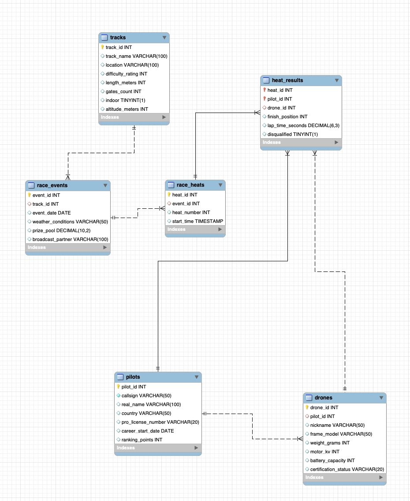

## Exercises: Normalisation

**Solutions can be in "minimal scheme notation"**: studen(student_ID, student_name, courses)


**Exercise A)**

| Post_ID | User_Name | Tags                |
| ------- | --------- | ------------------- |
| 1       | Alice     | #Travel, #Adventure |
| 2       | Bob       | #Coding, #Tech, #AI |


1. Identify the issues that make the table unnormalized.
   1. What are the issues with the tables current form?
2. Transform the table into 1NF.
   1. How does this solve the issues?


**Exercise B)**

| Match_ID | Player_Name          | Player_Position | Team_Name           | Match_Date | Match_Location   |
| -------- | -------------------- | --------------- | ------------------- | ---------- | ---------------- |
| M101     | Lionel Messi         | Forward         | Paris Saint-Germain | 2024-03-15 | Parc des Princes |
| M101     | Gianluigi Donnarumma | Goalkeeper      | Paris Saint-Germain | 2024-03-15 | Parc des Princes |
| M102     | Erling Haaland       | Forward         | Manchester City     | 2024-03-20 | Etihad Stadium   |
| M102     | Kevin De Bruyne      | Midfielder      | Manchester City     | 2024-03-20 | Etihad Stadium   |
| M103     | Lionel Messi         | Forward         | Paris Saint-Germain | 2024-03-25 | Old Trafford     |

1. Identify the issues that make the table unnormalized.
   1. What are the issues with the tables current form?
2. Identify partial/transitive dependencies.
3. Transform the data to 3NF
   1. How does this solve the issues?


**Exercise C)**

| OrderID | CustomerEmail                             | CustomerName | ProductID | ProductName     | ProductCategory | CategoryManager | Price  | OrderStatus | ShippingAddress |
| ------- | ----------------------------------------- | ------------ | --------- | --------------- | --------------- | --------------- | ------ | ----------- | --------------- |
| 1001    | [john@email.com](mailto:john@email.com)   | John Smith   | P100      | Gaming Mouse    | Gaming          | Sarah Jones     | 59.99  | Delivered   | 123 Main St, NY |
| 1002    | [john@email.com](mailto:john@email.com)   | John Smith   | P101      | Gaming Keyboard | Gaming          | Sarah Jones     | 129.99 | Pending     | 123 Main St, NY |
| 1003    | [mary@email.com](mailto:mary@email.com)   | Mary Brown   | P100      | Gaming Mouse    | Gaming          | Sarah Jones     | 59.99  | Processing  | 456 Oak Ave, CA |
| 1004    | [peter@email.com](mailto:peter@email.com) | Peter Wilson | P102      | Laptop Stand    | Office          | Mike Brown      | 29.99  | Delivered   | 789 Pine Rd, TX |
| 1005    | [mary@email.com](mailto:mary@email.com)   | Mary Brown   | P103      | Desk Lamp       | Office          | Mike Brown      | 39.99  | Processing  | 456 Oak Ave, CA |

1. Identify the issues that make the table unnormalized.
   1. What are the issues with the tables current form?
2. Identify natural primary keys.
3. Identify partial/transitive dependencies.
4. Transform the data to 3NF
   1. How does this solve the issues?

## Database design

Identify:

- What are the relationships between the tables.

### 


## Basic queries & aggregate functions

**Data:** https://github.com/nicklasdean/data/blob/main/drone-racing.sql

**A)** Fetch all pilots with more than 2500 ranking points

- 7 rows returned

**B)** Fetch all pilots and the weight of their drone from highest to lowest

- 10 rows returned: 250 highest, 235 lowest

**C)** Fetch how many pilots are from each country

- Japan 3, Spain 2, Rest of world 1 

**D)** Fetch the average ranking points by country. Sort by country name.

- India highest, UAE lowest

**E)** Fetch countries that have more than one pilot

- [Hint](https://www.w3schools.com/mysql/mysql_having.asp): `Having` is the "where" of aggregated queries
- Japan + Spain

**Advanced**

**F)** Fetch the average lap time for all races in indoor tracks

- 45.2602083

**G)** Fetch the pilot with the highest number of disqualifications


## Subqueries

**A)** Fetch all drones with a higher than average battery capacity

- 5 rows returned

**B)** Fetch all tracks that have hosted races with a price pool greater than 70.000

- 3 rows returned

**Advanced**

**C)** Fetch the pilots who have won more than 2 races.

- 1 Row returned: PhoenixFPV


## Window Functions

```sql
-- Basic window function
SELECT 
	`name`,
    primary_type,
    speed,
    AVG(speed) OVER (PARTITION BY primary_type ORDER BY speed)
FROM pokemon
```

**A)** Fetch all data about `tracks` and the average altitude meters

**B)** Fetch all data about pilots and the average ranking_points per. country.

```sql
-- Basic rank example
SELECT d.nickname, d.weight_grams,
       RANK() OVER (ORDER BY d.weight_grams DESC) AS weight_rank
FROM drones d;
```

**C)**  Rank pilots by their total ranking points

**D)** Rank tracks by difficulty rating

