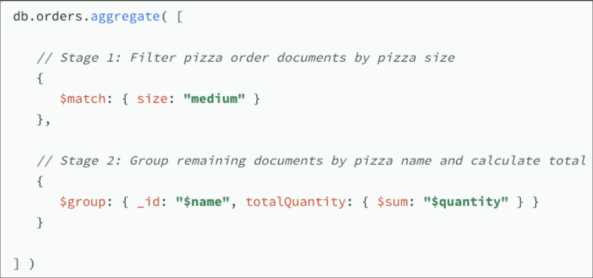
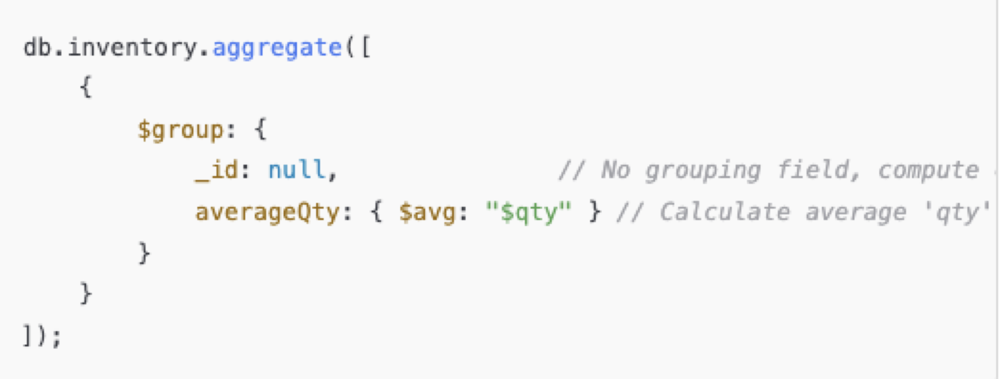

## Higher order functions / lambda functions

A higher order functions i a function that takes a functions as parameter.

Consider the filter function: 

```javascript
const ages = [32, 33, 16, 40];
const result = ages.filter(checkAdult);

function checkAdult(age) {
  return age >= 18;
}
```

The filter is (assumeably) implemented like so:

```javascript
function filter(array, callback) {
    let result = [];
    for (let item of array) {
        if (callback(item) === true) {
            result.push(item);
        }
    }
    return result;
}
```


### Higher order functions

**A)**  Write a higher-order function `repeat` that takes a function and a number `n` as arguments. It should call the provided function `n` times.

**B)** Write a higher-order function `customForEach` that takes an array and a callback function. It should call the callback function for each element in the array.


## MongoDB queries

```javascript
//Sorting - ORDER BY
//-1 - DESC, 1 - ASC
db.products.find().sort({ price: -1 })

//Truncating results - LIMIT
db.products.find().limit(1)

//Regex
//Finding all inventory with "computer" in the name.
db.inventory.find({ productName: { $regex: "computer", $options: "i" } })

//Multiple conditions
//Materiale either cloth or plastic
db.products.find({ material: { $in: ["cloth", "plastic"] } })

```


https://github.com/nicklasdean/data/blob/main/products.json

**A)** Fetch all products in the "electronics" category

**B)** Fetch all products with a stock greater than 50

**C)** Fetch all used products

**D)** Fetch all products that costs less than 50 and are in stock

**E)** Fetch the top 3 most expensive items

**F)** Fetch all items that has 2 or more product categories

- Hint: https://www.mongodb.com/docs/manual/reference/operator/query/size/

**G)** Fetch all products where weight is between 1 and 5

**H)** Fetch all products whose name contain the word "desk"

**I)** Fetch all products that are both used and have stock less than 20

**Advanced**

**J)** Fetch all products whose name contain the word "computer" and sort by stock in descending order


## Aggregate Queries

Filter stage + group stage



To aggregate on the **full** dataset - no grouping



**A)** Fetch the average price of all products

**B)** Fetch the average price in each category of products

**C)** Fetch the total price of all products in stock

**D)** Fetch the most expensive product in each category

**E)** Fetch the total stock of products for each material

**Advanced**

**E)** Find the average price of products that are either used or in the kitchen category

**F)** Find the most expensive product in each product category

- Hint: https://www.geeksforgeeks.org/how-to-use-unwind-operator-in-mongodb/