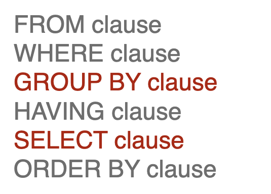

# Eksamensnoter

- Metadata
- Andre end Relationel database

## **Datatyper og skalaer**

- DIKW
- NOIR
- Datatyper og operationer

Porteføljeprojekter? 

Data: Faktuel information - **Form og formål**

DIKW pyramiden: Hvad bruger man den til?

- El-cykel eksempel?
- Domæner vi kan bruge? Personlig/Public/Arbejdsliv
  - Uddybe - hvordan kan vi bruge et dataset til diverse?
- Datadrevne beslutninger?
- Data til at modvirke bias -> Hvordan? 
- Hvordan gemmes data på computeren? 
- Data typer? Nævn nogle
- Data operationer
  - En plus operand (+)
  - En større end mindre end operand
- Kompleks data vs primitiv data
- NOIR
  - Nominal (Kategori - not ordered)
  - Ordinal (Kategori - order)
  - Interval (Order - tal -> Finde den eksakte forskel mellem to værdier)
  - Ratio (Absolut 0)
- Hvilke datatyper gruppere på? Hvorfor? 

## **Den relationelle databasemodel**

- Rækker, kolonner, tabeller
- Primary / Foreign keys
- **Kardinalitet**

- Joine tabeller (hvordan? Hvilke koncepter bruger man når man joiner?)
- Hvad definerer den relationelle model?
- **Forskel på Data i memory og på disk (hard drive)?**
- Andre modeller?
- Indexering
- Constraints

Create

## **EER og logisk databasedesign**

- ER / EER diagram

- Forskel på dem

- Koncepterne

- **Kardinalitet**

- Udtrykke: Mange til mange

  

## **Data quality og cleaning**

- **Accurracy:**

  - Semantisk
  - Syntaktisk

- **Completeness:**

  - Column completeness (function of missing values in a column)
  - Population completeness

- **Time related dimensions**

  - Stable Data
  - Time Variable

- **Consistency**

  - Semantic rules?

- How to clean dataset? 

  

## **Fremmednøgler og databaseintegritet**

- Rækker, kolonner, tabeller
- Primary / Foreign keys
- **Kardinalitet**

- Joine tabeller (hvordan? Hvilke koncepter bruger man når man joiner?)
- Hvad definerer den relationelle model?
- **Forskel på Data i memory og på disk (hard drive)?**
- Andre modeller?
- Indexering
- Constraints

- Intgritet?
- Foreign Key constraints
- Kardinalitet

## **Databaseforespørgsler (queries)**

SELECT

WHERE

FROM

GROUP BY

