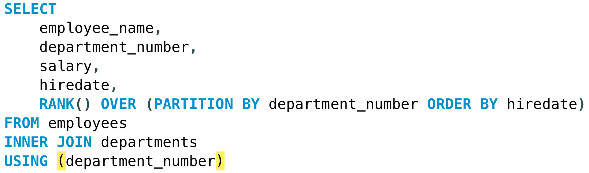
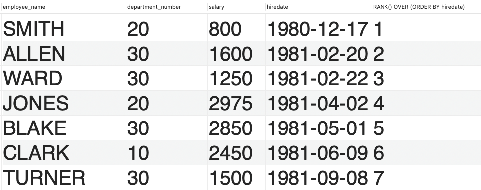
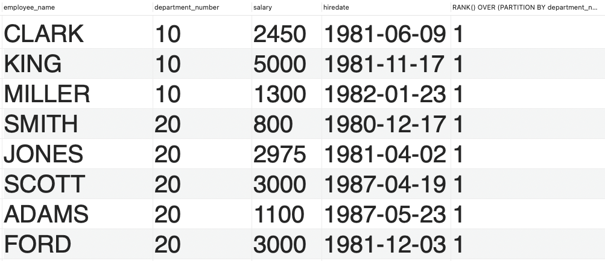
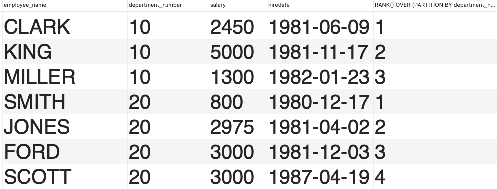
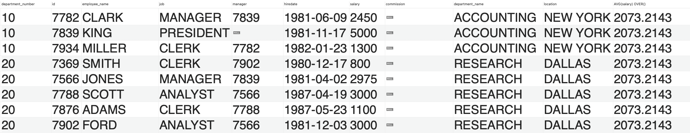

# Data Definition Language


## Peer instruction

**What result would the following query obtain?**



**A)**



**B)**




**C)**




**What result would the following query obtain?**


**A)**


**B)**



**C)**

Error


Two tables with primary keys and foreign key constraints

```sql
CREATE TABLE departments (	
	department_number INTEGER, 
	department_name VARCHAR(30), 
	location VARCHAR(30), 
	PRIMARY KEY (department_number)
);
```


```sql
CREATE TABLE employees(	
	id INTEGER, 
	employee_name VARCHAR(30), 
	job VARCHAR(30), 
	manager INTEGER, 
	hiredate DATE, 
	salary INTEGER, 
	commission INTEGER, 
	department_number INTEGER, 
	PRIMARY KEY (id),
	FOREIGN KEY (department_number) REFERENCES departments(department_number)
);
```


# Exercise 1

Implement the following constraints in the departments and employees DDL script

- A department number has to be between 0 and 1000
- A department name and location cannot be null
- An employee must be hired after 1980
- An employee cannot have a negative salary, but they can receive 0 (In the case of an intern)
- The default value for an employees manager is 7839

Insert two rows for each of the constraints / rules. One valid and one invalid.

Verify that your constraints work as intended.


# Exercise 2

In this exercise you will create a script such as this:

```sql
DROP TABLE if exists employees;
DROP TABLE if exists departments;

CREATE TABLE departments (	
	department_number INTEGER, 
	department_name VARCHAR(30), 
	location VARCHAR(30), 
	PRIMARY KEY (department_number)
); 

Insert into departments (department_number,department_name,location) values (10,'ACCOUNTING','NEW YORK');
Insert into departments (department_number,department_name,location) values (20,'RESEARCH','DALLAS');
```

The script has to drop all tables if they exists, create new tables and insert test data.


**Requirements**

Create a table named "students" with the following columns:

- `student_id` (INT, primary key)
- `first_name` (VARCHAR, 50)
- `last_name` (VARCHAR, 50)
- `birthdate` (VARCHAR,10)
- `enrollment_date` (DATETIME)
- `status` (VARCHAR, 15)


Modify the "students" table by adding a new column named `email` of type VARCHAR(100).

Modify a Column Change such that the data type of the `birthdate` column in the "students" table to DATE.


Create a new table named "courses" with the following columns:

- `course_id` (INT, primary key)
- `course_name` (VARCHAR, 100)
- `instructor_id` (INT, foreign key referencing an "instructors" table)
  - An instructor has a name, email & auto incrementing id 


Add a default value of 'Active' for the `status` column in the "students" table.


Create a table named "books" with the following columns:

- `book_id` (INT, primary key, auto incrementing)
- `title` (VARCHAR, 100)
- `author` (VARCHAR, 100)
- `isbn` (VARCHAR, 13, unique)


Populate the tables with at least 5 entities for each table


**(Advanced  optional)**

- Modify the database such that 1 book is used on each course


