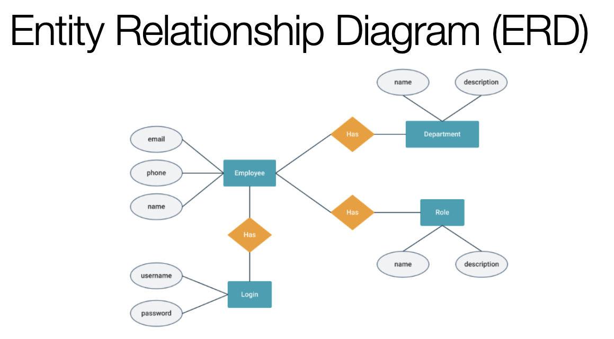
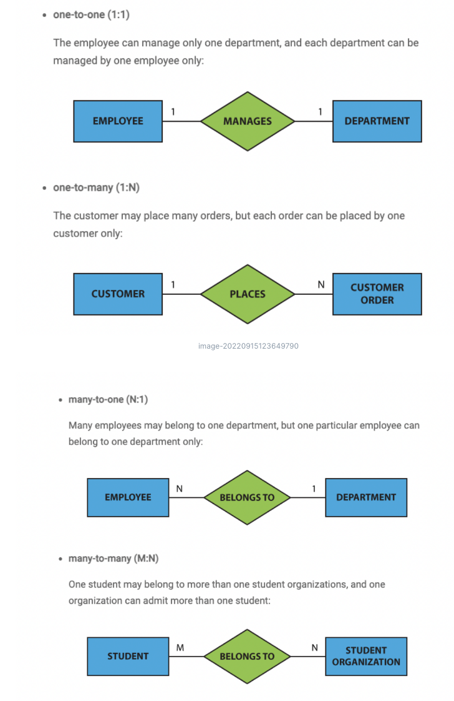
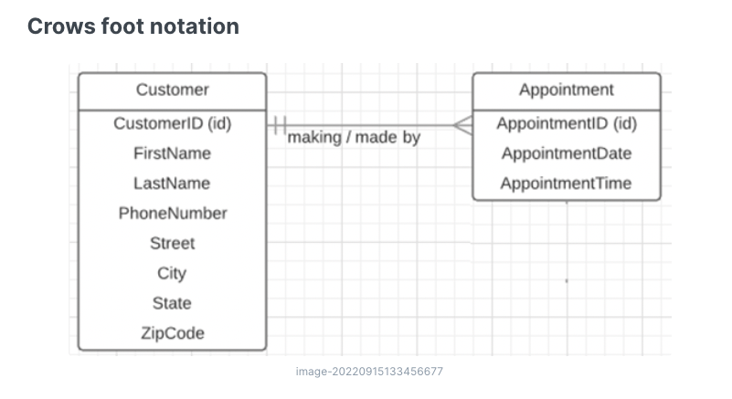
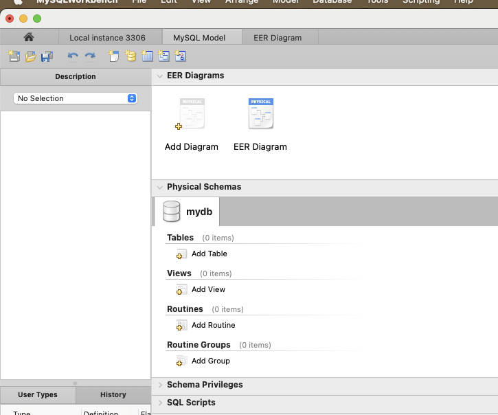

# Cardinality, ER & EER Diagrams 

## Exercise 1: Identify the primary key

- Describe: What is a primary key? What are the characteristics
- What could be the primary key from the following database schemas? If none answer that
  - *person(navn, fødselsdato, addresse, bruger_briller, cpr_nummer)*
  - *bil(farve,stelnummer,nummerplade, mærke, model)*
  - *sang(kunstner, album, længde, danceability, genre)*
  - *film(titel, hovedrolle, genre, årstal, instruktør)*
  - *hvem_står_i_kø(navn, alder, hårfarve, nummer_i_kø)*

## Exercise 2 - in Pairs: ER Diagram

Draw a ER diagram model for a small college with the classes/entities: *Student*, *Instructor*, *Course*, *Project*

You can use an online tool such as: https://app.diagrams.net/

The rules are: 

- All students must be enrolled in at least one course or one project
- An instructor must teach at least one course og supervise at least one project
- A student cannot be working on more than one project (they're too time consuming)
- An instructor can teach any number of courses and supervise any number of projects
- A project or course must have an instructor
- A course must have at least 1 student (or it is cancelled)

## Exercise 3: Cardinality

1. **Describe Cardinality:**

   - What is cardinality in the context of database design?

   - How do different types of cardinality (1:1, 1:N, N:N) affect relationships between entities?

     - What does the tables look like?

       

2. **Identify Relationships and Cardinality:** Consider the following database schema representing a simple book publishing system. Identify the relationships and specify their cardinality between the following entities:

   **Schema:**

   - **Author**: (Author_ID, Name, Date_of_Birth, Nationality)
   - **Book**: (ISBN, Title, Publication_Date, Author_ID, Language, Genre)
   - **Book_Publisher**: (Book_publisher_ID, ISBN, Publisher)
   - **Publisher**: (Publisher_ID, Name, Country, Founded_Year)
   - **Review**: (Review_ID, Score, Comment, Date, ISBN, User_ID)
   - **User**: (User_ID, Username, Email, Country)
   
   ### Questions:
   
   - What is the cardinality between **Author** and **Book**? Can a book have multiple authors? Can an author write more than one book?
   - What is the cardinality between **Book** and **Publisher**? Can a book be published by more than one publisher? Can a publisher publish multiple books?
   - What is the cardinality between **Book** and **Review**? Can a book have multiple reviews? Can a user review multiple books?
   - What is the cardinality between **User** and **Review**? Can a user leave multiple reviews? Can a review belong to more than one user?

## Exercise 4: EER Diagram (Workbench)

**New Model**

**Add Diagram**

**In this case - we are in the process of building an alternative to IMDB**

- We will not be writing the database ourselves, but need to communicate the design to a developer team
- For this we need to take business requirements and create a comprehensive piece of documentation

- A movie has a unique ID, an original title, an English title (translation), a release date, a runtime in minutes, and an optional homepage. Each movie had a certain budget (production cost) and revenue (income yielded so far). Based on the budget, movies are classified as low-, medium- and high-budget productions.

- A movie can be produced in arbitrarily many countries, each being described by an ISO 3166-1 alpha-2 country code, and name. Movies are further described by a list of genres, the language of the original title, and a list of spoken languages. Every language has an ISO 639-1 code, and an endonym (i.e., internal) name.

- The cast of a movie is composed of one or multiple actors, each playing one or multiple roles (characters) in the movie. A single actor might belong to the cast of one or many movies, has a unique ID, a non-unique name, a gender (1 female, 2 male, 3 non-binary), and lives in exactly one country.

- Every movie might receive an unlimited number of user ratings. A single rating of a movie is characterized by a score (scale 0.5-5), a date, and an anonymous user ID. A single rating refers to exactly one movie.

Modified from: https://mboehm7.github.io/teaching/ws2021_dbs/01_ExerciseModeling.pdf

**Create the table from the diagram in workbench by reverse engineering**