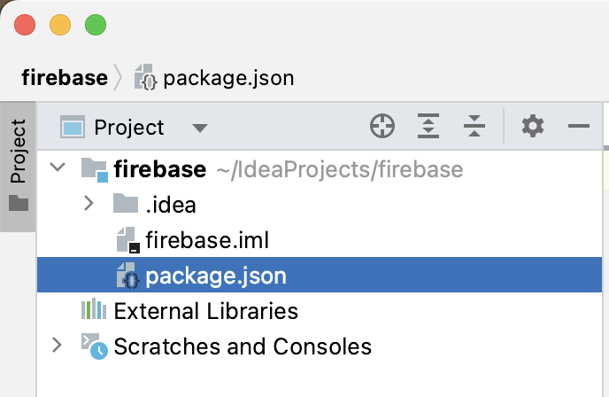
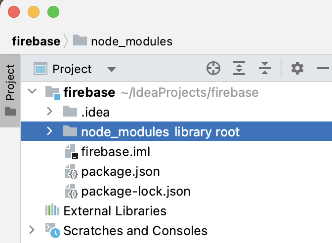
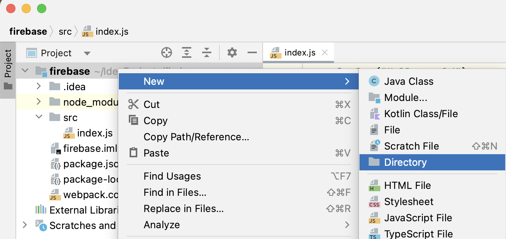
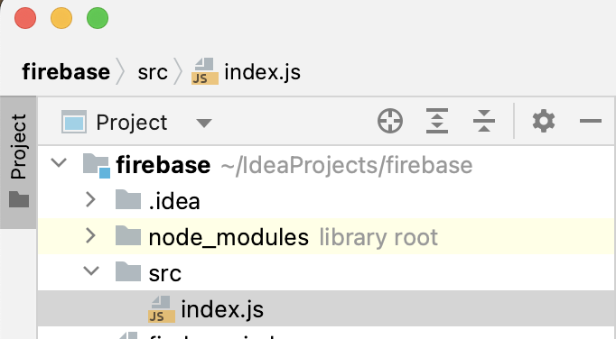
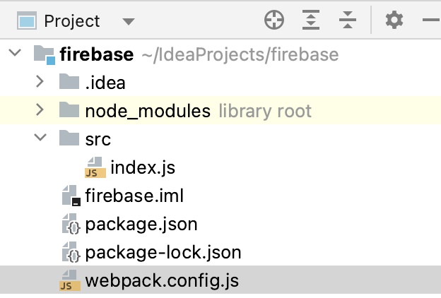

## To create a new project

### Initiate NPM on your current project

```bash
npm init -y
```

Notice that you have a new file in the file-tree: package.json:



```json
//package.json should have content like this
{
  "name": "firebase",
  "version": "1.0.0",
  "description": "",
  "main": "index.js",
  "scripts": {
    "test": "echo \"Error: no test specified\" && exit 1"
  },
  "keywords": [],
  "author": "",
  "license": "ISC"
}

```

### Install webpack in the project

In the Webstorm terminal

```bash
npm install webpack webpack-cli --save-dev
```

Notice that you have a new folder node_modules




### Enforce webpack on NPM BUILD

To accommedate webpacks build step (converting multiple javascript files into a single that can be deployed and run)

1. Create a new directory in the project root called `src`



2. Create a javascript file in the `src`folder called `index.js` such as this:



3. Create a javascript file the project root called `webpack.config.js`

   

4. Insert the following content in  `webpack.config.js`:

   ```javascript
   const path = require('path');
   
   module.exports = {
       entry: './src/index.js',
       output: {
           filename: 'main.js',
           path: path.resolve(__dirname, 'dist'),
       },
   };
   ```

5. Change  `package.json` to the following

```json
{
  "name": "firebase",
  "version": "1.0.0",
  "description": "",
  "main": "src/index.js",
  "scripts": {
    "test": "echo \"Error: no test specified\" && exit 1",
    "build": "webpack"
  },
  "keywords": [],
  "author": "",
  "license": "ISC",
  "devDependencies": {
    "webpack": "^5.88.2",
    "webpack-cli": "^5.1.4"
  }
}
```


## Exercises

The following exercises does not require you to make any styling. 

A simple display on an HTML page using an approach such as the following will do just fine:

```javascript
data = ["bob","alice","karsten"] //This data should be fetched from Cloud Firestore 

data.foreach((e) =>{
  let li = document.createElement('li');
  li.innerText = data[i];
  list.appendChild(li)
});
```

Each exercise-part (a,b,c) should be contained in its own function.


## Exercise 1

In the following dataset:

```javascript
import { collection, doc, setDoc } from "firebase/firestore"; 

const citiesRef = collection(db, "cities");

await setDoc(doc(citiesRef, "SF"), {
    name: "San Francisco", state: "CA", country: "USA",
    capital: false, population: 860000,
    regions: ["west_coast", "norcal"] });
await setDoc(doc(citiesRef, "LA"), {
    name: "Los Angeles", state: "CA", country: "USA",
    capital: false, population: 3900000,
    regions: ["west_coast", "socal"] });
await setDoc(doc(citiesRef, "DC"), {
    name: "Washington, D.C.", state: null, country: "USA",
    capital: true, population: 680000,
    regions: ["east_coast"] });
await setDoc(doc(citiesRef, "NY"), {
    name: "New York", state: "NY", country: "USA",
    capital: false, population: 8668000,
    regions: ["east_coast"] });
await setDoc(doc(citiesRef, "TOK"), {
    name: "Tokyo", state: null, country: "Japan",
    capital: true, population: 9000000,
    regions: ["kanto", "honshu"] });
await setDoc(doc(citiesRef, "BJ"), {
    name: "Beijing", state: null, country: "China",
    capital: true, population: 21500000,
    regions: ["jingjinji", "hebei"] });
await setDoc(doc(citiesRef, "CHI"), {
    name: "Chicago", state: "IL", country: "USA",
    capital: false, population: 2700000,
    regions: ["midwest", "great_lakes"]
});
await setDoc(doc(citiesRef, "LDN"), {
    name: "London", state: null, country: "United Kingdom",
    capital: true, population: 8900000,
    regions: ["england"]
});
await setDoc(doc(citiesRef, "PAR"), {
    name: "Paris", state: null, country: "France",
    capital: true, population: 2200000,
    regions: ["ile_de_france"]
});
await setDoc(doc(citiesRef, "BER"), {
    name: "Berlin", state: null, country: "Germany",
    capital: true, population: 3600000,
    regions: ["berlin_brandenburg"]
});
await setDoc(doc(citiesRef, "SYD"), {
    name: "Sydney", state: "NSW", country: "Australia",
    capital: false, population: 5000000,
    regions: ["new_south_wales"]
});
await setDoc(doc(citiesRef, "MEX"), {
    name: "Mexico City", state: null, country: "Mexico",
    capital: true, population: 9200000,
    regions: ["central_mexico"]
});
await setDoc(doc(citiesRef, "RIO"), {
    name: "Rio de Janeiro", state: null, country: "Brazil",
    capital: false, population: 6800000,
    regions: ["southeast"]
});
await setDoc(doc(citiesRef, "TOR"), {
    name: "Toronto", state: "ON", country: "Canada",
    capital: false, population: 2900000,
    regions: ["ontario"]
});
await setDoc(doc(citiesRef, "MUM"), {
    name: "Mumbai", state: "MH", country: "India",
    capital: false, population: 12400000,
    regions: ["maharashtra"]
});
await setDoc(doc(citiesRef, "SEO"), {
    name: "Seoul", state: null, country: "South Korea",
    capital: true, population: 9800000,
    regions: ["seoul_metropolitan"]
});
await setDoc(doc(citiesRef, "JKT"), {
    name: "Jakarta", state: null, country: "Indonesia",
    capital: true, population: 10900000,
    regions: ["java"]
});
await setDoc(doc(citiesRef, "DEL"), {
    name: "New Delhi", state: null, country: "India",
    capital: true, population: 2800000,
    regions: ["nct_delhi"]
});
await setDoc(doc(citiesRef, "MAD"), {
    name: "Madrid", state: null, country: "Spain",
    capital: true, population: 3200000,
    regions: ["community_of_madrid"]
});
await setDoc(doc(citiesRef, "AMS"), {
    name: "Amsterdam", state: null, country: "Netherlands",
    capital: true, population: 850000,
    regions: ["north_holland"]
});
await setDoc(doc(citiesRef, "ROM"), {
    name: "Rome", state: null, country: "Italy",
    capital: true, population: 2870000,
    regions: ["latium"]
});
await setDoc(doc(citiesRef, "LIS"), {
    name: "Lisbon", state: null, country: "Portugal",
    capital: true, population: 505000,
    regions: ["lisbon_district"]
});
await setDoc(doc(citiesRef, "ATH"), {
    name: "Athens", state: null, country: "Greece",
    capital: true, population: 664000,
    regions: ["attica"]
});
await setDoc(doc(citiesRef, "CAI"), {
    name: "Cairo", state: null, country: "Egypt",
    capital: true, population: 9120000,
    regions: ["cairo_governorate"]
});
await setDoc(doc(citiesRef, "DUB"), {
    name: "Dublin", state: null, country: "Ireland",
    capital: true, population: 554000,
    regions: ["leinster"]
});

```

A) Display a list of names of cities that are **not** capitals.


B) Display a list of names of cities that are either in USA or China

- You might have to use [in/not-in/contains](https://firebase.google.com/docs/firestore/query-data/queries#in_not-in_and_array-contains-any)

  

C) Display the name of the city and the population of the country with the highest population.

- You might have to use [orderby() or limit() function](https://firebase.google.com/docs/firestore/query-data/order-limit-data)

  

D) Display the name of the country with most cities in the list

- You might have to use javascript after querying the collection

  

E) Display a list of names of cities that are capitals with a population higher than 5.000.000

- You might have to create a [compund index](https://firebase.google.com/docs/firestore/query-data/queries#compound_and_queries)

  

E) Write a basic input-field in the HTML page. When the user enters a city name in the field and clicks a button, the application will display an alert with "found" or "not found" if the user has inputted a city name in the database.


## Exercise 2 (Advanced)

- Create a new project
- Insert the following data into a new collection

```javascript
// Product 4
await setDoc(doc(productsRef, "p4"), {
    name: "Smartwatch", category: "Electronics",
    price: 149.99, stock: 80,
    brand: "Apple", rating: 4.6
});

// Product 5
await setDoc(doc(productsRef, "p5"), {
    name: "Digital Camera", category: "Electronics",
    price: 449.99, stock: 30,
    brand: "Canon", rating: 4.4
});

// Product 6
await setDoc(doc(productsRef, "p6"), {
    name: "Coffee Maker", category: "Appliances",
    price: 59.99, stock: 150,
    brand: "Keurig", rating: 4.7
});

// Product 7
await setDoc(doc(productsRef, "p7"), {
    name: "Hiking Backpack", category: "Sports & Outdoors",
    price: 89.99, stock: 60,
    brand: "Osprey", rating: 4.8
});

// Product 8
await setDoc(doc(productsRef, "p8"), {
    name: "Gaming Console", category: "Gaming",
    price: 399.99, stock: 25,
    brand: "Sony", rating: 4.9
});

// Product 9
await setDoc(doc(productsRef, "p9"), {
    name: "Headphones", category: "Electronics",
    price: 129.99, stock: 100,
    brand: "Bose", rating: 4.5
});

// Product 10
await setDoc(doc(productsRef, "p10"), {
    name: "Men's Dress Shirt", category: "Fashion",
    price: 49.99, stock: 120,
    brand: "Calvin Klein", rating: 4.7
});

// Product 11
await setDoc(doc(productsRef, "p11"), {
    name: "Wireless Router", category: "Electronics",
    price: 79.99, stock: 40,
    brand: "Linksys", rating: 4.6
});

// Product 12
await setDoc(doc(productsRef, "p12"), {
    name: "Running Shorts", category: "Sports & Outdoors",
    price: 29.99, stock: 90,
    brand: "Adidas", rating: 4.4
});

// Product 13
await setDoc(doc(productsRef, "p13"), {
    name: "Refrigerator", category: "Appliances",
    price: 799.99, stock: 20,
    brand: "Samsung", rating: 4.8
});

// Product 14
await setDoc(doc(productsRef, "p14"), {
    name: "Smart Home Hub", category: "Electronics",
    price: 99.99, stock: 35,
    brand: "Google", rating: 4.6
});

// Product 15
await setDoc(doc(productsRef, "p15"), {
    name: "Women's Running Shoes", category: "Sports & Outdoors",
    price: 74.99, stock: 70,
    brand: "New Balance", rating: 4.5
});

// Product 16
await setDoc(doc(productsRef, "p16"), {
    name: "Digital Drawing Tablet", category: "Electronics",
    price: 199.99, stock: 15,
    brand: "Wacom", rating: 4.7
});

// Product 17
await setDoc(doc(productsRef, "p17"), {
    name: "Blender", category: "Appliances",
    price: 39.99, stock: 50,
    brand: "Ninja", rating: 4.6
});

// Product 18
await setDoc(doc(productsRef, "p18"), {
    name: "Fitness Tracker", category: "Fitness",
    price: 79.99, stock: 55,
    brand: "Fitbit", rating: 4.8
});

// Product 19
await setDoc(doc(productsRef, "p19"), {
    name: "Men's Sneakers", category: "Fashion",
    price: 69.99, stock: 80,
    brand: "Nike", rating: 4.7
});

// Product 20
await setDoc(doc(productsRef, "p20"), {
    name: "Security Camera System", category: "Electronics",
    price: 299.99, stock: 10,
    brand: "Arlo", rating: 4.5
});

```

- Create a web application such that:
  - A user can enter a product name in a text input field and click a button.
  - The amount of stock of the product will be displayed on the page (styling is not important)
  - The category of the product will be displayed
  - The brand will be displayed
  - If the product is not found - an alert will inform the user