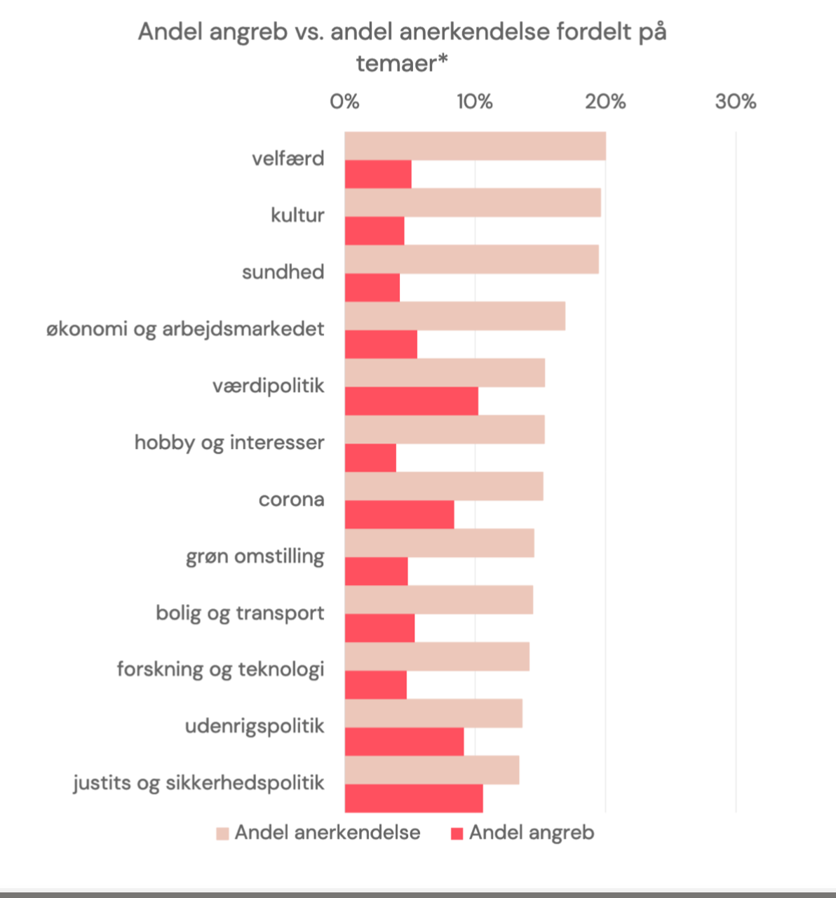
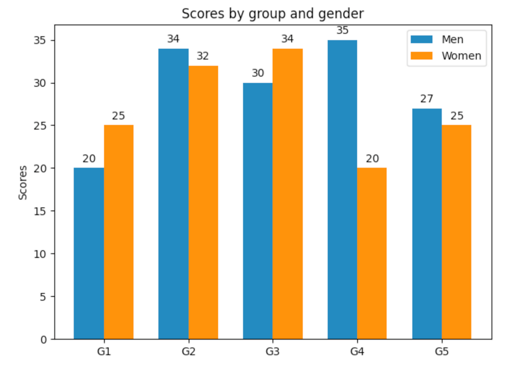
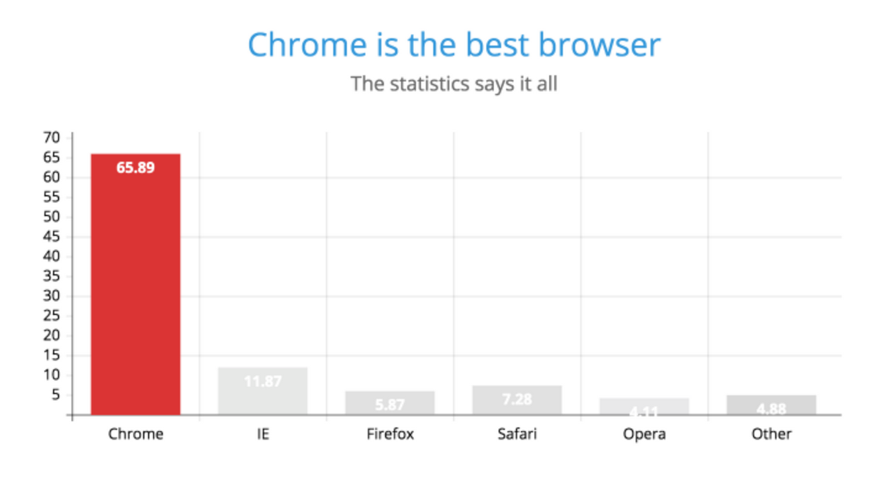
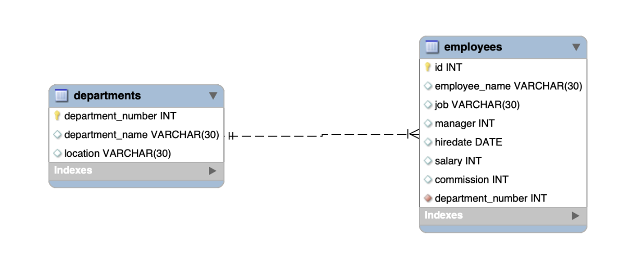
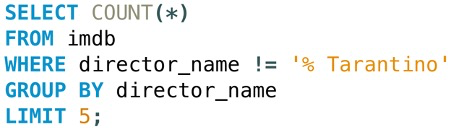

# Exam


- **Two Exams**
  - Dataforståelse & Database Design
  - Web Technology, Data visualisation & Aesthetic, Digital Culture
- **Portfolio projects are used as reference material**
  - Has to be handed in within deadline (closed handin)
- **Both subjects have to be passed!** 
- **Exam format:**
  - 30 minutters eksamen
    - Ca 25 minutters dialog
    - 5 minutters votering
  - *"Portfolio skal fungere som en støtte for den studerende. Det er IKKE et krav at der skal afleveres, men kun såfremt der er afleveret betids kan den studerende anvende materialet som støttemateriale ifbm. eksamen"* 
  - Emnerne er bekendt på forhånd
  - Det emne der bliver trukket tilfældigt er et udgangspunkt for eksamen. 
    - Vi kommer til at stille spørgsmål til andre emner også.
    - Fx hvis man trækker "Creating the right chart" kan vi komme til at stille spørgsmål til fx HTML DOM
  - Der vil være live coding i eksamen ift det emne man trækker
- **Hjælpemidler**
  - Hjælpemidler er tilladt dvs. man må gerne slå op i noter, søge i søgemaskine under eksamen, kigge på gamle opgaver
    - Det er **læringsmål** vi eksaminerer i. Det er ikke et læringsmål at finde information på internettet eller i noter og copy/paste direkte. Derfor kan noter <u>bidrage til løsning af et problem</u>, men bør ikke stå alene. Vi stiller opfølgende spørgsmål til kode skrevet vha. noter

  - Læringsmål:
    - Dataforståelse: [https://katalog.kea.dk/course/4111101/2022-2023](https://katalog.kea.dk/course/4111101/2022-2023)
    - Databasedesign: [https://katalog.kea.dk/course/4111106/2022-2023](https://katalog.kea.dk/course/4111106/2022-2023)
    - Webteknologi: [https://katalog.kea.dk/course/4111102/2022-2023](https://katalog.kea.dk/course/4111102/2022-2023)
    - Visualisering og æstetik: [https://katalog.kea.dk/course/4111105/2022-2023](https://katalog.kea.dk/course/4111105/2022-2023)
    - Digital kultur: [https://katalog.kea.dk/course/4111103/2022-2023](https://katalog.kea.dk/course/4111103/2022-2023)


# Webteknologi og visualiserings eksamen


### Webteknologi Emner

- **Working with the DOM**
  - Html/css 

  - Selecting elements 

  - Inserting elements 

  - Eventlistener 

  - Changing elements
- **Visualisering I javascript** 
  - Fra data til visualisering

  - Chart.js

  - Interaktivitet via DOM

- **Functions in javascript**
  - Arguments, parameters
  - Return value
  - Callback function

- **Asynchronicity**
  - Callback function
  - `fetch`, `setTimeout`, `addEventlistener`

- **Getting data from an API** 
  - Fetch

  - Asynkron kode

  - JSON

  - DOM


#### Eksempler på eksamensspørgsmål

#### Working with the DOM

Create an html page with 2 input fields and a button. The first input should be related to age the other to a name

1. When clicking the button the text `"clicked on button"` should be logged to the console
2. Log out the age and the name of what has been written in the input field
3. If the age is larger than 40 render to the page the string `"You are old"`. If the age is less than 40 render `"You are young"`


#### Visualisering i js

Create a function that when called visualises a line chart with the following data

const ages = [4, 23, 26, 28, 67]; 

1. When clicking a button change the background-color of the page


#### Functions in javascript

1. Create a function called `arrayAdder` that takes two parameters: an array of numbers and a number
2. Add the number to all numbers in the array
3. Return the new array with the added number
4. Render the first element of the array to the page


Here is an example

```javascript
const newAddedArray = arrayAdder([3, 4, 8], 2);
console.log(newAddedArray); // [5, 6, 10]
```


#### Asynchronicity

1. Create a function called `waiter` that takes number of seconds to wait
2. When `waiter` is called it should wait the number of seconds the function is called with and log out `Done with waiting`
3. Instead of logging `Done with waiting` log out `Waited NUMBER_OF_SECONDS` where `NUMBER_OF_SECONDS` is the number the funciton is called with
4. Instead of just calling `waiter` when the script is loaded call the function when a button is clicked


#### Getting data from an API

[https://dog.ceo/dog-api/](https://dog.ceo/dog-api/) is an api related to dogs. Fetch the following endpoint: [https://dog.ceo/dog-api/documentation/](https://dog.ceo/dog-api/documentation/)

1. Describe the data structure
2. Fetch the endpoint and log out the data gotten from the api
3. How many breeds of retriever are there?
4. Render the first breed name to the page


### Visualisering og æstetik Emner

- **Creating the right chart** 
  - Hvem er brugerne og hvad er budskabet? 
  
  - Hvilken graf skal vi vælge?
  
  - Hvordan laver man fouserede grafer?
  
  - Hvordan laver man flotte grafer?
  
- **From data to visualisation**
  - Hvordan kommer man fra data til en visualisering?
  
  - Hvad er processen?
  
- **Story telling and interactive graphs**
  - Hvordan fortæller man en historie med data?

  - Hvordan og hvornår laver man en graf interaktiv?


### Eksempler på eksamensspørgsmål

#### **Creating the right chart** 

Vi har en case hvor vi skal visualisere at folk med mere erfaring tjener mere. Brugerne er folkeskoleelever. Hvordan ville du visualisere det? 

- Hvilken graf 
- Hvordan vil du lave en fokuseret graf? 

  

Er den her graf showing eller telling? Hvad vil afsenderne sige med den her graf? 



Kan du nævne nogle forskellige graf typer og hvornår man bruger dem? 

Hvordan kan vi mislede med grafer? 


Hvilke gastalt love kan du huske? Kan du nævne en gestalt lov der bliver brugt her: 



Hvordan guider vi brugeres opmærksomhed? Og hvorfor? 


#### From data to visualisation

Lad os sige at vi har en sql database der indeholder data relateret til de forskellige sider af en hjemmeside. Det data kunne være

- Antal visinger
- Hvor lang tid brugeren har været siden
- Hvor aktiv på siden han har været

Hvordan kommer vi fra den database over til en visualisering på en hjemmeside?


Lad os sige at vi finder ud at at deres landing page er den side der får færreste visninger. Hvordan ville du lave en grafik der viser det?


#### Story telling and interactive graphs

Hvornår ville du lave en hjemmeside interaktiv? Hvornår ikke? 

Hvorfor gør vi brug af storytelling? Hvorfor kan det være et smart greb? Kan du forklare elementerne i en historie?

Hvad synes du om den her visualisering? Hvilke virkemidler er der blevet brugt her? Hvem tror du brugerne er? 




# Databaser og Databasedesign

- **1. Datatyper & skalaer**
  - DIKW pyramide
  - NOIR
  - Datatyper og operationer

 

- **2. Den relationelle databasemodel** 
  - Rækker, kolonner, tabeller 
  - Primary / Foreign keys 
  - Kardinalitet 
  - Constraints & Keys


- **3. EER & Databasedesign** 
  - Analyse og forklaring af konkret diagram og koncepter herunder 
  - Normalisering
  - Indeksering
  - Views

 

- **4. Data Quality & cleaning** 
  - Data Quality dimensions 

  - Cleaning a dataset 


- **5. Databaseforespørgsler (Queries)** 
  - Analyse og forklaring af konkret kompleks join query 
  - Analyse og forklaring af konkret kompleks aggregate query
  - Analyse og forklaring af konkret kompleks sub-query


- **6. NoSQL & MongoDB**

  - Dokumentorienteret database / NoSQL

  - CRUD i mongoDB

  - Aggregate queries i mongoDB

    

- **7. API & Backend using node.js**

  - API development & MySQL using node.js
  - GET end-point
  - POST end-point
  - Database connection: MySQL & mongoDB


### <u>Eksempler på eksamensspørgsmål:</u>

**Datatyper & Skalaer**

- Beskriv datatyperne i MySQL - Hvorfor er der et behov for flere datatyper
- Give eksempler på og forklar hvilke dataskala data såsom: tid, navn & temperatur ville tilhøre.


**Den relationelle databasemodel**

- Hvad er en foreign key?
- Beskriv følgende diagrams relation og kardinalitet:



- Hvad er årsagen til databaseindeksering? I hvilket tilfælde er det relevant at anvende?

**Data Quality & Cleaning**

- Hvilke parametre har vi arbejdet med i datakvalitet?
- Beskriv semantisk og syntaktisk upræcision


**Databaseforespørgsler (Queries)**

- Analyser følgende query og forklar output:

  


**NoSQL & mongoDB**

- Hvad er forskellen på den relationelle databasemodel og dokumentorienteret databasemodel?
- Dokument-orienterede databaser siges at have en mere fleksibel databasemodel. Hvorfor er den mere fleksibel? Giv et eksempel.


**API & Backend using node.js**

- Beskriv en API's rolle og dets forhold til en klient?

- Beskriv den følgende kode og outputtet til klienten

  ```javascript
  // Sample blog post data (in a real application, this data would come from a database)
  const blogPosts = [
    { id: 1, title: 'First Post', content: 'This is the first blog post.' },
    { id: 2, title: 'Second Post', content: 'This is the second blog post.' },
  ];
  
  // Route to list all blog posts
  app.get('/posts', (req, res) => {
    res.send(blogPosts);
  });
  ```

- Hvis der skulle tilføjes funktionalitet så der kunne tilføjes en blog-post til dataen - hvordan skulle det udføres? 
