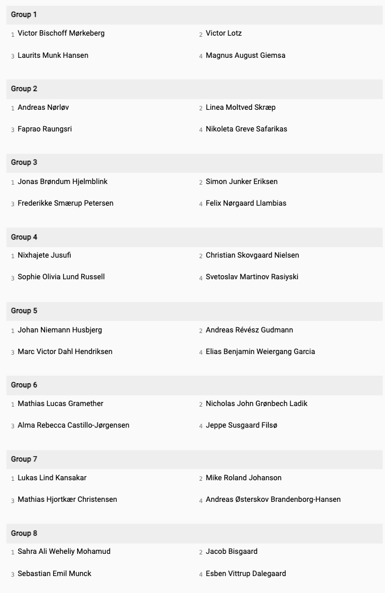

 

**Formål**

Opgaven har til formål at undersøge et fænomen, der udspringer af eller påvirker den digitale kultur gennem internettet. Du skal analysere, hvordan dette fænomen former eller formes af den digitale verden og producere et medieprodukt, der formidler din undersøgelse til et bredere publikum. Derudover skal du udarbejde en rapport, der dokumenterer dit arbejde og redegør for det teoretiske og metodiske grundlag for din undersøgelse.

 

**Fænomenvalg**

Du skal vælge et specifikt fænomen fra den digitale kultur, som kan omfatte (men er ikke begrænset til):

- Sociale medier (f.eks. TikTok, Instagram-fænomen, meme-kultur)
- Digitale trends (f.eks. viral markedsføring, influencer-kultur, cancel culture)
- Virtuelle fællesskaber (f.eks. gaming-kultur, fandoms, online forums)
- Teknologisk udvikling (f.eks. kunstig intelligens, blockchain, big data)
- Online aktivisme eller politik (f.eks. hashtag-aktivisme, fake news)
- Digitale identiteter (f.eks. digitale personas, selviscenesættelse)

 

**Medieprodukt**

Du skal producere et medieprodukt, der præsenterer dit valgte fænomen og din analyse på en engagerende og informativ måde. Dette kan være i form af:

- **En podcast** (fx en dybdegående samtale eller interview om fænomenet)
- **En video** (fx en dokumentarisk præsentation eller et visuelt essay)
- **En artikel** (fx et journalistisk indslag, blogindlæg eller analyse)
- **En anden form** (fx en infografik, webside, interaktiv præsentation)

Dit medieprodukt skal kunne formidles til en bred målgruppe og skal give en klar forståelse af det undersøgte fænomen.

- Medieproduktet skal være tilgængeligt til underviser.

 

**Rapport**

Du skal desuden udarbejde en rapport på ca. 5-10 sider, der ledsager dit medieprodukt. Rapporten skal indeholde følgende:

**1. Problemformulering og fænomenvalg**

- Beskriv det valgte fænomen og hvorfor det er relevant at undersøge i konteksten af digital kultur.
- Udform en problemformulering, der styrer din undersøgelse.

**2. Teoretisk grundlag**

- Forklar, hvilke teorier om digital kultur, medier eller kommunikation, du anvender for at analysere fænomenet.
- Referer til relevante kilder og forskning, der understøtter din analyse.

**3. Metode**

- Redegør for den metode, du har anvendt til at indsamle og analysere data om fænomenet (fx kvalitative interviews, indholdsanalyse, etnografisk observation).
- Beskriv dine overvejelser om datavaliditet og etik i undersøgelsen.

**4. Analyse**

- Udfør en dybdegående analyse af det valgte fænomen med udgangspunkt i din data og det teoretiske grundlag.
- Drøft fænomenets betydning og dets konsekvenser i den digitale verden.

**5. Produktionsproces**

- Beskriv den kreative proces bag dit medieprodukt. Inkluder overvejelser om målgruppe, formidling og valg af medie.

**6. Konklusion**

- Sammenfat dine vigtigste indsigter fra analysen.
- Reflektér over den viden og forståelse, dit produkt formidler til publikum.

**Vurderingskriterier**

- **Relevans og aktualitet** af det valgte fænomen
- **Kvaliteten af medieproduktet**, herunder evnen til at formidle komplekse idéer på en engagerende måde
- **Analysens dybde** og brugen af relevante teorier og metoder
- **Rapportens klarhed** og struktur, samt dens evne til at reflektere over både fænomenet og produktionsprocessen
- **Kreativitet og originalitet** i tilgangen til både undersøgelsen og medieproduktet

 

**Deadline**: Afleveringsfrist for både medieprodukt og rapport: 3/11-2024

 

**Omfang**:

- Medieproduktet skal have en passende varighed eller længde afhængigt af formatet (fx 10-20 minutter for en podcast/video, 1500-2000 ord for en artikel).
- Rapporten skal være mellem 5 og 10 sider.

