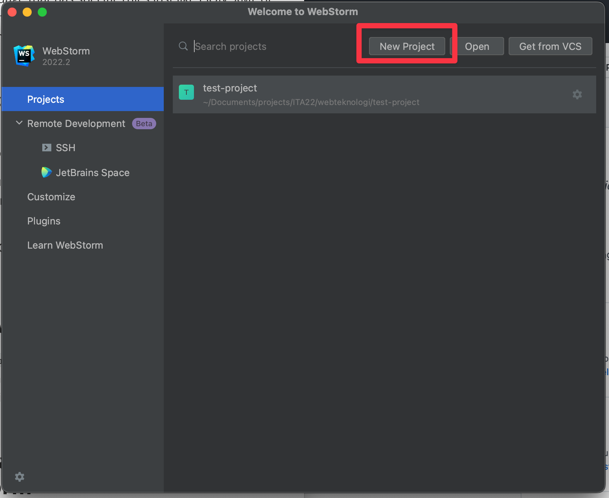
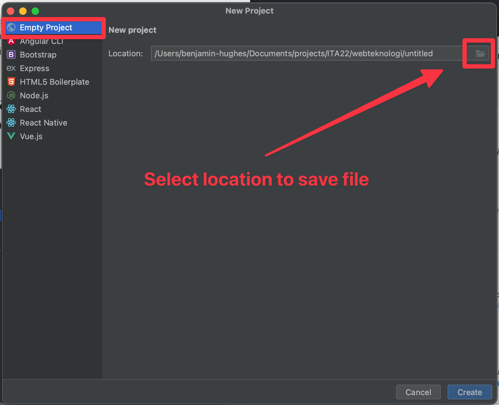
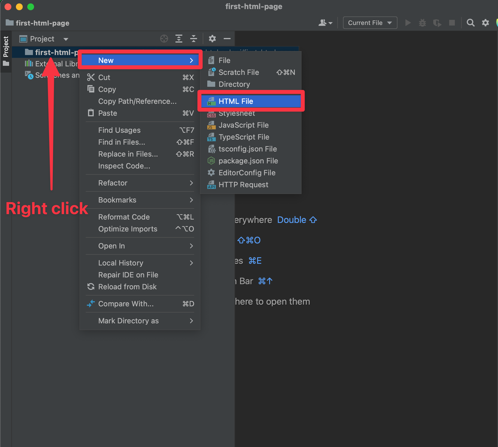
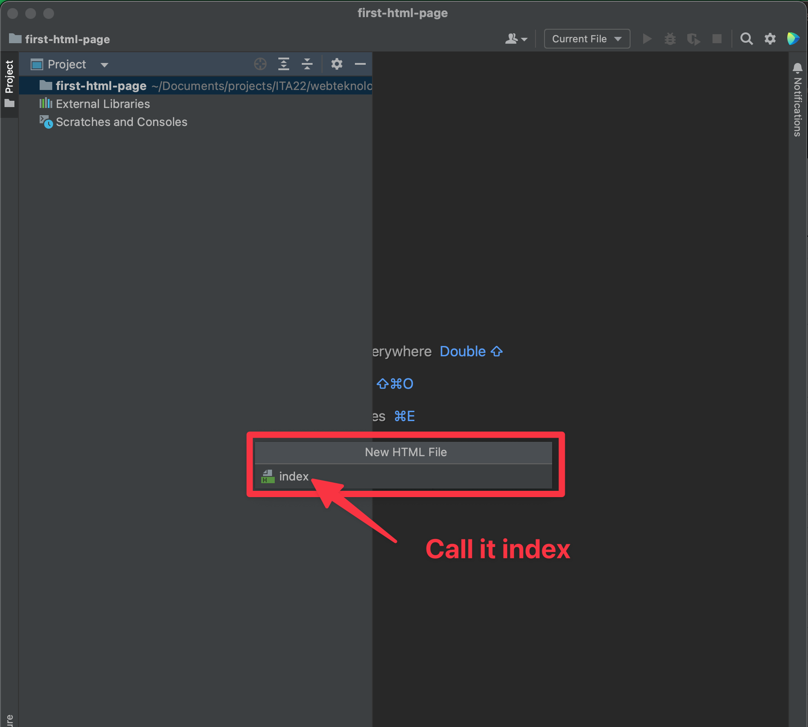
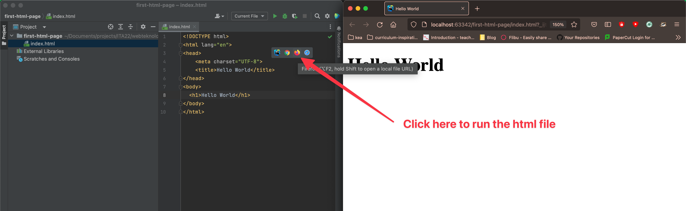

# Html


## Learning goals

- Understand what html is used for
- Create an html page
- Knows how to create a tag and when to use certain tags
- Knows the structure of a html document (`body`, `head`, `header`, `footer`, `section`) etc
- Can identify different visual parts of a website (`section`, `header`, `footer`)


## Flipped classroom videos

- [Introduktion til HTML](https://youtu.be/381xqdUt7WY)
- [HTML tags](https://youtu.be/D9QYg0MTC7g)
- [HTML - En hjemmesides struktur](https://youtu.be/KRSi8j1htnw)


<!--

Hjemmelavet videoer:

- Hvad er HTML?
  - Hypertext markup language - Instruktions manual til browseren om hvilket indhold en side har
    - Hypertext means text displayed on a computer or other digital device that provides links to other text
    - Markup means to mark text as a specific type of text
  - Alle hjemmesider består af HTML
  - Filformat der beskriver indhold
  - En html fil slutter på `.html`
  - Hvordan laver man en html fil?
  - Index.html
  - Tags
- Hvad er tags
  - Forskellige tags forskellige formål
  - Tag navne div, span, li, a, h1
  - Åbne lukke tags
    - Nogle tags lukker selv
  - Attributter
  - Content
  - Element tag and content
  - Indentation
- Structure of a html page
  - html, head, Body, header, footer, main

-->


<!--

## Efter klasse overvejelser

- Hjælp dem med at lave deres første projekt med en ny mappe. Der er mange der bare gemmer direkte i webteknologimappen

-->


## Peer instruction

### Question 1

1 min

What do we use html for?

1. Content
2. Style
3. Interactivity
4. None of the above


### Question 2

2 min

```html
<a class="https://kea.dk" href="kea-link">Keas hjemmeside</a>
```

What will the following code output?

- A link tag that says `Keas hjemmeside` and takes you to `kea-link` 
- A link tag that says `https://kea.dk` and takes you to `Keas hjemmeside`
- A link tag that says `https://kea.dk` and takes you to `https://kea.dk`
- A link tag that says `Keas hjemmeside` and takes you to `https://kea.dk` 


### Question 3

1 min

Consider the following HTML snippet:

```html
<p>This is a <strong>paragraph</p>
```

What is wrong with the above code?

1. The `<p>` tag should not contain any other tags.
2. The `<p>` tag is not properly closed.
3. The `<strong>` tag should be closed before the `</p>` tag.
4. The code is correct; there is no error.


### Question 4

1 min

What is the `<header>` tag used for in HTML?

1. To define the main content of a webpage.
2. To contain logo or navigation links.
3. To define the footer of a webpage.
4. To style the text with larger fonts.
5. Contains elements relevant for the `head` tag


## Why are we even talking about html?

Html and css is 2 or 3 building blocks of all websites which are html, css and javascript. 

- HTML is structure and content
- CSS is styling
- JS is interactivity

it is hugely important and writing good html can save a company millions! 


## What is HTML?

HTML stands for Hypertext Markup Language. **Hypertext** is text displayed on a display. **Markup language** is a computer language that  uses tags to define elements. You could say that html is a language that has specific rules just like JSON, XML or a Java file, that uses tags to define individual elements like the header tag, link tag or others.


## How to create an html file

Simply create a new file with the file ending `.html` fx `index.html` or `about.html`

In this file you can write html. To open the rendered html file, open the file in a browser (usually you can just double click the file)

*Teacher note*: Create a simple html file and add some simple tags


### Whats up with the index.html file??

The `index.html` file has always been used as the default html page. So usually when navigating to a websites main page. The `index.html` file will be served.


## Create a new HTML project in Webstorm

1. Create a new project




2. Select what folder to save project in (remember to create the folder where the project can be saved)




3. Create a new HTML file




4. Call the file `index`




5. Open the `index.html` file hover in the file and click the browser you would like to run the html file in. To write some html starter, simply write `html:`and then autocomplete with the first option.



6. Celebrate, you have created your first html page 🎉


### 📝 Exercise 1 - 15 min - individually

Create an `html` file with a specific `title` and the following tags. Write whatever inside the tags

- `h1`
- `h2`
- `div`
- `footer`
- Some tag inside another tag


## HTML Tags

To open a tag, you you write this: `<p>` where `p` is the tag name. To close the `p` tag write this `</p>`. What you write inbetween is the content of the tag. `<p>this is the content of the p tag</p>`

There are a few tags that are **self closing** like fx a line break tag: `<br/>` or an image tag ``


There are lots of different html tags! Here are a few:

- `h1` defines a header tag - `<h1>Buy okay products</h1>`
- `a` defines a link tag - `<a href="www.telmore.dk">Go to Telmore website</a>`
- `footer` defines a footer element - `<footer>Adress: copenhagen street 1, 2300 Copenhagen</footer>`

Find more tags by googling somthing like `html tags`. This site i can generally recommend: [https://developer.mozilla.org/en-US/docs/Web/HTML/Element](https://developer.mozilla.org/en-US/docs/Web/HTML/Element )


### HTML elements

An html element is the tag together with the content. So fx `<p></p>` is just the `p` tag. `<p>This is the content</p>` this would be a `p` html element.


### Naming HTML elements

Why should we even name our html elements? Mostly it's for targeting when writing css and javascript. So fx if we wanted to change the text color of a `h2` tag. Then we would need to tell for what tag the text color should be changed. The same with js, if we wanted to change the text of an h2 we would need to select that element first. Here namin is super useful!

There are 2 main ways of naming:

1. **Class** - `<p class="user-name">Pernille Høegh</p>`
   - The same class can be used for multiple elements
   - You can use multiple classes on a single element
2. **Id** - `<p id="user-name">Pernille Høegh</p>`
   - Id's should be used for unique elements
   - The same id should not be used for an element
   - `id`'s should be very rarely used! 


Use hyphen between names ([https://google.github.io/styleguide/htmlcssguide.html#ID_and_Class_Name_Delimiters](https://google.github.io/styleguide/htmlcssguide.html#ID_and_Class_Name_Delimiters)) and always lowercase! So not `UserName` but `user-name`, `productList` to `product-list`


## HTML attributes

HTML attributes is used for adding information to a tag. There are **tons** of html attributes. I will give a few examples:

`<a href="www.telmore.dk">Go to Telmore website</a>` - `href` is an attribute that decides what link to go to when the link is clicked.

`<div class="user-name">Benjamin Hughes</div>` - `class` is the attribute defining an identifier for an element.


### 📝 Exercise 2 - 20 min

In pairs investigate a specific tag. Investigate these things:

1. What the tag does
2. When to use it
3. How it can be used using a practical code example


I will pick one or two groups to present for the class


Here are the tags

- `header`

- `ul` and `ol`
- `img`
- `section`
- `head`
- `nav`
- `a`


## HTML document structure

An html document is divided into different parts:

```html
<html>
    <!-- inside of the html tag is where all your html will go -->
    <head>
        <!-- This is where you put meta information about the page: favicon, title, social media tags etc -->
    </head>
    <body>
        <!-- In the body is where you put the content of your website -->
        <main>
            <header>
                <!-- In the header you have things like the logo and navigation-->
              	<nav>
                  <ul>
                    <li><a href="/">Ebai</a></li>
                    <li><a href="#products">Products</a></li>
                  </ul>
              	</nav>
            </header>
            <section class="intro">
                <h1>Welcome to our wonderful site</h1>
            </section>
            <section id="products" class="products">
                <ul>
                    <li>Tv</li>
                    <li>Mobile</li>
                    <li>Washing machine</li>
                </ul>
            </section>
        </main>
        <footer>
            <!-- In the footer you have things like contact information, links, address-->
        </footer>
    </body>
</html>
```


An example of some sections on a page


### 📝 Exercise 3 - 15 min

In groups

Go to [https://threejs-journey.com](https://threejs-journey.com/) and identify the different sections of the page. Inspect elements in the browser to see the tags

Write down 4 examples of how different tags were used


## How to write good html

- Write semantic html. Try and really think about what tag you are using
- Give good class or id names to the element where naming makes sense


### 📝 Exercise 4 - individually

Duration: Rest of the time

Lets create a portfolio! I would encourage you to use this portfolio as your actual portfolio that you can show interested employeers.

You are more than welcome to add css but please focus on writing good clean html! Think about what tags you use

Tomorrow we will be working with styling your portfolio 👏

I want **at least** these tags in the portfolio! 

- `head`
  - `title`
- `header`
  - `nav`
- `main`
- `section`
- `footer`
- `img`
- `ul` or `ol`


Content:

- Introduction that describes yourself
- List of educations
- List of jobs
- A footer with contact information
- Some extra information


Here are some amazing examples of portfolios you can get inspired from

- [https://benna100.github.io/portfolio/](https://benna100.github.io/portfolio/) 😆
- [https://marcodecara.com](https://marcodecara.com)
- [https://ejosue.com/](https://ejosue.com/)
- [https://kyleledbetter.com/](https://kyleledbetter.com/)
- [https://bruno-simon.com/](https://bruno-simon.com/)


To check the html of some website. Right click on the mouse and go to `inspect elements`. On safari you need to enable it. Google something like `safari inspect elements`.  


## HTML checklist

Try use this checklist for writing good html!

- [ ] Are the class names and id’s semantic and do they describe the content of the tag?
- [ ] Has id’s and class names been used correctly.
- [ ] Has the correct tag been used. Fx is main, header, footer, section, nav used properly.
- [ ] Is the html correctly implemented. 
- [ ] Are there unnecessary wrappers?
- [ ] Has kebab-case been used? `product-list`
- [ ] Has alt attributes been written for `img` tags?


### If you want to continue your learning

- Aria

