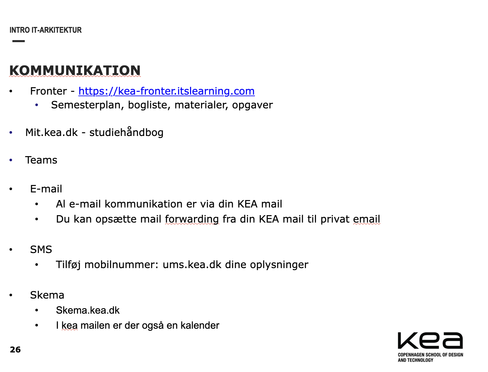
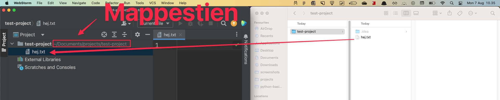
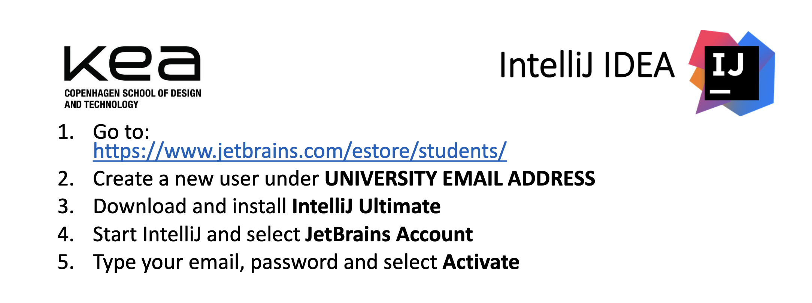

# Kend din computer


## Learning goals

- Forstå filsystemet
  - Filnavne og mapper
  - Filendelser
  - Stifinder/finder
  - Projekter
  - Vi skal lave en mappe struktur!
- Kend dit tastatur
- Genveje
- Installering af værktøjer
  - Webstorm
  - Microsoft applikationer
  - Mysql
- KEA technicalities
  - 


## Webtechnology

- [Studiekort](https://keastudiekort.dk/)
- Where does webtechnology fit in
- Stejl læringskurve. Hæng i!
- Starter med html og css derefter programmering i js
  - HTML - indhold
  - CSS - styling
  - Git
  - Javascript basics
  - Generative AI
  - Javascript - DOM interaktivitet
  - Visualisering
- Der er en test d. 28/10
- Studenterprojekter
  - [https://arnefogh.github.io/boliusProjektTjekRisikoVedBolig/](https://arnefogh.github.io/boliusProjektTjekRisikoVedBolig/)
- Det er ufatteligt vigtigt at i forbereder jer og at i skriver kode
  - Man kan ikke læse om at køre på cykel. Man skal køre på den for at lære. Det er det samme med programmering
- Løs opgaverne en af gangen. Hvis i har svært ved en opgave. Spørg endelig eller kig i gitbooken


## Filsystemet

Program til at navigere rundt i filer og mapper

Mac: Finder

Windows: Stifinder


### Mapperne på en standard computer

Gå til hvor i kan se jeres harddiske

Mac åbn Finder og klik `cmd` + `shift` + `G` og vælg `Macintosh HD`

Windows klik på Din computer


Root directory

- Gå til hoved harddisken på din computer (typisk C:)

  - Users - Data for the users on that machine
    - Desktop - files on the desktop (sometimes they are stored on your cloud storage)
    - Documents - Where documents should be stored
    - Downloads -  Downloaded files

  - Application (Mac)/Program files (windows) - All application data 


Vis de forskellige mappe visninger der findes


I skal tænke over hvor i vil gemme filerne der har noget med KEA at gøre. 


### Mapper

Inddeling af filer og mapper. En mappe har altid en sti der viser hvor på computeren den mappe ligger. Den sti er vigtig!

Kan fx se sådan her ud: `/Users/benjamin-hughes/Documents/noter`


### Filer

Filer indeholder noget data. Der findes mange forskellige slags filer. De forskellige slags filer har typisk en forskellig endelse

- `.txt` - Et tekst dokument
- `.docx` - Et word dokument
- `.xlxs` - Et excel ark
- Osv


### Skjulte filer og mapper

Der findes skjulte filer og mapper. Dem kan man vise ved på mac at taste `cmd` + `shift` + `.` og på windows kan vi google :) 


### Projekt i Webstorm

Et projekt i Webstorm er en folder på computeren. 

Når man laver et nyt projekt laver den en skjult mappe der hedder `.idea`. Her gemmer den konfigurations filer mht. projektet. 

Hvis en fil bliver slettet på computeren bliver den også slettet i projektet! Hvis en fil bliver slettet i projektet, bliver den også slettet på computeren!

Sørg for altid at have en ide om hvor dit projekt ligger på din computer!





### 📝 Exercise 1 - KEA folder structure

Please create the following structure in a folder on your computer. Do not put the folder in a dropbox/google drive/one drive/iCloud folder! These folders are primarely for code!


KEA - kode

- IT-Arkitektur
  - 1. semester
       - Webteknologi
       - Dataforståelse
       - Databasedesign
       - Visualisering
       - Digital kultur
       - Tværfaglige projekter
  - 2. semester
  - 3. semester
  - 4. semester


Du kan også lave samme mappe til dine dokumenter på dit online drive. Det må du selv om

KEA - dokumenter

- IT-Arkitektur
  - 1. semester
       - Webteknologi
       - Dataforståelse
       - Databasedesign
       - Visualisering
       - Digital kultur
       - Tværfaglige projekter
  - 2. semester
  - 3. semester
  - 4. semester


**Remember where you save the KEA folder!** We will be using that throughout the semester so please write it down somewhere you can remember!!


## Kend dit tastatur ⌨️


### 📝 Exercise 2 - Hvad hedder tasten

Sammen med sidemanden skriv ned hvad tasterne hedder i det her [dokument](https://kea-fronter.itslearning.com/LearningToolElement/ViewLearningToolElement.aspx?LearningToolElementId=1293618)


### 📝 Exercise 3 - Lær at skrive mærkelige tegn

Løs [den her opgave](https://typing.io/lesson/javascript/jquery/traversing.js/1) ved hjælp af [hvordan skriver man mærkelige tegn](../typing-characters-keyboard.md)


## Shortcuts

- `ctrl` + `A` - Marker alt
- `ctrl` + `S` - Gem
- `ctrl` + `V` - Paste
- holde ctrl nede og piltaster
- `ctrl` + `cmd` + `mellemrum` Emoji genvej
- `ctrl` + `z`- Gå tilbage i historik
- Nogle andre relevante?
- [https://resources.jetbrains.com/storage/products/webstorm/docs/WebStorm_ReferenceCard.pdf](https://resources.jetbrains.com/storage/products/webstorm/docs/WebStorm_ReferenceCard.pdf)


Det ultimative mål er ikke at bruge musen 😱


## Installering

- [Webstorm](https://www.jetbrains.com/webstorm/)
- Auto increment: preferences -> Tools -> Actions on save -> Reformat code
  
- Lav meget simpel hjemmeside


- 


**DENNE INSTRUKTIONSSLIDE ER TIL INTELLIJ I SKAL DOWNLOADE WEBSTORM - SAMME PROCESS**


```html
<!doctype html>
<html lang="en">
<head>
    <meta charset="UTF-8">
    <meta name="viewport"
          content="width=device-width, user-scalable=no, initial-scale=1.0, maximum-scale=1.0, minimum-scale=1.0">
    <title>First html page!</title>
</head>
<body>
    <main>
        <h1>First html page!</h1>
    </main>
</body>
</html>
```

- **For installering:**
  - Først ind på [jetbrains.com/estore/students](https://www.jetbrains.com/shop/eform/students) og signe up. Brug jeres kea mail!
  - I får så en mail hvor i skal oprette en ny IntelliJ konto. Der skal i bruge den samme mail. Så skulle i gerne kunne logge ind med jeres IntelliJ konto
  - 
- [Microsoft package](https://www.office.com/)
  - Teams
    - Check class room
- Opret [https://github.com/](https://github.com/) bruger. Brug jeres personlige mail!


## KEA Technicalities

Lad os sætte email forwarding og sms op til jer


## Links

- [Github Student](https://education.github.com/pack)
- [https://www.lofi.cafe/](https://www.lofi.cafe/)
- [Tænk i Tech Youtube kanal](https://www.youtube.com/c/T%C3%A6nkiTech)
