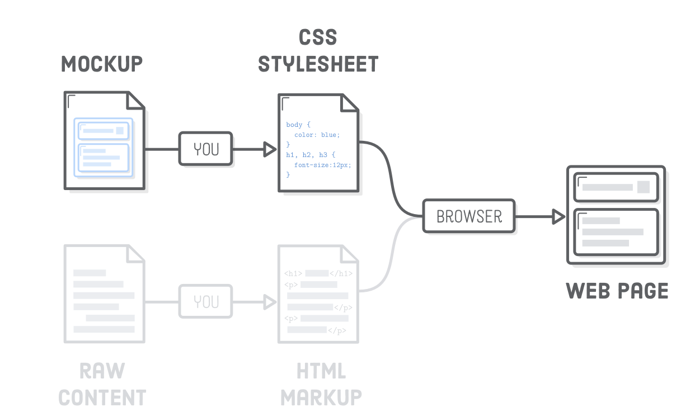
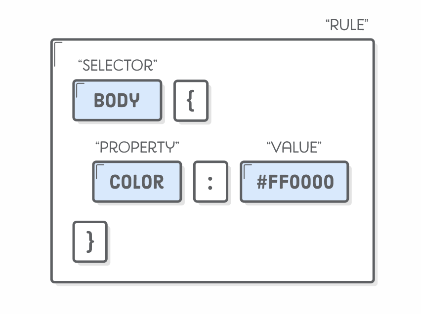
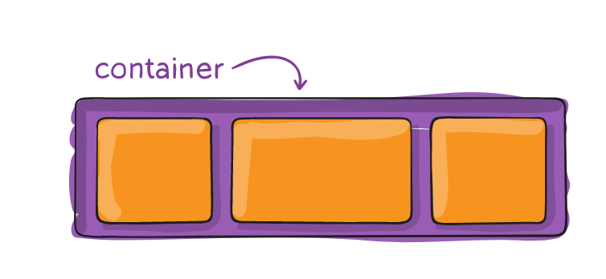
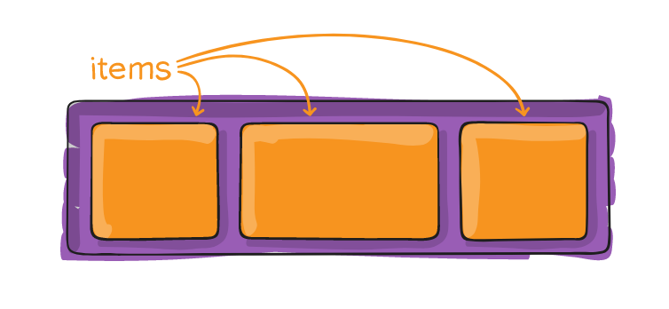
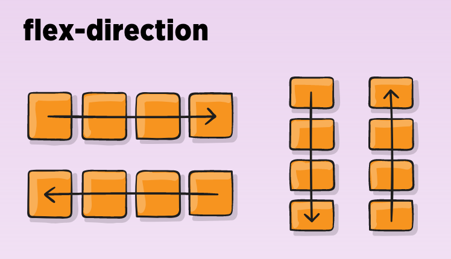
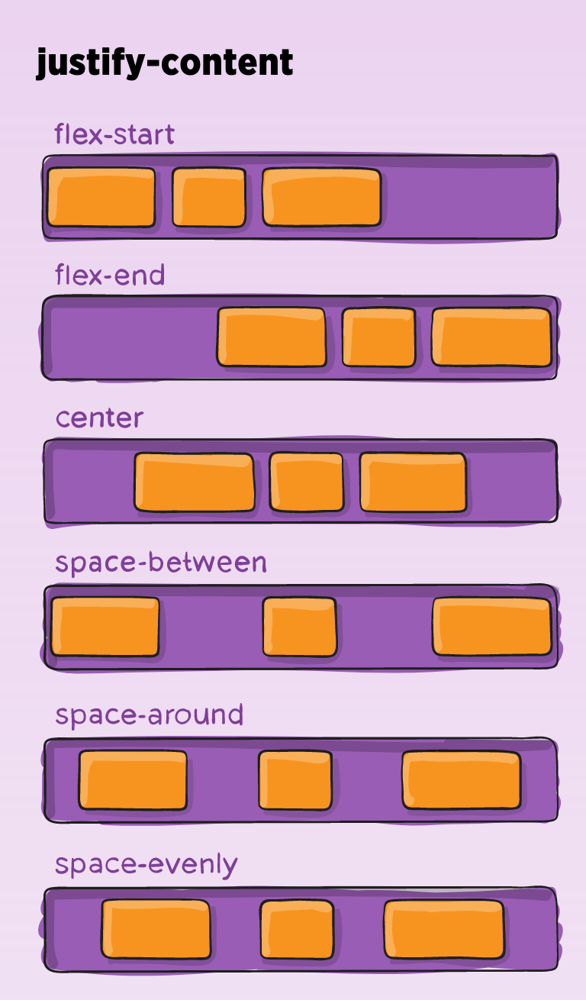
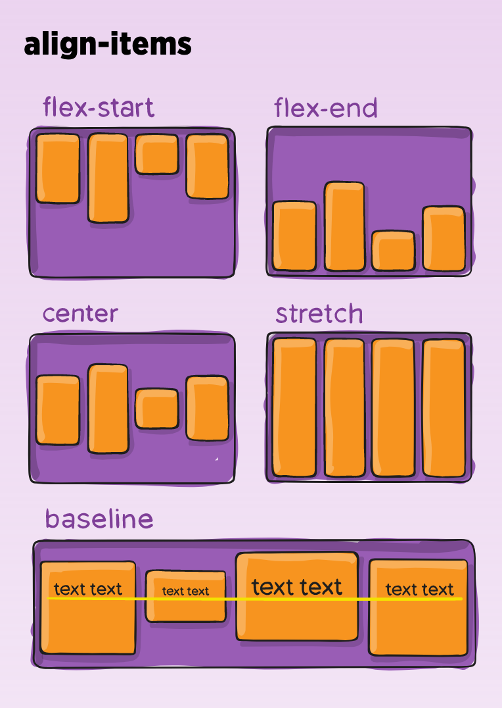
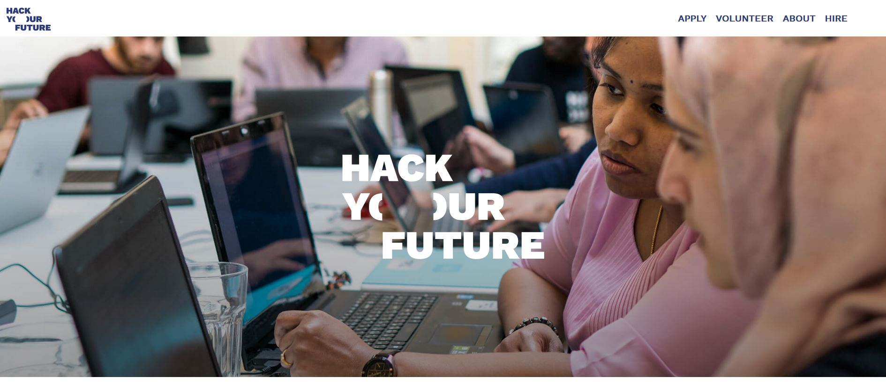
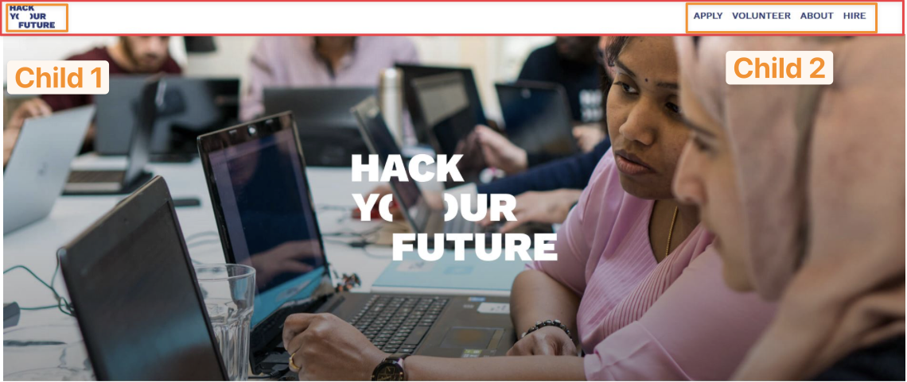
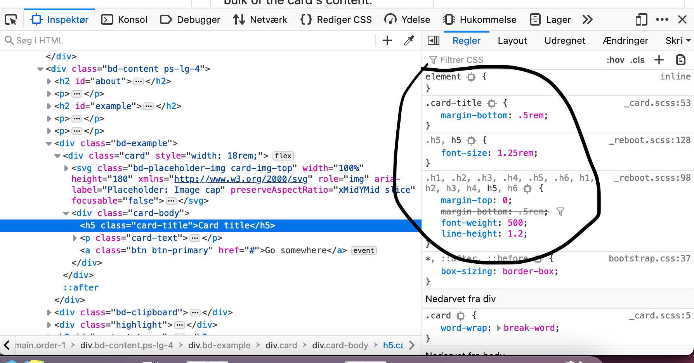

# CSS


## Learning goals

- Adding css to a site
- CSS selectors, properties and values
- CSS layout
  - Flexbox


## Flipped classroom videos

- [Hvad er CSS](https://youtu.be/FbXyzlimByY)
- [CSS selectors and properties](https://youtu.be/cxaddpC8Bb8)
- [Learn Flexbox CSS in 8 minutes](https://www.youtube.com/watch?v=phWxA89Dy94)


<!--

Hjemmelavet videoer

- What is css
  - CSS - stands for cascading style sheets
  - A way to style a page
    - Color
    - Layout
    - Font size
    - Animations
    - Spacing
  - How to add css to a site
  - Remove all css from site
  - document.querySelectorAll('[style]')
      .forEach(el => el.removeAttribute('style')); 
    document.querySelectorAll('link[rel="stylesheet"]')
      .forEach(el => el.parentNode.removeChild(el)); 
    document.querySelectorAll('style')
      .forEach(el => el.parentNode.removeChild(el));
- CSS selectors and properties
  - Css selector
    - Class, id, tag
    - More advanced:
      - Descendant selector
      - And selector
      - N-th-child
      - *
      - Hover
  - Propertiesx
    - Width
    - Margin, padding
    - Background-color
    - Font-size
    - Many more
- Layout
  - Flexbox kan måske godt bruge flex videoen!?

-->


## Teacher instrcution

- Har i lavet studiekort? Videresendelse af email?
- Der er kommet eksamensdatoer: 
  - Eksamen 1: 6/1, 7/1 og 8/1 
  - Eksamen 2: 13/1, 14/1 og 15/1
- Vi kører et mix af opgaver i par og alene idag
- Nogle spørgsmål til videoerne?
- Parent child relationship
- Remember to deconstruct layout


<!--

## Efter klasse overvejelser

- Parent-child er faktiks vigtigt
- Jeg lavede en impromptu flex + box model undervisning. Det var ikke særlig skarpt
- De lærte sygt meget om flex via hyf opgaven der tog sygt lang tid for dem. Men virkelig god
- Den flex opgave kan godt stilladseres meget mere. Måske skriver jeg punkterne ned de skal igennem for at få layoutet. Virkelig holder dem i hånden. Bare får det ind i fingrene

-->


## Peer instruction


### Question 1

What does the following css do?

```css
#user-name {
    font-size: 2px;
}
```

1. The element with class  `user-name` gets the font-size to 2 pixel
2. The element with id  `user-name` gets the font-size to 2 pixel
3. The element with tag name  `user-name` gets the font-size to 2 pixel
4. Syntax error


### Question 2

What does the following css do?

```css
.user-name:hover {
    color: purple;
}
```

1. When an element with class name `user-name` is hovered. It colors the background purple
2. When an element with the id of `user-name` is hovered. It colors the background purple
3. When an element with class name `user-name` is hovered. It colors the text purple
4. When an element with the id of `user-name` is hovered. It colors the text purple
5. Syntax error


## What is css?

CSS stands for cascading style sheets.  It means the styles that are added for an element cascades down to their children. Its like a waterfall where the water will continue cascading down affecting the pools below. 

Lets see a concrete example of that! 





## Adding css to your site

Create a css file. Fx `main.css`. To add the css to your html, add this line in the `head` of your html: `<link rel="stylesheet" href="main.css">`. Now the css file called `main.css` is connected to the html. 

```html
<head>
  <link rel="stylesheet" href="main.css">
</head>
```


## CSS selectors and properties

CSS has three parts:

1. The selector - specifies what html elements to style
2. The property - specifies what sproperty we are changing (`color`, `width`, `font-size`)
3. Value - The value of the property. `20px`, `red` etc.



It goes kind of like this: First we find the elements to style (the selector) then we tell how those selected elements should be be styled. Here is an example:

```css
h1 {
    color: red;
}
```

 This reads like this: Select the `h1` html element. Now color the text red.

Lets go into more css selector details:


### CSS selector

[This site](https://fffuel.co/css-selectors/) visualizes the selector quite nicely

#### Tag selector

Select all elements based on their tag name. Simply write the tag name 


This selector

```css
h1 {
    color: red;
}
```

Would color the text `Hello` red  `<h1>Hello</h1>`

```css
li {
    background-color: yellow;
}
```

Would give the `li` a yellow background color  `<li>List item</li>`


#### Id selector

For id selectors use `#`

```css
#congratulation-message {
    background-color: red;
}
```

Will select an element like this:

`<div id="congratulation-message">Congratulations 🎉</div>`


#### Class selector

For class selectors use `.`

```css
.user-name {
    font-weight: bold;
}
```

Will select an element like this:

`<div class="user-name">Charlotte123</div>`


#### Descendant selector

You can make the selectors more specific by using the descendant selector:

```css
.intro h1 {
    font-size: 25px;
}
```

Style all `h1` elements that are descendants of the element with class name intro

```html
<section class="intro">
    <h1>Welcome to our wonderful site</h1>
</section>
```

You can also formulate it differently:

First find all the elements with a class of intro. Then find all the h1 tags that is descendants of the element with class intro. 


#### And selector

Use the comma

```css
section.intro, h1 {
    font-size: 25px;
}
```

Now you would give the section with class name intro **and** the `h1` a font size of 25 pixel. 


#### Pseudo selector

use the `:`

```css
.user-name:hover {
    color: purple;
}
```

Give the element with class user-name a color of purple when hovered with the mouse


There are **a lot** more but these are the most important ones. You can find more here: [https://developer.mozilla.org/en-US/docs/Web/CSS/Reference#selectors](https://developer.mozilla.org/en-US/docs/Web/CSS/Reference#selectors)


## CSS properties

[https://developer.mozilla.org/en-US/docs/Web/CSS/Reference](https://developer.mozilla.org/en-US/docs/Web/CSS/Reference)

A property in css is the styling you want to apply to an element. You write a property with the property name then `:` and then the value.


### 📝 Exercise 1

Duration: 45 min

Do it as pair programming exercise. One drives, one supports. 

Copy the html below into Webstorm


Now apply the following styles 👇

1. Give the button with the text `Signup` a `green` background color

2. Give the button with the text `Signup` a `white` text color

3. Give the button with the text `Contace me` a red background color
4. Give the `section` with the id `education` a bottom margin of 24 pixel
5. All buttons in the page should have a padding of `12px` and rounded corners
6. When hovering the `h1` tag make the text larger
7. Color the `p` tag with the text ` Here are my different educations` pink
8. Give the `li` element with the text `Birkerød Gymnasium` a blue background color
9. Add a `box-shadow` to all `button` elements to give them a subtle raised appearance

*Remember to [add](#adding-css-to-your-site) the*  `main.css` *file*. Do not change the html!

```html
<html>
	<head>
		<link rel="stylesheet" href="main.css">
	</head>
  <body>
		<main>
			<section class="intro">
				<h1>Welcome to my site</h1>
        <p>
          I hope you like it
        </p>
				<button class="call-to-action">Contact me</button>
				<a href="education">See my educations</a>
			</section>
      <section id="education">
				<p>
          Here are my different educations
        </p>
        <ul>
          <li>Birkerød Folkeskole</li>
          <li>Birkerød Gymnasium</li>
          <li>KEA</li>
        </ul>
			</section>
      <footer>
      	<button>
          Signup
        </button>
      </footer>
		</main>
	</body>
</html>
```


## CSS layout

CSS layouting is hard!

CSS layouting decides how elements are layouts. What comes on top/to the left of what. 


### Flow

CSS flow decides how  elements are layed out. The flow can be changed with the `display` css property *show*. 


#### Block flow

Elements that have block flow are stacked on top of each other. 

These elements are fx `div`, `p`, `section`, `footer`

*Teacher note:* Show with example


#### Inline flow

Elements that have inline flow are positioned next to each other. 

That if fx `span`, `a`, `strong`

*Teacher note:* Show with example


### Positioning - not part of learning goals!

#### Relative

Position an element **relative** to its original position. 

```css
section .user-name {
    display: relative;
    left: 10px;
}
```


#### Absolute

Position an element in relation to the first parent that has a position set as a property. Text on top of and in the middle of an image. 

```css
section .user-name {
    display: absolute;
    left: 10px;
}
```


#### Fixed

A fixed element always appear at the same place on the screen no matter of someone scrolls! Imagine a cookie accept box. 

```css
section .user-name {
    display: fixed;
    left: 10px;
}
```


### Flex

Flex is a relative new way of layouting things in the browser. 

[https://codingfantasy.com/games/flexboxadventure](https://codingfantasy.com/games/flexboxadventure)


## Let's get started!

We will be using this html

```html
<div class="flex-container">
    <div class="flex-item">Flex item 1</div>
    <div class="flex-item">Flex item 2</div>
    <div class="flex-item">Flex item 3</div>
    <div class="flex-item">Flex item 4</div>
    <div class="flex-item">Flex item 5</div>
</div>
```


#### Flex container

Is where the `display: flex;` rule is applied. In our example it is the div with the class `flex-container`. 




### Flex items

When `display: flex;` is applied to the container all the **immediate children** will be the flex items. In our example that is the div's with the class of `flex-item`



When applying `display:flex;` the default direction of the flex items is row, meaning they will be positioned next to each other. 

### Flex-direction

The `flex-direction` desides in what direction the items will align. This rule is applied to the container

- `flex-direction: row;` the items will align from left to right (next to each other)
- `flex-direction: reverse-row;`  the items will align from left to right but in the reverse order
- `flex-direction: column;` the items will align from top to bottom (on top of each other)
- `flex-direction: reverse-column;` the items will align from top to bottom but in the reverse order




### Justify content

Decides the spacing between the items **in the direction of the flex-direction**. This rule is applied to the container

An example is: `justify-content: space-between;`




### Align items

Decides the spacing between the items **in the opposite direction of the flex-direction**. This rule is applied to the container

`align-items: center;`




Now try and play around with `flex-direction` and with `justify-content` and `align-items`

[https://marina-ferreira.github.io/tutorials/css/flexbox/](https://marina-ferreira.github.io/tutorials/css/flexbox/)

[https://css-tricks.com/snippets/css/a-guide-to-flexbox/](https://css-tricks.com/snippets/css/a-guide-to-flexbox/)


## How to deconstruct a layout class presentation

What website should i deconstruct? 


### 📝 Exercise 2

Duration: 45 min

Alone or in pairs

Try and recreate the layout below with the code found [here](https://github.com/behu-kea/dat20-classes/tree/master/HTML:CSS/exercises/flexbox). Think in Flexbox!

You can clone the project and open the files in Webstorm or just copy the files to your computer. Thats up to you. 

*Hint: for getting the white HackYourFuture logo in the middle of the background image. Look into position: absolute*



I see the layout kind of like this:




## Working with the inspector

You can see the css for any element on the web. Right click on the element and choose inspect element. 

on the right hand side you can see the styles applied to the element you have inspected. In the `element` panel you can write your own css rules!




### 📝 Exercise 3 - Portfolio

Duration: rest of class. Alone

Style your portfolio 🎉

We want to see you doing some css on your portfolio. That means both layouting and colors, spaces, margins etc.

Find cool colors [here](https://fffuel.co/hhhue). Find great webdev ressources [here](https://cccreate.co/). Color patterns website: [https://realtimecolors.com/](https://realtimecolors.com/)


#### CSS checklist

- [ ] Is the css imported using the style tag.
- [ ] Are there unused selectors.
- [ ] Are there lots of fixed pixel values. This could affect responsive layouts.
- [ ] Try to avoid absolute positioning as this tends to break responsive layouts.
- [ ] Use flexbox over floats.
- [ ] Avoid using `!important` statements.
- [ ] Avoid inline styles
- [ ] Consistent naming and grouping of css-classes (see naming conventions below)
- [ ] CSS selectors are only as specific as they need to be


## If you want to continue learning css

- A css selector game [https://flukeout.github.io/](https://flukeout.github.io/)

- A flexbox game: [https://codingfantasy.com/games/flexboxadventure](https://codingfantasy.com/games/flexboxadventure)


Other topics to research

- Responsive
  - Mobile first
  - Media queries
- Animation
- Boxmodel
- Grid
- Floating
- Specificity

- External, inline element styles