# Git

<!--

## Efterklasse overvejelser

- Det gik rigtig godt idag. God læring

-->

## Learning goals

- What is git and version control?
- Git concepts
- Get a new project
  - Get project from GitHub
  - Create project locally and push it to GitHub

- Working on your own repo (commit and push)
- Working with others (pull)

## Flipped classroom videos

- [WebStorm Fundamentals: Introduction to Git and Other VCS](https://www.youtube.com/watch?v=v0t_GHKyTiI)
- [WebStorm Fundamentals: Add a Project to Git and GitHub](https://www.youtube.com/watch?v=iV0iW8L6yt8)

## Teacher notes

1. What is git and github
2. Create a project from scratch. Go through init, commit and push (use the visual guide below on whiteboard but without staging!)
3. Clone a project. Simulate multiple users with changing on GitHub. Simulate merge conflict
4. Take an html file deploy to github pages

## KEA's anbefalinger til brug af Github

1. GitHub er et offentligt sted: Vælg et brugernavn som ikke er henførbart til din person.
2. Lad dit kodeord på GitHub følge KEA's password-politik, som er minimum 12 karakterer og består af mindst ét stort bogstav, ét lille bogstav og ét specialtegn. Benyt en password manager så din computer kan huske kodeordet for dig.
3. Opret dig med din KEA-mail og undlad at offentliggøre mailen på din GitHub-profil. Det er muligt at have flere emails forbundet med en GitHub-bruger. Din KEA-mail lukkes når du er færdig med dit studie, så for fortsat adgang kan du tilføje din egen mail-adresse.
4. Det er ikke nødvendigt at angive dit navn, profilbillede eller andre personlige info.
5. Markér din profil som privat og skjul aktivitet til offentligheden.
6. Hvis du opretter repositories til gruppearbejde på din egen konto, så gør dem private og invitér dine gruppemedlemmer og underviseren ind, så de kan følge med.
7. Husk at slette indhold som, som du ikke længere ønsker, skal opbevares på GitHub, fx repositories eller hele din konto. KEA kan ikke slette data på din private konto.
8. Slå 2-faktor-login til på GitHub, hvilket kræver fx din mobiltelefon for at logge ind.
9. Du bestemmer selv, om du vil benytte GitHubs fordelsprogram, når du opretter en konto på GitHub. Det er ikke et krav, at du følger det.

## What it Git?

**Git != Github**

**Git** is a versioning / Source Control Management (SCM) tool developed by Linus Torvalds. Linus Torvalds is also the author of the Linux kernel

- “*I really never wanted to do source control management at all and felt that it was just about the least interesting thing in the computing world (with the possible exception of databases ;^), and I hated all SCM’s with a passion*”
  - Command Line tool to version & share codebases, built on the concept of **repositories**
  - Repository = Code base

### GitHub

- [https://www.youtube.com/watch?v=pBy1zgt0XPc](https://www.youtube.com/watch?v=pBy1zgt0XPc)
- Online service that serves as remote repository for git repositories (called repo)
- Acquired by Microsoft $7.5B
- Explore open source code
- Host to deploy simple web-applications
  - Portfolios: [https://benna100.github.io/portfolio/](https://benna100.github.io/portfolio/)
  - Git-books: [https://behu.gitbook.io/kea/week-12/sql-3-aggregate-functions](https://behu.gitbook.io/kea/week-12/sql-3-aggregate-functions)
  - External drive for text / files

### Why Git?

- Share code base between developers / stakeholders
- Work distributed on a code base at the same time by:
  - Avoiding overwriting work done by others
  - Keep one source of truth
  - Keep a version history

### Basic concept

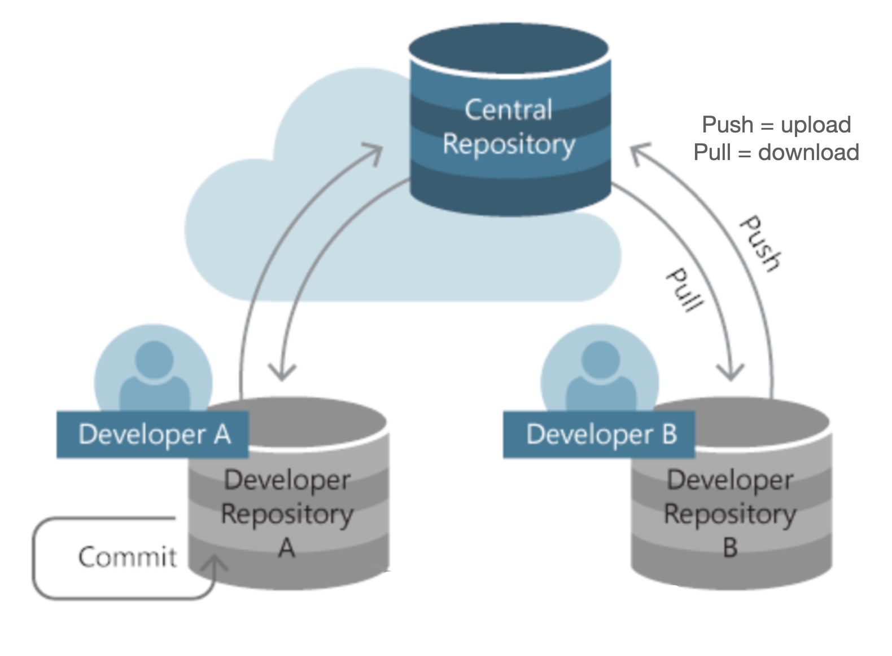

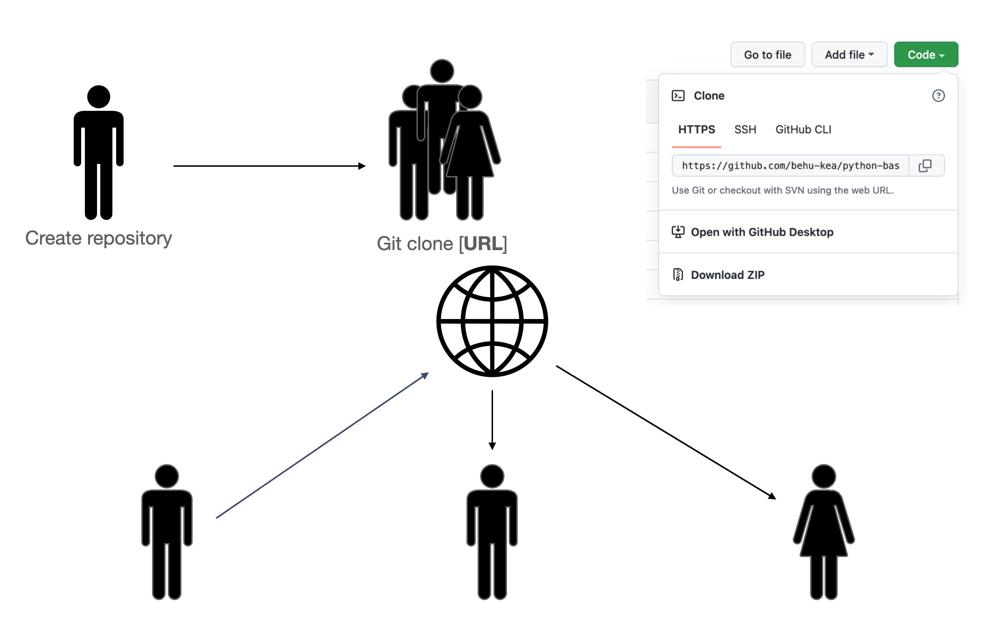

## Git concepts

<!--

I dont think this analogy is very helpful.

Also the studetns dont work with init and add when using IntelliJ

### Comparison with saving a word document

Let's first start with an analogy: Saving word documents

1. You first make som changes that you would like to save

2. Now you press `ctrl` + `s` and save a word document. This is saved locally on your own computer

3. You can now take the document and sync to the cloud (save to the cloud)
4. The last step is if someone else has access to the document, their document will now sync with the newest changes

Hold these steps in your head for later!

### Init

Init is when you initiate or begin a new project. Running the `init` command will create a hidden folder called `.git`. Inside this folder are files and folders relevant for git.

### Add

If we compare this to our word analogy. Imagine if we could make changes to a word document and decide which changes we would like to save. Fx save the changes where i added this header and that link. Instead of saving everything. This is what add does. You specify which changes you would like to save. 

-->

### Clone

Cloning a project is like downloading a project onto your computer

### Commit

Now continuing with the word analogy, what if we could give the things we wanted to save a name. Fx save the changes i did where i wrote the intro and added the image and call this save `wrote introduction`

A commit is a package that contains all the changes that were added together with a message that describes the changes. In git we don't upload individual changes to GitHub. We need to put the change/changes inside a commit and then push the commit.

### Push

Push means to take all the commits and upload them to GitHub. This is step 3 in the word analogy. Now the repo locally and the repo in the cloud (on GitHub.com) are in sync! If you loose the files locally it does not matter because they are also stored in github.com

### Pull

When working multiple people on a repo sometimes there will be changes that other people created that you need on your repo locally. To do this we use the command pull. It simply means: "Download the latest version of the repo to my computer"

This is step 4 in the word analogy

## Create a new project locally

Lets first create the Github repository where we want to save our project

Go to [https://github.com/new](https://github.com/new)

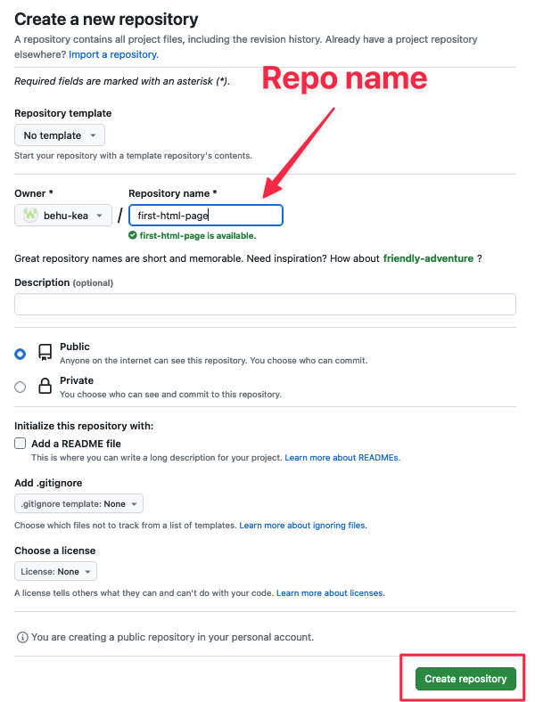

Write your repository name and click `Create repository`

Now copy the url for your github repo. This is where we will save your project!

Now lets create your project locally on your computer 👇

First create a new project in Webstorm. Also create an `index.html` file in the project

With the created project in Webstorm let's add version control to the project. Version control is a way to keep track of the the code (or the different versions of the code)

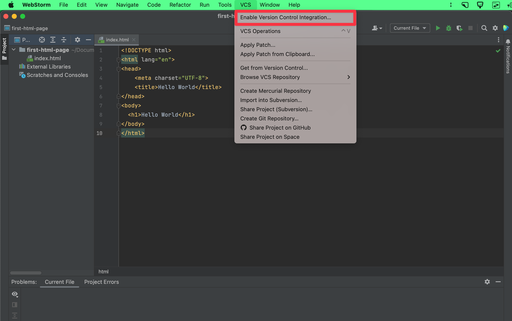

## Working on your own repo (add, commit and push)

Now version control has been enabled for the project. That means a few different options have been enabled

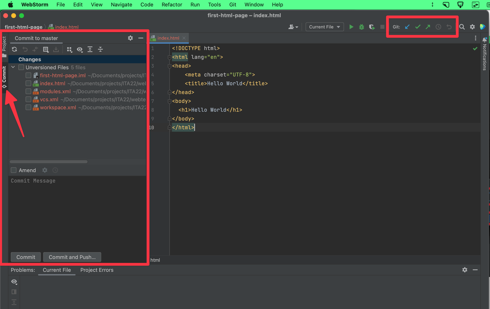

In the `Commit` tab to the left we can see that there are 5 files under `Unversioned Files`. This means they are not tracked by git. The files not called `index.html` are autogenerated by Webstorm. 

To add a file, simply check off the box. Let's add the `index.html` file by putting a check in the box. 

To commit the file write a message in the `Commit Message` box. Then click `Commit`

Now we can see the comit 

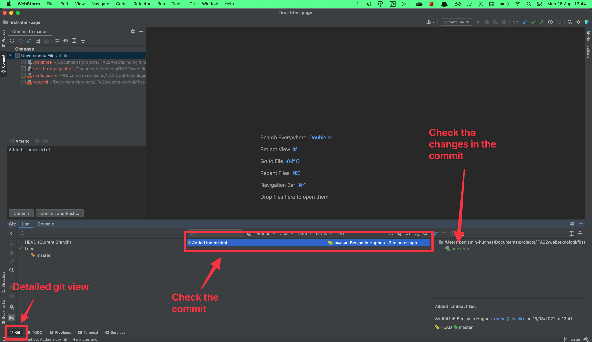

Now i will add a change to the `index.html` file (the `h2` tag). The change can be seen under the `Changes` view. I write a new commit message and press commit. 

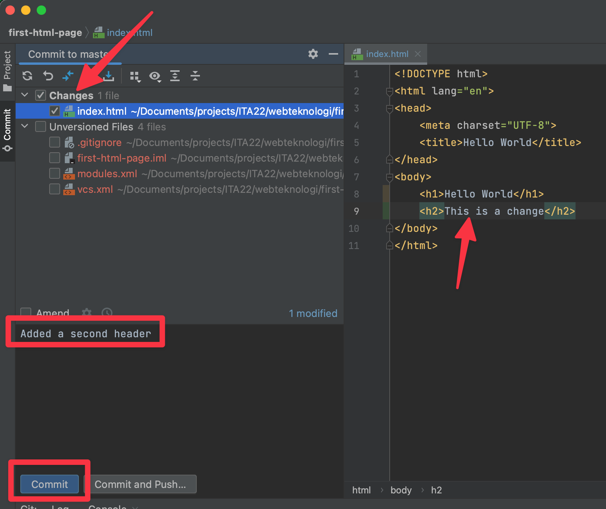

Now i have two commits

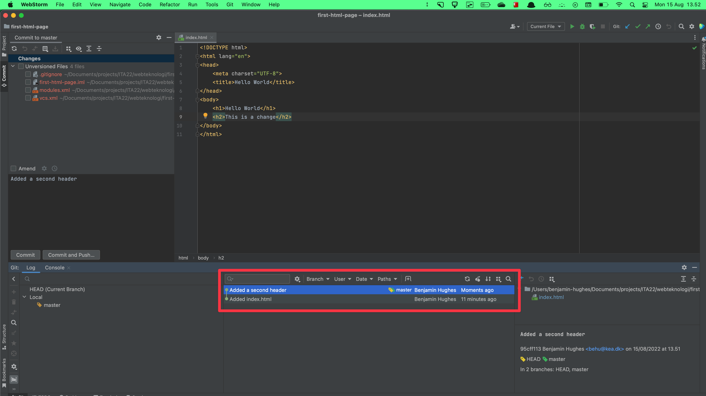

To push these two commits to GitHub click the green arrow pointing up. Now click `Define remote`. Then write the github repository url you copied in the top of the guide

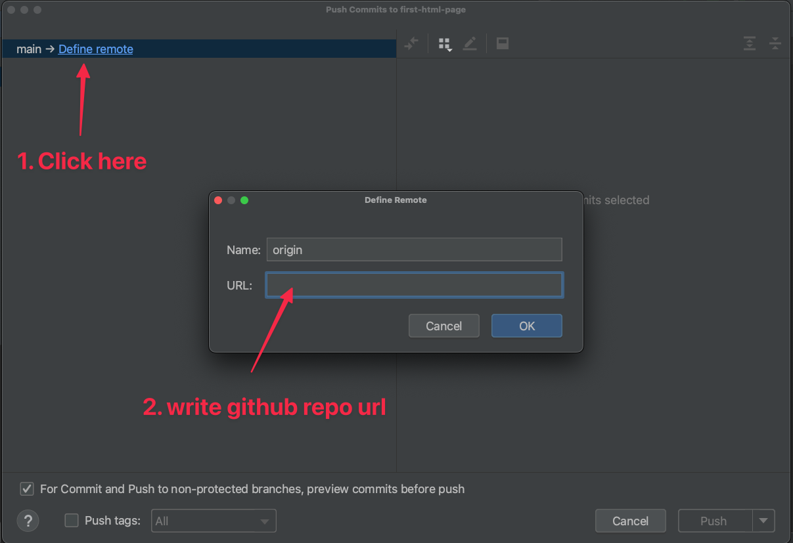

Now you can click the `Push` and push the two commits to the github url

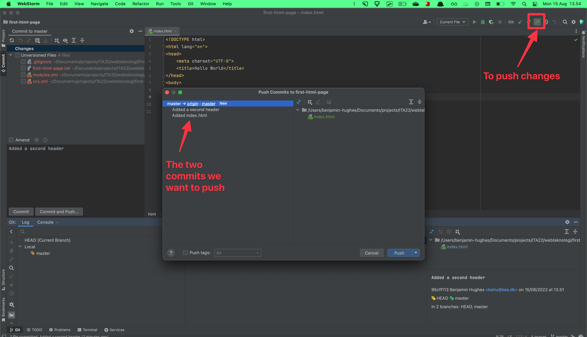

Now the two commits have been pushed to GitHub 🎉

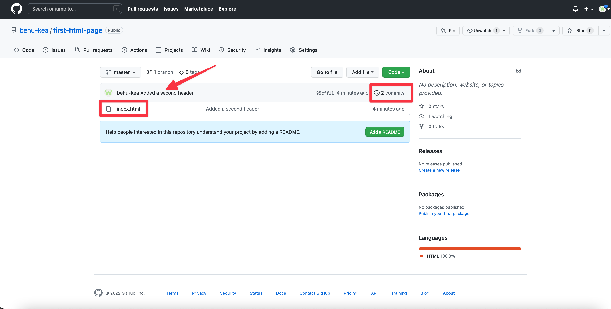

## Clone a project from Github down to your computer

This is also called cloning

First open Webstorm and click `Get from VCS`. If Webstorm is open click `File` -> `New` - `Project from Version Control`

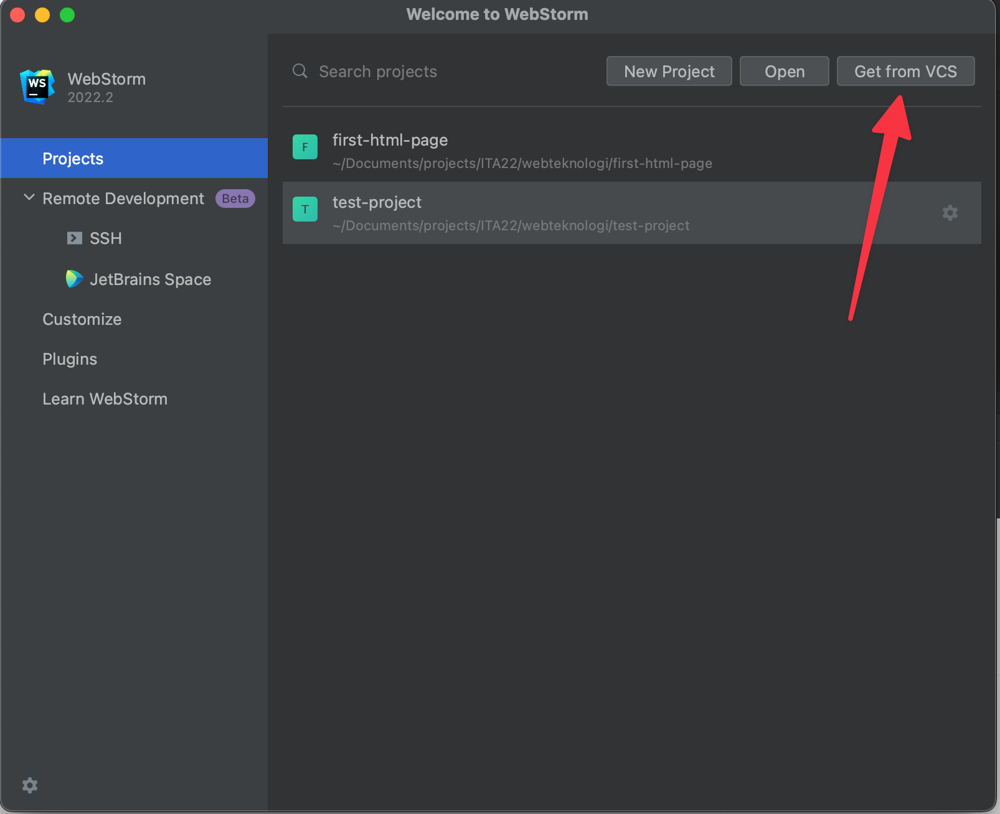

Now we need a url to a github repository! Get the url for the GitHub repo you want to clone. Go to the repo link, click `Code` and then copy the link in the box. 

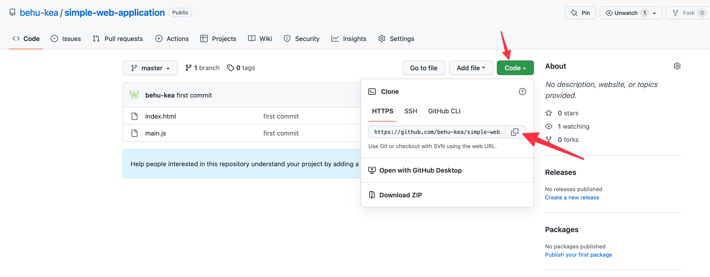

For `URL` write the copied url from above. For `Directory` find the directory where you want to save the repo

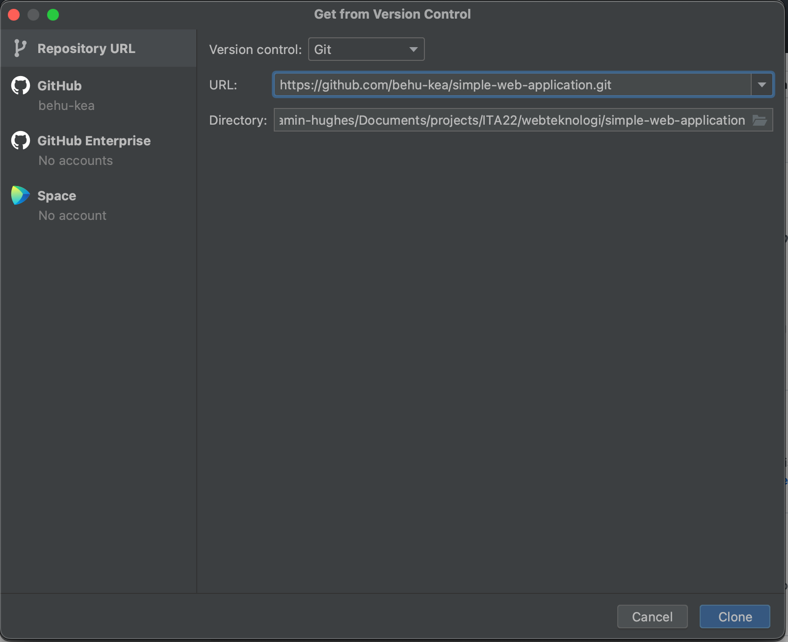

You should now have a GitHub repo in Webstorm 🎉

## Working with others (pull)

When working with others we need to be able to pull changes that other people have created. 

Click the blue button that is pointing down in the top right corner

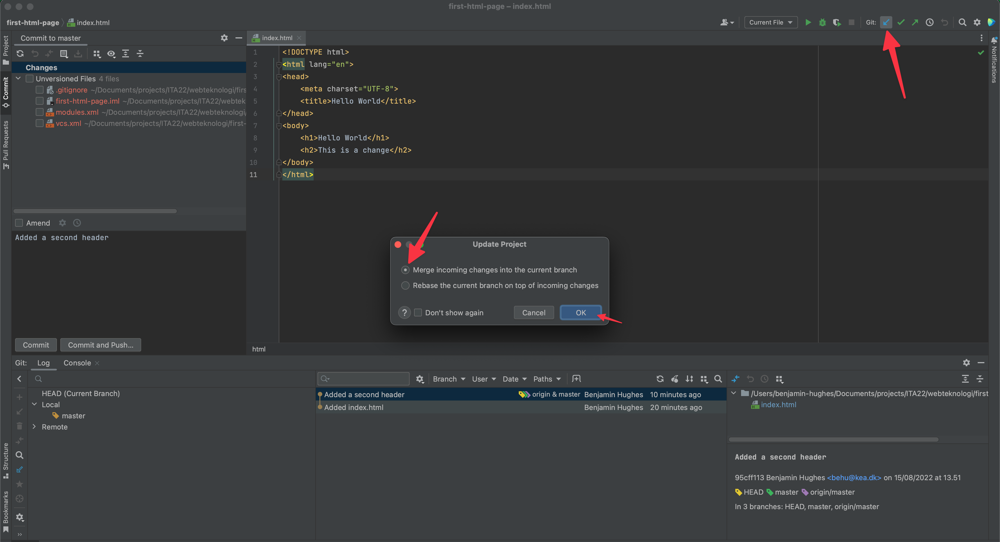

We can now see the change from someone else

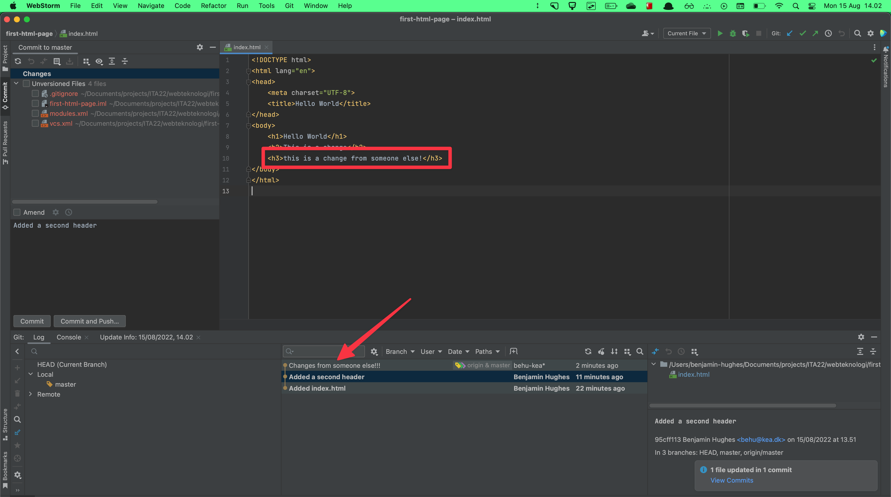

### Adding collaborators

In the github repo go to `Settings` -> `Collaborators` -> `Add people`. Then invite who you want to be part of the repo. 

## 📝 Exercise 1

In your group create an html file where you present the members of your study group. Each member should contribute with his/her own description! 

*Advice:* Try to avoid merge conflicts which is when two developers change the same line of code and git cannot figure out which code to use. 

Therefore try and create a overall structure in the `index.html` file for all of you to work in. Fx creating a `section` for each member. The everyone pulls down those changes, write a description about themselves and then pushes the changes

*If you get a merge conflict. Watch this video: [https://www.youtube.com/watch?v=mSfq1SoMocg](https://www.youtube.com/watch?v=mSfq1SoMocg)*

### Deploy your group page!

And try to make it look nice with maybe

- The projects you have done together
- Images of the teammates
- Styling
- Gifs
- Easter eggs
- Whatever. Go crazy

### Deploy your portfolio to the web using github pages

- Create a new repository on GitHub 
- Add your `index.html` to that repo
- Go to `settings` for that repo
- Scroll down to where it says `Pages`
- Where it says `Branch`, select `main` and then `Save`
- If you scroll back down you can see the url for your new portfolio! it should be called `https://YOUR_GITHUB_USERNAME.github.io/YOUR_REPO_NAME/    `

Now everytime you push changes to `master` your website will be updated!

### 📝 Exercise 2 - Deploy your portfolio to the web using github pages

## Handin on Fronter

Hand in your portfolio on fronter [here](https://kea-fronter.itslearning.com/LearningToolElement/ViewLearningToolElement.aspx?LearningToolElementId=1278720). Find den under Fronterrummet -> Ressourcer -> Webteknologi (mappe) -> Portfolio

Aflever disse to ting:

1. Linket til dit deployede github portfolio repository. Noget ala *https://YOUR_GITHUB_USERNAME.github.io/YOUR_REPO_NAME/*
2. Linket til github repositoriet. Noget ala *https://github.com/DIT_GITHUB_BRUGERNAVN/portfolio*

Remember peer feedback!

Deadline: **08-09-2023 23:59**

You will get general class feedback for the assignment but not individual feedback from me
