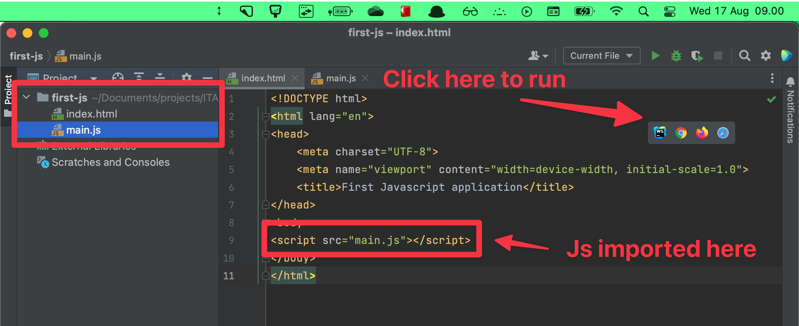
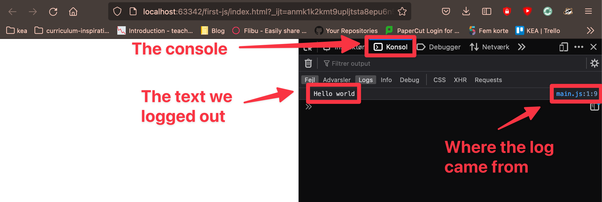
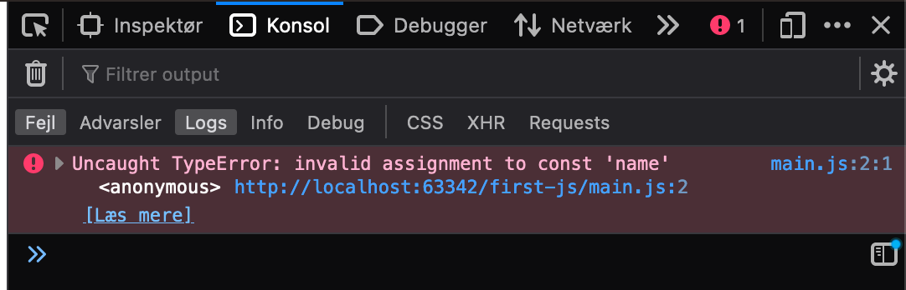

# Programming basics: Variables, types, operators


<!--

## After class considerations

- Peer instruction er for nem. 

-->


## Learning goals

- Hello world in javascript
  - `console.log`
- Variables
  - `const`, `let`
  - Assignment, reassignment
  - Giving variable names
- Comments
- Errors
- Types
  - `number`
  - `string`
  - `boolean`
  - `typeof`
- Operators
  - Arithmetic operators
    - Addition `+`
    - Subtraction `-`
    - Multiplication `*`
    - Division `/`


## Flipped classroom videos

- [Import external javascript file in HTML](https://youtu.be/YWQ0I6YYe8w)
- [Variables in javascript - var, let, const](https://www.youtube.com/watch?v=mIv6OW_BS6c)
- [Javascript - Types (number, string and boolean) and arithmetic operators](https://youtu.be/XYCvDfnDjeo)


## Portfolio feedback

- I tør kaste jer ud i ting jeg ikke har snakket om. Det er fedt. Fx at lave sider der linker til andre html sider

- Virkelig imponeret over flex!

- Stærke css selectors. Hvad gør den her: `header nav .right a:last-child`. Eller den her: .Employment, .Education

- alt attributter skal beskrive indhold``, ``, `alt="animation.gif"`
  

- Undgå sådan noget her:

- <ul class="links">
          <li class="link"><a href="index.html">Home</a></li>
          <li class="link"><a href="experience.html">Erfaring</a></li>
          <li class="link"><a href="projects.html">Projekter</a></li>
          <li class="link"><a href="contact.html">Kontakt</a></li>
        </ul>

- Kun en h1 tag

- `<footer id="Links">` Start med lille forbogstav. `<div class="Header_Communication_List">`

- Ikke lav inline styles!

- <style>html, body {
      margin: 0;
      padding: 0;
      height: 100%;
      overflow-x: hidden;
      overscroll-behavior: none;

      /* Hide scrollbar for WebKit browsers (Chrome, Safari) */
      
      body::-webkit-scrollbar {
          display: none;
      }
      
      /* Hide scrollbar for IE, Edge, and Firefox */
      
      body {
          -ms-overflow-style: none; /* IE and Edge */
          scrollbar-width: none; /* Firefox */
      }
  }
  </style>

  <p class="introduction" style="color:whitesmoke">

- Links skal være inde i ul li. 

- <nav>
             <div class="logo"> PORTFOLIO</div>
              <div class="nav-items">
                  <a href="/">PLAYLIST</a>
                  <a href="/">COMPANY</a>
                  <a href="/">CONTACT</a>
              </div>
          </nav>

- Gode til at bruge ul og li, sektioner også
- Vildt højt niveau helt generelt!


## Teacher instruction

- Syntax og problem solving
- Create random pairs from two groups. People who have coded. People who have not coded. Tell about teaching a man to fish
- The first 20 min we will work strictly with pair programming! 10 min each as driver and support. Only coding on one computer
- After the 20 min the students decide if they would like to continue or work alone
- If you continue pair programming remember to get time on the keyboard. Shifting who is driver. 
- **I don't want to see anyone just supporting**
- I expect everyone to complete level 1 today
- Meet at 11:30 to see some exercise solutions


## Peer instruction

### Question 1

What will the following code log to the console?

```javascript
const age = "3";
const sentence = `i am ${age}years old`;
console.log(sentence);
```

1. `i am 3 years old`
2. `i am 3years old`
3. ``i am age years old``
4. Syntax error


### Question 2

What will the following code log to the console?

```javascript
console.log(typeof 3);
```

1. `string`
2. `number`
3. `boolean`
4. `3`
5. Syntax error


## Importing external javascript file in html

Let's write our first Hello world program in Javascript. Firstly create a new project in Webstorm. For javascript to run in the browser we need to import a javascript file in the `index.html` file. Like we did with the css (but the syntax of importing is different)

`index.html`

```html
<!DOCTYPE html>
<html lang="en">
<head>
    <meta charset="UTF-8">
    <meta name="viewport" content="width=device-width, initial-scale=1.0">
    <title>First Javascript application</title>
</head>
<body>
    <script src="main.js"></script>
</body>
</html>
```

This line: `<script src="main.js"></script>` is the line that imports and runs javascript in the browser. The javascript that it will run can be found in the `main.js` file. The name of the javascript file does not matter.


**main.js**

```javascript
console.log("Hello World");
```

`console.log` is a function that will log some text to the console. The text it will log in this example is `Hello World`


To run the javascript click on of the browsers when hovering over the `index.html` file. 



To find the log go to your browser and open developer the developer tools. Depending on which browser you have it might be a bit different. Generally right click -> Inspect Element -> Then click on the `Console` or `Konsol` depending on your language. A shortcut on both mac and windows is `F12`. 





### 📝 Exercise 1 - level 1

*(This exercise will help you expand your understanding of `console.log`)*

Log 2 different strings to the console

The log will look fx like this:

```
Hello, my name in Benjamin
This is my log 🎉
```


## Variables

[https://youtu.be/Jvrszgiexg0](https://youtu.be/Jvrszgiexg0)

When you write code, you'll want to create shortcuts to data values so you don't have to write out the same value every time.

We can use a *variable* to create a reference to a value. Variables can be thought of as named containers. You can place data into these containers and then refer to the data simply by naming the container.


### Variable declaration

Let's first try and declare a `let` variable

```javascript
let greeting;
```

Now we have declared (created) a variable called `greeting`. We have not put anything into it yet. Let's do that!


### Variable assignment

```javascript
let greeting;
greeting = "Hello";
```

Now we first declare the variable `greeting` and then on the next line assign it with the value of the text `Hello`.

This can be done in one line:

```javascript
let greeting = "Hello";
```


### `let` vs `const`

Variables are declared with `let` and `const` keywords as follows.

- `let` tells Javascript that the variable will be reassigned
- `const` tells Javascript that the variable cannot be reassigned


Using `let` reassignment is possible:

```javascript
let numberOfCars = 4;
numberOfCars = 5;
numberOfCars = 6;
console.log(numberOfCars);
```

Using `sonst` reassignment is **not** possible:

```javascript
const name = "Irina";
name = "Benjamin";
```

This will throw an error!

> The rule to use is: When defining a variable, always declare it as a `const`, then if you need to modify that variable change it to `let`
>
> Always use `const` until it won't `let` you 😉


### Giving variable names

Giving good variable names is an art and we will get into that later aswell. For now try and give descriptive names that describes what the variable contains. **Not** what it is!

In javascript the way to give names is using camelCase

```javascript
// correct variable name
const minutesInADay = 60 * 60;
// wrong variable name
const minutes_in_a_day = 60 * 60;
// wrong variable name
const MinutesInADay = 60 * 60;
```


### 📝 Exercise 2 - level 1

1. Add a variable `greeting` and assign a greeting of your choice to the variable. Fx `Hello how are you`
2. Print your `greeting` to the console 3 times. You should see the greeting 3 times on the console, one on each line.


### 📝 Exercise 3 - level 1

Consider this code, it has a syntax error in it.

Fix it so that when running this file it logs the message `'I'm awesome!'`

```javascript
console.log('I'm awesome'!;
```

*Exercise taken from [HackyourFuture](https://github.com/HackYourFuture/JavaScript/tree/main/Week1/practice-exercises)*


## Comments

Comments is text that describes the code. It is **not** interpreted by javascript (it is invisible to javascript). You can create a comment in two ways

- Using `//` will create a oneline comment
- Using `/* COMMENT HERE */ will create a multiline comment`

```javascript
// This is a one line comment that Javascript will not see!

/*
This is a multiline comment
*/
```

Try and use comments to document/describe your code

```javascript
// First I declare a variable
let greeting;
// Then I assign it with the text "Hello"
greeting = "Hello";
```


## Errors

Working with errors is an integral part of working as a developer. Getting comfortable with getting errors, reading errors and understanding error is essential.

Let's start with this code

```javascript
const name = "Peter";
name = "Johanne";
```



The error says `Uncaught TypeError: invalid assignment to const 'name' main.js:2:1` 

`invalid assignment to const 'name'` tells us that we have made an invalid assignment to the variable `name`. `main.js:2:1` tells us that the error happened at line 2. In this case the error happened because we are reassigning the `const` called `name`. We can either make the variable a `let` or not reassign the variable. 


## Types

In all programming languages there are different *types of* data. We will go through the most basic types which is **string**, **number**, **boolean**. These are also called the primitive types of javascript


### Strings

Text is by software developers called strings. 

```javascript
const character = "a";
const message = "This is a string";
```

String can be created in 3 different ways. 

1. Using double quotes around the string `"hello"`
2. Using single quotes around the string `'hello'`
3. Using backpacks around the string `` `hello` `` - string literal


#### String literal

A string literal is a special form of string where we can put a variable inside another string

```javascript
const age = 23;
const ageString = `I am ${age} years old`;
console.log(ageString); // Will log out: "I am 23 years old"
```


```javascript
const firstname = "Mie";
const lastname = "Hansen";
// We define a string literal that has the fullname of a person
const fullname = `${firstname} ${lastname}`;
console.log(fullname); // Will log out: "Mie Hansen"
```


There are a **ton** of string methods. Check them out [here](https://developer.mozilla.org/en-US/docs/Web/JavaScript/Reference/Global_Objects/String)


### String `.length`

To get a number of characters of a string simply write `.length` after the variable

```javascript
const name = "Charlotte";
console.log(name.length); // Will log out: 9
```


### String concatenation

You can add two strings together

```javascript
const name = "Charlotte";
const words = " is my name";
console.log(name + words); // Will log out: Charlotte is my name
```


### 📝 Exercise 4 - level 1

Using string literals, string length and the following code. Log out a string that says: `"My name is peter. It has 5 characters"`

```javascript
const name = "peter";
// YOUR CODE GOES HERE
```


## Numbers

There are different types of numbers in programming. These are the two most important

- **Integers** - Whole numbers like 1, 45 or -7
- **Float** - Numbers with decimals: 1.1, 100.5, 1.76

javascript does not care which you use. To javascript those are just numbers

```javascript
const age = 21;
const height = 1.76;
```


## Boolean

There is another *primitive type* in JavaScript known as a **boolean** value. A boolean is either `true` or `false`, and it should be written without quotes. A boolean is like a light switch that can be either on or off. 

```javascript
const keaIsGreat = true;
const thisIsATerribleClass = false;
```

We can use boolean values to make decisions in our code based on certain conditions, as we shall see in the next class.


### `typeof`

`typeof` is a helpful method that will help figure out what type most variables are. 

```javascript
const age = 23;
console.log(typeof age); // number

const name = 'Mohammed';
console.log(typeof agename); // string

const isTall = true;
console.log(typeof isTall); // boolean
```


### 📝 Exercise 5 - level 1

With pen and paper write down what the following will log out

```javascript
console.log(typeof 3 + 5);
console.log(typeof "3 + 5");
console.log(typeof "+");
console.log(typeof "");
console.log(typeof "3" + 5);
console.log(typeof typeof 3+5);
```


## Operators

An operator performs some operation on single or multiple operands (data value) and produces a result. There are different types of operators. Today we will talk about arithmetic operators (also called mathematical operators)


### Addition

```javascript
const sum = 1 + 2;
console.log(sum); // 3

const numberOfApples = 8;
const numberOfBananas = 2;
const numberOfFruits = numberOfApples + numberOfBananas;
console.log(numberOfFruits); // 10

console.log(10 + 1); // 11
```


### Subtraction

```javascript
const subtraction = 10 - 5;
console.log(subtraction); // 5

const subtraction2 = 5 - 10;
console.log(subtraction); // -5
```


### Multiplication

```javascript
const multiplication = 10 * 4;
```


### Division

```javascript
const division = 1 / 2;
```


## Order of Operations

In mathematics and programming, the order of operations determines the sequence in which different operations are performed in an expression. This is crucial for ensuring consistent and correct results across all calculations.

### PEMDAS

The order of operations is often remembered using the acronym PEMDAS:

1. **P**arentheses
2. **E**xponents
3. **M**ultiplication and **D**ivision (from left to right)
4. **A**ddition and **S**ubtraction (from left to right)


### Parentheses

Expressions inside parentheses are always evaluated first.

```javascript
const result = (5 + 3) * 2;
console.log(result); // Will log out: 16
```


### Exponents

After parentheses, exponents (powers) are calculated.

```javascript
const squared = 3 ** 2;
console.log(squared); // Will log out: 9
```


### Multiplication and Division

Multiplication and division have equal precedence and are performed from left to right.

```javascript
const result1 = 10 / 2 * 5;
console.log(result1); // Will log out: 25

const result2 = 10 * 2 / 5;
console.log(result2); // Will log out: 4
```


### Addition and Subtraction

Addition and subtraction have the lowest precedence and are also performed from left to right.

```javascript
const result = 10 - 5 + 2;
console.log(result); // Will log out: 7
```


### Combined Operations

When multiple operations are present, they are evaluated according to PEMDAS.

```javascript
const complexCalc = 2 + 3 * 4 ** 2 - (6 + 2) / 2;
console.log(complexCalc); // Will log out: 46
```


Let's break it down:

1. (6 + 2) = 8
2. 4 ** 2 = 16
3. 3 * 16 = 48
4. 8 / 2 = 4
5. 2 + 48 - 4 = 46


### 📝 Exercise 6 - level 1

Solve the following math like javascript would with pen and paper

1. 5 + 3 * 2
2. (5 + 3) * 2
3. 4 / 2 ** 2
4. 10 - 4 / 2 + 6
5. (8 + 4) * 3 - 4 ** 2


### 📝 Exercise 7 - level 2

1. Create two variables `numberOfStudents` and `numberOfteachers` and assign them to some numbers of your choosing
2. Log a message that displays the total number of students and teachers


**Expected Result**

```
Number of teachers: 15
Number of mentors: 8
Total number of teachers and mentors: 23
```


### 📝 Exercise 8 - level 2

Now log out the percentage of students and percentage of teachers

````
Percentage of trainees: 65%
Percentage of mentors: 35%
````

*Exercise taken from https://syllabus.codeyourfuture.io/js-core-1/week-1/lesson#exercise-15-mins*


### Exercise 9 - problem solving

Turen fra Måløv til Vesterbro Station med S-tog tager 25 minutter. Strækningen er omkring 25 km.

Togene kører hver vej hvert 10. minut. 


Hvis jeg kigger ud af vinduet fra måløv til Vesterbro, hvor mange tog kan jeg i gennemsnit forvente at se ud af vinduet?


### 📝 Exercise 10 - level 3

**Part 1**

Create a variable to store the name of your favourite pizza. Create a variable to store the price of the pizza

Now log at statement to the console that will show the pizza man the entire pizza order in a language he understands, eg. like this: `New pizza order: <name of pizza>. The price of the pizza is:  <price of pizza>`


**Part 2**

Now we will modify the program so that you can order multiple pizzas

1. Create a new variable to store the amount of pizzas you would like to order
2. Now write a formula to calculate the total price of your  pizza order, and save it in a variable called totalPrice
3. Modify the log statement for the pizza man so it shows the total price of  the order `New pizza order: <amount of pizzas> <name of pizza>. Total cost for the order is:  <total price>`
4. Try to change the price of the pizza and check if the total price is calculated correctly.
5. Research how the `prompt()` functions works. Now use the prompt function to make the user write how many pizzas should be ordered

> Exercise taken from [HackYourFuture](https://github.com/HackYourFuture-CPH/JavaScript/blob/main/javascript1/week1/lesson-plan.md#pizza-project)


### Exercise 11 - problem solving

Kom med et overslag på hvor mange buschauffører bor i Storkøbenhavn?


### 📝 More exercises for experienced - level 3

[Age-ify (A future age calculator)](https://github.com/HackYourFuture-CPH/JavaScript/blob/main/javascript1/week1/homework.md#age-ify-a-future-age-calculator)

[Goodboy-Oldboy (A dog age calculator)](https://github.com/HackYourFuture-CPH/JavaScript/blob/main/javascript1/week1/homework.md#goodboy-oldboy-a-dog-age-calculator)

[Housey pricey (A house price estimator)](https://github.com/HackYourFuture-CPH/JavaScript/blob/main/javascript1/week1/homework.md#housey-pricey-a-house-price-estimator)

