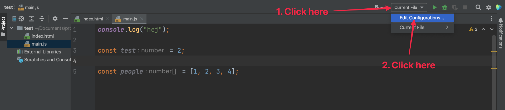
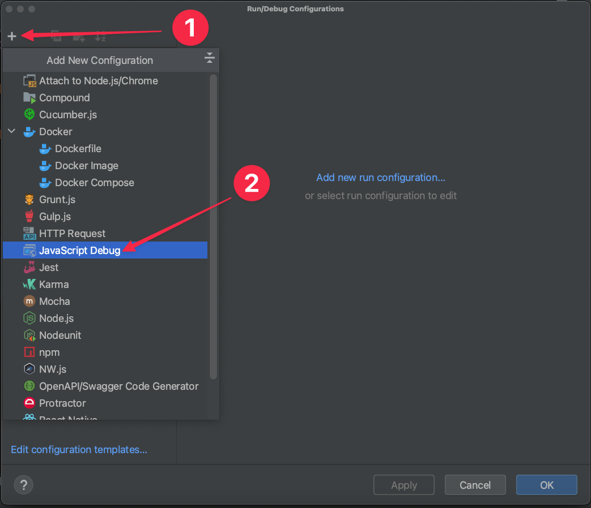
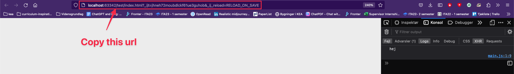
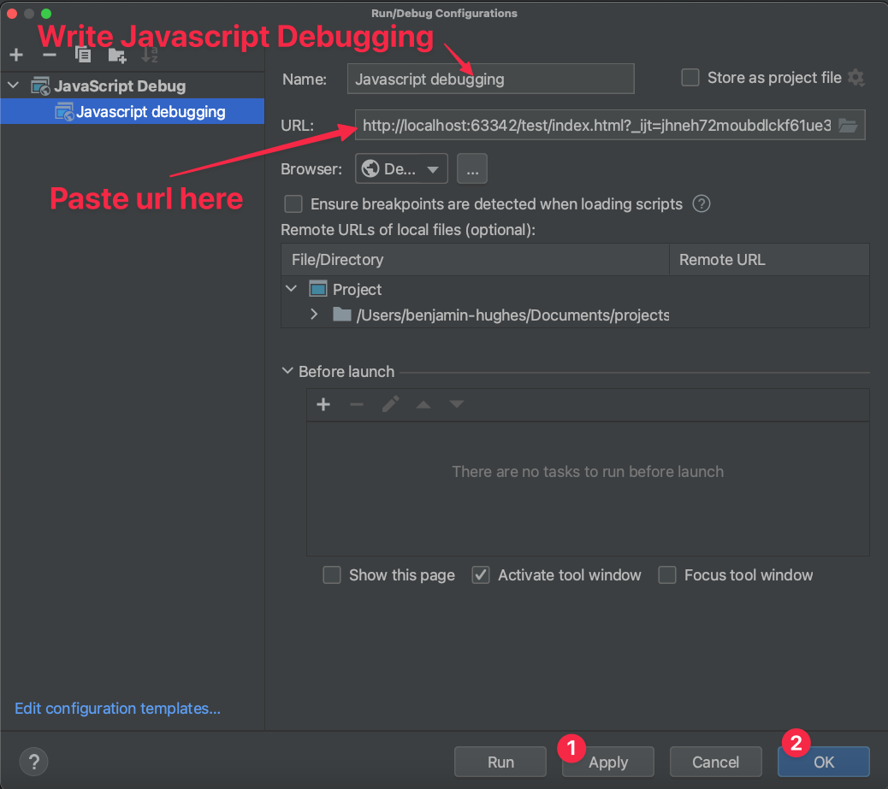
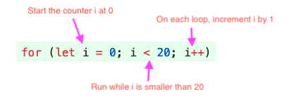
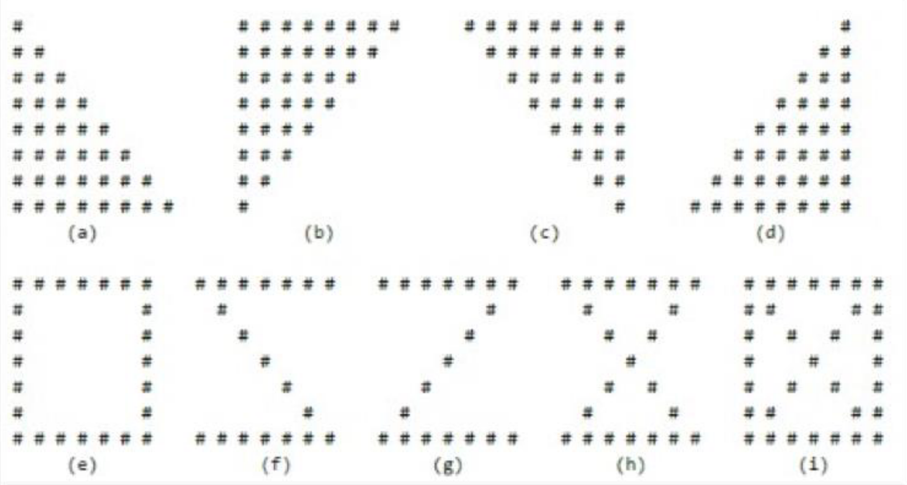

# Loops and conditional


<!--

## After class considerations

- Mht random number junne man godt vise hvordan man laver random number og så skal de få den ind
- Consider using this tool as for learning about if else: [https://teachablemachine.withgoogle.com/](https://teachablemachine.withgoogle.com/)

-->


## Learning goals

- Debugging in the browser
- Operators
  - Equality operator
  - Relational operator
  - Logical operator
- Conditional
  - If, else, else if sentence

- Loops
  - Forloop


## Flipped classroom videos

- [Mindset of Successful Programmers](https://youtu.be/nogh434ykF0?si=Dd5pIint92FpxYOR)
- [Javascript - Boolean operators. Equality, relational and logical operators](https://www.youtube.com/watch?v=LjKBwbDeKG4)
- [Javascript - if else sentence](https://www.youtube.com/watch?v=Pw3Kt4nPETM)
- [Javascript - For loop](https://www.youtube.com/watch?v=i047hBwJlFc)


## Teacher instruction

- Prøv lige at tjekke de her knapper 🥹 [https://www.toptutors.com/](https://www.toptutors.com/)
- Undervis i debugging
- Husk ikke at sammenligne jer med hinanden for meget!! Sammenlign dig selv med hvor du var for 2 uger siden. Hvis du har rykket dig der, så tillykke. Det går som det skal
- [https://www.youtube.com/watch?v=kkS2ess19es](https://www.youtube.com/watch?v=kkS2ess19es)
- 11:30 to see some of the solutions
- Der er mange opgaver. Det er ikke forventet at i laver dem alle! Vi skal lige lære jeres niveau og hvor mange opgaver i kan køre igennem. Level 2 forventer i at i laver færdige derhjemme. 
- Opgave 6 efter pause. Kl 10:15


## Peer instruction


### Question 1 - 2 min

What will the following code log to the console?

```javascript
const number = "3";
const string = 3;
const boolean = typeof string === "number" && number == string;
console.log(boolean);
```

1. `true`
2. `false`
3. `"true"`
4. `"false"`
5. Syntax error
6. None of the above


### Question 2 - 1 min

What will the following code log to the console?

```javascript
const balance = 3300
if(balance > 2000) {
  console.log("over 2000");
} else if(balance > 3000) {
  console.log("over 3000");
} else if(balance === 3500) {
  console.log("exactly 3000");
} else {
  console.log("Something else");
}
```

1. `over 2000`
2. `over 3000`
3. `exactly 3000`
4. `Something else`
5. Syntax error
6. None of the above


### Question 3 - 2 min

What numbers will the following code log to the console?

```javascript
for(let j = 4; j > 4; j--) {
	console.log(j);
}
```

1. `4,3,2,1,0`
2. `0,1,2,3,4`
3. `3,2,1,0`
4. Continues to decrease infinite from 4
5. None of the above
6. Syntax error


## Debuggin in the browser

To start debugging in the browser first we need to create a Debug Configuration

First click the dropdown with the text `Current File` to the left of the green play icon. Now click `Edit Configurations...`




Create a new configuration by clicking the `+` and then select `JavaScript Debug`




Now copy the url where the project is running (when you click the browser in the `html` file)







## Operators


### Equality operator

> Note the two different uses of the equals sign:
> A single equals sign (=) is used to assign a value to a variable.
> A triple equals sign (===) is used to compare two values (see Equality Operators).


### Equality operators

Equality operators are used for checking if to values are equal each other

- Equality `==`
- Inequality `!=`
- Identity / strict equality `===` (preferred)
  - Checks **both** type **and** value

- Non-identity / strict inequality `!==` (preferred)

How does this work in practice?

```javascript
1 == 1 // -> true
7 == '7' // -> true
1 != 2  // -> true
5 === 5  // -> true
9 === '9'  // -> false
3 !== 3 // -> false
3 !== '3' // -> true
```


### Relational operator

Relational operators are used when checking how two values relate to each other

- Greater than operator `>`
- Greater than **or** equal operator `>=`
- Less than operator `<`
- Less than **or** equal operator `<=`

```javascript
4 > 3   // -> true
3 >= 3  // -> true
13 < 12 // -> false
3 <= 4   // -> true

// Realistic example
const televisionPrice = 10000;
const availableFunds = 5000;
console.log(availableFunds < televisionPrice); // logs out true 
```


### Logical operator

Logical operators are used for the code to take decisions 

- AND `&&` - both values on the right side **and** the left side has to be `true` for an and sentence to be `true`
- OR `||` - either values on the right side **or** the left side has to be `true` for an or sentence to be `true`

```javascript
true && true //-> true
true && false //-> false
false || true //-> true
false || false //-> false

// Realistic example
const isUserLoggedIn = true;
const isUserPremiumUser = true;
// If a user is a premium user and is logged in. Show the premium page to that user
const showPremiumPage = isUserLoggedIn && isUserPremiumUser;
console.log(showPremiumPage);
```


### 📝 Exercise 1 - level 1

Together in the group with pen and paper write the answer for the following question. No computer!

1. `2 === 2`
2. `true && false`
3. `false || true`
4. `3 > 4`
5. `7 > 11 && 'a' === 'b' || true`
6. `true === true && false === true`


## Conditionals

Like humans, computer programs make decisions based on the information given to them. **Conditionals** are a way of representing these decisions in code (remember, you saw this in a previous exercise!)

For example:

- In a game, if the player has 0 lives, then the game is over
- In a weather app, if rain is forecast, a picture of rain clouds is shown

The most common type of conditional is the **if statement**.


### If sentence

An if statement runs some code if a condition is met. If the condition is not met, then the code will be skipped.

```javascript
const isHappy = true;

if (isHappy) {
  console.log("I am happy");
}
```


The code in paratheses - e.g. `(isHappy)` - is the condition. The condition can be *any* expression. The following are all valid conditions:

```javascript
// boolean value

if (true) {
  // do something
}

// variable assigned to boolean value
const isHappy = true;

if (isHappy) {
  // do something
}

// equality operator returns a boolean value
if (1 + 1 === 2) {
  // do something
}

// comparison operator returns a boolean value
if (10 > 5) {
  // do something
}
```

An `if` statement runs code when a condition is met. What if the condition is  not met? Sometimes you want to run an alternative bit of code.


#### If else sentence

An **if...else statement** also runs code when the condition is *not* met.

```javascript
const isHappy = true;

if (isHappy) {
  console.log("I am happy 😄");
} else {
  console.log("I am not happy 😢");
}
```

What if there is more than one condition you want to handle in your program? For example, what if you can be confused as well? You can use **else if** to handle multiple conditions.


#### Else if sentence

```javascript
const funds = 1000;
if(funds > 10000) {
  console.log("You are rich");
} else if(funds > 1000) {
  console.log("You are not poor");
} else if(funds > 0) {
  console.log("You are poor");
} else {
  console.log("You are quite poor");
}
```


### 📝 Exercise 2 - level 1

In your group explain what these lines of code does

```javascript
const num = 19;

if (num > 20) {
  console.log(`${num} is greater than 20`);
} else if (num === 20) {
  console.log(`${num} is equal to 20`);
} else if (num < 20) {
  console.log(`${num} is less than 20`);
} else {
  console.log(`${num} isn't even a number :(`);
}
```


### 📝 Exercise 2.1 - level 1

Create a variable called `balance`. If balance is larger than `10000` log out `I am rich 💰`. Otherwise log out `I am poor 🪙`


### 📝 Exercise 3 - level 2

Create a small program that gives you a message depending on your mood! It should:

- Use a variable called `mood`
- Log `"Good job, you're doing great!"` if `mood` is `"happy"`
- Log `"Every cloud has a silver lining"` if `mood` is `"sad"`
- Log `"Beep beep boop"` if `mood` is a number
- Log `"I'm sorry, I'm still learning about feelings!"` if `mood` is anything else


Write the text to the webpage using `document.write`


## Loops

When we're writing programs, we often find that we want to repeat a bit  of code over and over, or repeat it but change something about it each  time. To save ourselves from writing all that code, we can use a **loop**. JavaScript has two kinds of loops, a `while` loop and a `for` loop. I will only cover the `for` loop. 


### for loop

The `for` loop is similar to a while loop, but with a more specialized syntax.  Programmers invented the for loop when they realized they were always  doing the same three things: creating loop counter variables (like `i` above), incrementing them by some amount, and checking that they're less than a value.

The `for` loop syntax has special places for each of those three things. Here's  the same loop as the first while loop above, as a for loop:



```javascript
for (let i = 0; i < 20; i++) {
	console.log(i);
}
```


### 📝 Exercise 5 - level 1

- Print out `Hello World` 3 times
- Use a loop to print the numbers from 1 to 10
- Use a loop to print a `*` 10 times
- Use a loop to print the numbers starting from 5 to -5
- Use a loop to print every third number from 5 to 30


### 📝 Exercise 6 - teachers and students

Duration: 20 min

In the following exercise one group will randomly be selected to be teachers and the other group will be students

In groups of two people prepare a small 5 minute lecture. The lecture should explain the topic of **for loops** any way you like. That might be with a small slideshow or it might be with code, thats up to you. 

- As teachers present the 5 minute lecture
- As students ask good interesting questions


### 📝 Exercise 7 - level 2

Using a for loop `console.log` a random number of hashtags (`#`)

```javascript
// Random number between 0 and 10
const randomNumber = Math.floor(Math.random() * 11);
// Your code here
```

If `randomNumber` is 7 then 7 hashtags should be logged


### 📝 Exercise 8 - level 2

Using a for loop `console.log` the following output 👇

```
1
2
3
4
5
6 is larger than 5
7 is larger than 5
8 is larger than 5
9 is larger than 5
10 is larger than 5
```


### 📝 Exercise 8.1 - level 2

Using a for loop and conditionals `console.log` the following

```
1 is a small number
2 is a small number
3 is a small number
4 is a relatively small number
5 is a relatively small number
6 is a relatively small number
7 is a large number
8 is a large number
9 is a large number
10 is ten
```


### 📝 Exercise 9 - level 2

Create a for loop that logs out each indvidual character in a string

With the last character log out "This is the last character". With the string `Copenhagen` the following output is expected👇

*Tip: To make this work, read [this article](https://riptutorial.com/javascript/example/8024/access-character-at-index-in-string)*

```
C
o
p
e
n
h
a
g
e
n
This is the last character
```


### 📝 Exercise 9.1 - level 3

Create a for loop that logs out each indvidual character in a string

With the **middle** character log out "This is the middle character". With the string `Hello` the following output is expected👇

*Tip: To make this work, read [this article](https://riptutorial.com/javascript/example/8024/access-character-at-index-in-string)*

```
H
e
l this is the middle character
l
o
```

What is the word has an even number of characters?


### 📝 Exercise 10 - Fizzbuzz - level 3

You need to write a program that prints the numbers from 1 to 100 such that:

    If the number is a multiple of 3, you need to print "Fizz" instead of that number.
    If the number is a multiple of 5, you need to print "Buzz" instead of that number.
    If the number is a multiple of both 3 and 5, you need to print "FizzBuzz" instead of that number.


### 📝 Exercise 11 - level 3

You can have a for loop in a for loop. See if you can print the following patterns to the console




