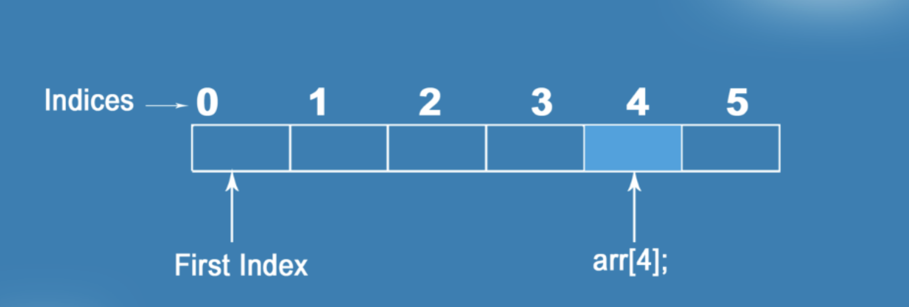

# Arrays


### Learning Goals

- Creating an array
  - index
  - `.length`
- Array methods
  - `push`
  - `indexOf`

- Iterating through an array
  - `forEach`
  - `for of`

- Using conditional logic on each data element from an array


## Flipped classroom videos

- [JavaScript Arrays](https://youtu.be/oigfaZ5ApsM?si=6vdbmoC70wNwHwpj)
- [Javascript Arrays Made Simple: Iterators (Part 1)](https://youtu.be/NaJI7RkSPx8?si=Wl8iFtiBxh5N81Vw) (first 7 min)


## Teacher instruction

- Korrekt brug af ChatGPT: *https://www.oneusefulthing.org/p/post-apocalyptic-education*
- Vi arbejder individuelt i dag
- For at løse nogle af opgaverne skal i læse gitbooken. 
- Lav opgaver, men hop over opgave 5, 6 og 7. Dem laver vi i klassen sammen. kl 14:00
- Vi mødes 15:30 hvor jeg vil løse en af opgaverne og vise den "rigtige" løsning


<!--

## Afterclass considerations

- Peer instruction var for svær
- Lidt for få opgaver idag. 

-->


## Peer instruction

### Question 1 - 2 min

What will the following code log to the console?

```javascript
const arr = [1, 2, 3, 4, 5];
arr[arr.length] = 6;
console.log(arr);
```

1. [1, 2, 3, 4, 5, 6]
2. [1, 2, 3, 4, 6]
3. [1, 2, 3, 4, 5, undefined]
4. undefined
5. Syntax error
6. None of the above


### Question 2 - 2 min

What will the following code log to the console?

```javascript
const arr = [10, 20, 30];
for(let i = 0; i <= arr.length; i++) {
  console.log(arr[i]);
}

```

1. 10, 20, 30
1. 10, 20, 30, undefined
1. undefined
1. 30, 20, 10
1. Syntax error
1. None of the above


## Creating an array

If you ever find yourself writing code like this...

```javascript
const mentor1 = "Daniel";
const mentor2 = "Irina";
const mentor3 = "Rares";
```

...then it's probably time to use an **array**!

Arrays are data structures that hold a list of values. We call these values the **elements** of the array.

```javascript
const mentors = ["Daniel", "Irina", "Rares"];
```

Arrays can hold any type of value (although almost always you only have one data type per array).

```javascript
const testScores = [16, 49, 85];
const grades = ["F", "D", "A"];
const greetings = ["Hello, how are you?", "Hi! Nice to meet you!"];
```


### Index

An array is based on an index. The first element is saved at index 0

### 


### Accessing elements using index

You can access elements in an array using the **index** of an element with **bracket notation**. If you want the first element you use index 0 which can cause some confusion 😱

```javascript
const trainees = ["Ahmed", "Maria", "Atanas", "Nahidul", "Jack"];
trainees[0]; // "Ahmed"
trainees[3]; // "Nahidul"
```

**🔔 Remember:** All arrays start at position 0! To access the first element in an array, you need to access index `0`, the second element at `1`. There are some [very intense reasons for this](http://www.cs.utexas.edu/users/EWD/transcriptions/EWD08xx/EWD831.html), but most people just accept it and move on.


### Assigning elements

You can also *assign* new values to parts of an array:

```javascript
const trainees = ["Ahmed", "Maria", "Atanas", "Nahidul", "Jack"];

trainees[2] = "Bianca";

console.log(trainees); // ["Ahmed", "Maria", "Bianca", "Nahidul", "Jack"]
```


### `.length`

To get the number of elements in an array you can use the `.length` property

```javascript
const trainees = ["Ahmed", "Maria", "Atanas", "Nahidul", "Jack"];

console.log(trainees.length); // 5
```


### 📝 Exercise 1 - level 1

Create an array that contains a list of your interests. Get the number of interests you have added to the list. Give the variable a good name

Log out the following string `I have 10 interests`


### 📝 Exercise 2 - level 1

Using the following array

```javascript
const fruits = ['banana', 'apple', 'strawberry', 'kiwi', 'fig', 'orange'];
```

Now, using the correct indexes, print the following values from the array:

- strawberry
- kiwi
- orange
- banana

*taken from https://syllabus.codeyourfuture.io/js-core-1/week-2/lesson#arrays*


### 📝 Exercise 3 - level 2

Write some code that can get the first and last elements in an array. 

```javascript
const names = ['Peter', 'Susan', 'Charlotte'];
// Use the names array
const firstNameInArray = YOU WRITE CODE HERE;
const lastNameInArray = YOU WRITE CODE HERE;

console.log(firstNameInArray); // Peter
console.log(lastNameInArray); // Charlotte

const fruits = ['pear', 'banana', 'apple', 'grape'];
const firstFruitInArray = YOU WRITE CODE HERE;
const lastFruitInArray = YOU WRITE CODE HERE;

console.log(firstFruitInArray); // pear
console.log(lastFruitInArray); // grape
```


## Array methods

There are **lots** of different array methods. Today we will focus the two most important ones


### `.push`

Elements can be "pushed" into an array. The pushed element will figure as the latest element.

```javascript
const trainees = ["Ahmed", "Maria", "Atanas", "Nahidul", "Jack"];

trainees.push("Nicklas");

console.log(trainees); // ["Ahmed", "Maria", "Bianca", "Nahidul", "Jack", "Nicklas"]
```


### `.indexOf`

If you know the value and want the index number, you can use indexOf

```javascript
const trainees = ["Ahmed", "Maria", "Atanas", "Nahidul", "Jack"];

const indexOfMaria = trainees.indexOf("Maria");

console.log(indexOfMaria); // 1
```


More methods documented [here](https://www.w3schools.com/js/js_array_methods.asp)


### 📝 Exercise 4 - Favorite Songs - level 2

1. Create an array called `favoriteSongs` and add five of your favorite song titles.
2. Use the `.push` method to add another song to the end of the array.
3. Use the `indexOf` method to find the position of a song in the array.


## Iterating an array

Iterating an array is about going through each element in an array. Here is an example

```javascript
const names = ["Benjamin", "Mie", "Klara"];
// Instead of doing this 👇 (what if we had 1000 elements in the array 😱)
console.log(names[0]); // Benjamin
console.log(names[1]); // Mie
console.log(names[2]); // Klara

// Do this:
for (const name of names) {
  // This log is called 3 times because there are 3 elements in the array
  console.log(name);
}
// this will log Benjamin then Mie then Klara
```


### For...of

```javascript
const cars = ['fiat', 'volvo', 'peugeot'];

for (const car of cars) {
  console.log(car);
}

// Output: "fiat"
// Output: "volvo"
// Output: "peugeot"
```


### ForEach

Does the same, but we can get the index aswell!

```javascript
const cars = ['fiat', 'volvo', 'peugeot'];

cars.forEach((car, index) =>  {
  console.log(index, car);
});

// Output: "0 fiat"
// Output: "1 volvo"
// Output: "2 peugeot"
```


### 📝 Exercise 6 - In class let's analyze this code

```javascript
let b = [3, 7, 2, 9, 5];
let r = [];
let t = 0;

for (let p = 0; p < b.length; p++) {
  t = b[p] * 2;
  r[r.length] = t;
}

for (let x = 0; x < r.length; x++) {
  console.log("r is: " + r[x]);
}
```


### 📝 Exercise 5 - teachers and students

Duration: 20 min

In the following exercise one group will randomly be selected to be teachers and the other group will be students

In groups of two people prepare a small 5 minute lecture. The lecture should explain the topic of **forEach** or **for...of** any way you like. That might be with a small slideshow or it might be with code, thats up to you. 

- As teachers present the 5 minute lecture
- As students ask good interesting questions


### 📝 Exercise 7 - Analyze this code

Ask the following questions

- What does this code do/what should it do?
- How would you improve it?
- Does it work?
- Do you like the variable names?
- Is the code easy to understand?

```javascript
let givenArray = [1, 2, 3, 4, 5];
let revarr = [];

givenArray.forEach((element, index) => {
    revarr[index] = givenArray[givenArray.length + index];
});

console.log(revarr);
```


### 📝 Exercise 8 - level 2

Given the following array:

```javascript
const words = ["apple", "banana", "cherry", "date", "elderberry"];
```

Write a program that prints out each word and its length.

Here is the expected output:

```
apple: 5
banana: 6
cherry: 6
date: 4
elderberry: 10
```


### 📝 Exercise 9 - level 2

Given the following array:

```javascript
const animals = ['cat', 'dog', 'bird', 'fish', 'elephant'];
```

Write code that finds the index of 'bird' in the array and then replaces it with 'parrot'. Print the updated array.

Expected output: `['cat', 'dog', 'parrot', 'fish', 'elephant']`


### 📝 Exercise 10 - level 3

Given the following array:

```javascript
const grades = [85, 90, 78, 88, 76, 95, 89];
```

Write code that 

1. Calculates the total grades from the array
2. Calculates the average grades in the the array

Expected output: `Average grade is 86`


### 📝 Exercise 11 - level 3

Using the following array:

```javascript
const words = ['apple', 'banana', 'cherry', 'date', 'fig'];
```

Write code that prints the words that have more than 5 letters.

Expected output: `banana cherry`


### 📝 Exercise 12 - level 3: Data Filtering

You are given an array of user input data. Each item in the array is a string that a user has entered into a search bar on a website.

```javascript
const searchData = ['apple', 'banana  ', '  Cherry', 'apple ', 'APPLE', '  Banana'];
```

1. Clean the data: Remove any leading or trailing whitespace from each item.
2. Standardize the data: Convert all items to lowercase so that the search is case-insensitive.
3. Remove any duplicate items from the array.

Print the cleaned and standardized array

Expected output: `['apple', 'banana', 'cherry']`
