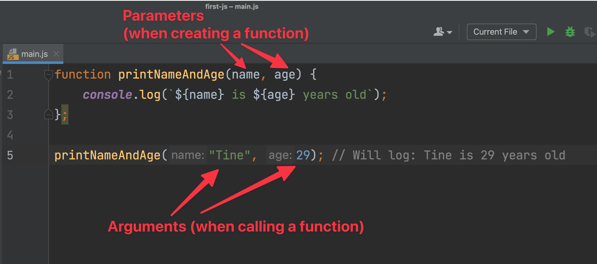
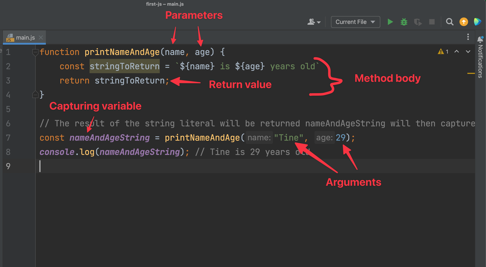

# Functions


## Learning goals

-  Calling functions (using them)
  - No arguments
  - With arguments
- Creating function
  - No parameters
    - Function body
  - Parameters
  - Arguments vs parameters
    - Parameter placeholder value
  - Return value
    - Capturing return
- Scope


## Flipped classroom

- [JavaScript FUNCTIONS are easy! 📞](https://www.youtube.com/watch?v=HFaxylC7bUc)
- [JavaScript Scope (Local vs Global)](https://www.youtube.com/watch?v=iJKkZA215tQ)


## Teacher instruction

- Rydde op efter jer
- Studiestarts undersøgelse.
- Individuelt idag. Alle skal nå til level 1 idag
- Hjemmeopgave: Færdig med opgaver til om med opgave 6
- Brug debuggeren
- After this week you can call yourself real developers 🎉
- Aflevering af portefølje på søndag
- ChatGPT parametre og argumenter


## Peer instruction


### Question 1 - 1 min

What is the value of `numberOfCharacters`?

```javascript
function getNumberOfCharacters(word) {
	console.log(word.length);
}

const numberOfCharacters = getNumberOfCharacters("Kea er sej");
```

1.  `9`
2. `"9"`
3. `10`
4. `"10"`
5. None of the above


### Question 2

What will get logged out

```javascript
function isNumberLargerThanSeven(number) {
	const numberLarger = number > 7;
}

console.log(isNumberLargerThanSeven(5));
```

1. `true`
2. `false`
3. `5`
4. `7`
5. None of the above


## Hiding abstraction

Lets begin with a good old metaphor. Imagine you have a huge machine. The machine has lots of things you can control. Like a lever, 3 buttons, a pulley and wheel and much more. All of this affects what happens inside the machine. It works by giving the machine some input. Now the input is transformed through the machine and in the end you get an output. 


Imagine now that the machine is actually a **function**, the inputs to the method is called **arguments**, the things that control the method are called **parameters**, the output of the machine is called a **return value**. That might not make a lot of sense for now, but keep the metaphor of the machine, it will get handy later on!


## Calling functions

There are two sides to functions: a creation side and a usage side. The usage side you have actually already been using quite a lot. Let's take a closer look at some examples:


### Calling a function with no arguments

```javascript
Math.random()
```

Here we are actually calling a function called `random`. **Calling a function is done by writing the function name and then open and close parentheses `()`**. So we are calling the function with the name of `random`. Calling this function will give us a random number between 0 and 1

```javascript
console.log(Math.random()); // Will log a new number each time fx: 0.23029599683254565
```

Let's take a look at another function called `trim`:

```javascript
const trimmedString = "  string with messy spaces.   ".trim();
console.log(trimmedString); // Will log: "string with messy spaces."
```

`trim` will remove the trailing spaces in a string. Again here we are calling the function with the name of `trim` by writing the function name and `()`

> 💡 A very common beginner mistake is to **forget to call your function!**


### Calling a function with arguments

Simply calling a function and getting something back is fine. But sometimes we want to give a function some data to work with (input). That we do through arguments. Let's take an example 👇


```javascript
console.log("Hello")
```

Here we are calling a function called `log`. Inside of the parentheses we put the arguments. In this case we have one argument: the string `hello`. To sum up we are calling the function `log` with the argument of `hello`


#### Multiple arguments

A function can have multiple arguments. Each argument is seperated by a comma

```javascript
const maxNumber = Math.max(3, 5);
console.log(maxNumber); // Will log: 5
```

Here we are calling a function called `max` with the arguments of `3` and `5`


>  🧠 Remember this: **The values we call a function with are called agruments!**


## Creating a function

Now let's talk about creating our own function. 


Let's create a function called `printHello`, which will print 'Hello' to the console.

```javascript
function printHello () {
  console.log("Hello");
}
```

To create a function we use the `function` keyword. After the keyword we write the name of the function. In this case we chose to name it `printHello`. Then we open and close parentheses and curly brackets `{ }`. Inside the curly brackets we write the code we want to run when we call the function. This is called the function body


Let's call the function we just created 👇

```javascript
function printHello() {
  console.log("Hello");
}

printHello(); // This will log out Hello to the console
```


### Function with parameters

We can also create functions which can take parameters. Let's create a function that logs a name out to the console

```javascript
function printName(name) {
  console.log(name);
}

printName("Tine"); // Will log: Tine
```

In the example above we have given the `printName` function the parameter `name`. This means we can pass in a value when we call the function. In this case we passed in the string `Tine`.

A parameter is a placeholder value for what the function it is called with! If the function `printName` is called with the value of `"Tine"` then the parameter `name` will get the value of `"Tine"`. If  `printName` is called with the value of `"Jens"` then the parameter `name` will get the value of `"Jens"`. 

The parameter is like a shapeshifter it changes all the time depending on what the function is being called with!!!!

```javascript
function printName(name) {
  console.log(name);
}

printName("Jens"); // Will log: Jens
```


#### Multiple parameters

We can also have multiple parameters. The parameters should be seperated by comma

```javascript
function printNameAndAge(name, age) {
	console.log(`${name} is ${age} years old`);
}

printNameAndAge("Tine", 29); // Will log: Tine is 29 years old
```

Here we have given the `printNameAndAge` function two parameters. We can pass a value for both parameters. The first value will be assigned to the first parameter `name` and the second value will be assigned to the second parameter `age`. 


### Arguments vs parameters

For some reason, we often get confused between **arguments** and **parameters**. Let's go through it again.

**Arguments** are the values we call a function with.

**Parameters** are the placeholder values for the arguments.




### Return value

Instead of just console logging the result inside of a function we can actually get that value by returning it. Let's rewrite our `printNameAndAge` function

```javascript
function printNameAndAge(name, age) {
  const stringToReturn = `${name} is ${age} years old`;
	return stringToReturn;
}
// The result of the string literal will be returned nameAndAgeString will then capture it
const nameAndAgeString = printNameAndAge("Tine", 29);
console.log(nameAndAgeString); // Tine is 29 years old
```

Now `printNameAndAge` first creates the string to be returned called `stringToReturn`. Then that string is returned. The return value is captured in the `nameAndAgeString` variable. 





## Scope

Scope defines where a variable exists (lives). There are two kinds of scope:

1. Global scope
2. Local scope


### Global scope

Global scope is when a variable is defined on the top level. Meaning in the top of the javascript file. This variable can be reached everywhere in the file. 

```javascript
const name = "Ahmed";

function printName() {
  // The variable name can be reached here
  console.log(name);
}
```

Here the function `printName` has access to the variable `name` because `name` is defined in the global scope


### Local scope

Local scope is when a variable is defined and lives within local scope (defined by curly braces`{}`)

```javascript

{
  // name only exists within the curly brackets!
	const name = "Camilla";
}

console.log(name); // ERROR: Name is not defined
```


The same with functions:

```javascript
function sum(number1, number2) {
	const sumOfNumbers = number1 + number2;
	// After the close curly brackets sumOfNumbers stops existing!
}
sum(1, 2);

console.log(sumOfNumbers); // ERROR: sumOfNumbers is not defined!
```

And the same with if sentences and loops, anything with curly braces!

So how can we fix the code above? We define the variable outside

```javascript
// now we need let because we want to reassign sumOfNumbers
let sumOfNumbers;
function sum(number1, number2) {
	sumOfNumbers = number1 + number2;
}
sum(1, 2);
console.log(sumOfNumbers); // 3
```


## Exercises


### 📝 Exercise 1 - level 1

Create a function that takes a string and then logs that string out

```javascript
someFunctionName("hello"); // logs out hello
someFunctionName("abcde"); // logs out abcde
```


### 📝 Exercise 1.1 - level 1

Create a function that adds two numbers together. The added number should be returned

```javascript
const returnedNumber = someFunctionName(2, 6);
console.log(returnedNumber); // 8
```


### 📝 Exercise 2 - level 2

Create a function that takes a name and returns `true` if the first character is the character `a` otherwise `false`

```javascript
console.log(someFunctionName('kea')); // false
console.log(someFunctionName('anna')); // true
```

*Hint: Check out [https://stackoverflow.com/questions/3427132/how-to-get-first-character-of-string](https://stackoverflow.com/questions/3427132/how-to-get-first-character-of-string)*


### 📝 Exercise 3 - level 2

Create a function called `celciusToFahreneit` it should have a parameter called `celcius`. 

It should return a string in the following format `CONVERTED_TEMPERATURE degree fahrenheit` fx `23 degree fahrenheit`

Think carefully about

- What the parameter name should be
- Creating good names for any variables you use
- Don't use `console.log` inside the body of the function!

Try call the function and check with google if the function returns the right value.

```javascript
console.log(celciusToFahreneit(30)); // 86 degree fahrenheit
```


### 📝 Exercise 4 - level 2

Create a function called `increaseByHalf` that should

- Take a number as an input
- Return this input number **increased by a half**


Here is an example of the output

```javascript
console.log(increaseByHalf(50)); // 75
console.log(increaseByHalf(100)); // 150
```


### 📝 Exercise 5 - level 1

Check out the code below:

```javascript
function printMessage(x) {
  console.log("Hello, nice to meet you " + x);
}

function getMessage(name) {
  return "Hello, nice to meet you " + name;
}

printMessage("Mitch");
printMessage("August");
getMessage("Laetitia");
```

The functions above behave similarly but *differ* in some important ways.

Study the code above and then answer the following questions:

1. How many times is the function `printMessage` called ?
2. How many times is the function `getMessage` called ?
3. What is the parameter name for the function `printMessage` ?
4. What is the parameter name for the function `getMessage` ?

> Taken from [Code your future](https://syllabus.codeyourfuture.io/js-core-1/week-1/lesson/#functions)


### 📝 Exercise 6 - level 2

Create a function that has two parameters: `stringToLog` and `numberOfTimesToLog`

When calling the function it should log out the `stringToLog` the amount of times specified in `numberOfTimesToLog`

Here is an example of the output 👇

```javascript
logString('hello', 3);
// hello
// hello
// hello
```


### 📝 Exercise 7 - level 2

When working with data we often need to convert data from one format to another therefore: Create a function that takes a date in the following format: `MONTH/DAY/YEAR` fx `10/24/2022`. It should return a date in the following format: `DAY-MONTH-YEAR` fx `24-10-2022`

*Hint: research the `.split` method*

```javascript
const reformattedDate = someFunctionName('10/24/2022');
console.log(reformattedDate); // 24-10-2022

const reformattedDate = someFunctionName('5/9/2020');
console.log(reformattedDate); // 9-5-2020
```


### 📝 Exercise 8 - level 3

Create a function (that you have to name) that has temperature as parameter. Based on the temperature it should return a string with what the user should wear. You decide what the user should wear based on the temperature.

An example is:

```javascript
const clothesToWear = youCreateThisFunctionName(18);
console.log(clothesToWear); // Logs out: "shorts and a t-shirt"
```


### 📝 Exercise 9 - level 2

Imagine we work at a company. Peter from the HR department wants us to send out a couple of emails to some recepients. The only  problem is that he sent us the email in a weird format: `benjamin@gmail.com|peter@gmail.com|hans@gmail.com|ahmad@gmail.com|sana@gmail.com|virgeen@gmail.com|mohammed@gmail.com`

Use the `sendEmailTo` function to send an email to all the recepients that we got from Peter.

*Hint* use the `.split` method and look up `iterating an array js for loop` on google.

```javascript
// This function emulates sending emails to receipients
function sendEmailTo(recepient) {
	// But really it only logs out a string
	console.log('email sent to ' + recepient);
}
```


### 📝 Exercise 10 - level 3

Another customer has contacted us. He works for a secret company that rimes with foogle. The customer works on their calendar application. They need some functionality to help with writing what weekday an event is held.

You specify how many days from today an event is being held. The function then figures out what weekday the event is being held. Here is an example:

Today is Sunday and the event is in 5 days. Therefore the event will be held on a friday.

```javascript
// With todays weekday a tuesday
console.log(getEventWeekday(9)); // Logs out "Thursday"

// With todays weekday a Friday
console.log(getEventWeekday(2)); // Logs out "Sunday"
```

You should get the today's day from the system.

Hint: use remainder operator, array indexes and investigate `new Date` in js.


