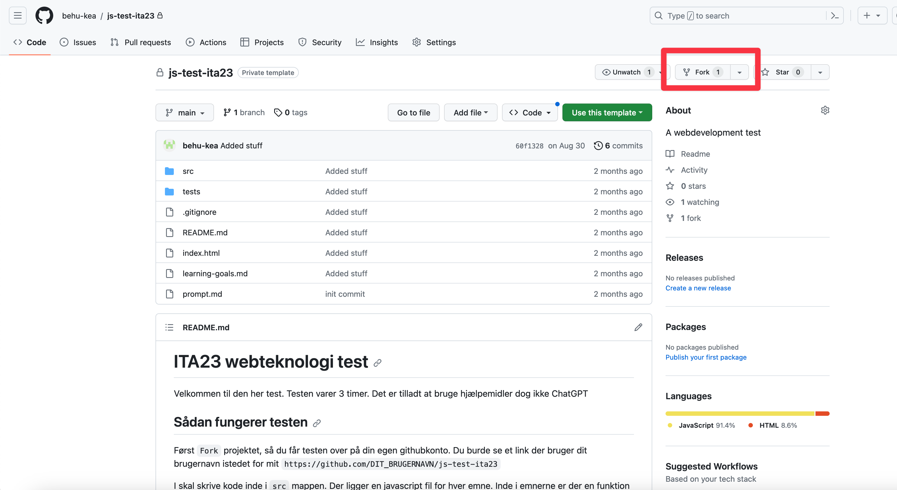

# Preparation Test

## Teacher instruction

- I må gerne bruge hjælpemidler, men ikke ChatGPT. Den kan løse alle opgaverne
- Den her test er en hjælp for jer. At snyde med ChatGPT ville vitterligt bare være at snyde jer selv. Til eksamen er der ikke ChatGPT
- I må gerne bruge ting i finder online
- Vi bruger testen som en trivselssamtale om hvordan det går i klassen og hvordan det går fagligt
- **FORSTÅ PROBLEMET FØRST!!!** Derefter gå igang med opgaven. Hvis i ikke forstår opgaven så spørg endelig. Jeg hjælper gerne med afklaringsspørgsmål
- Husk debugging. Det kan være en kæmpe hjælp!
- Hvis i ikke forstår en opgave så bare hop videre til den næste og prøv den

## Test setup

I kan finde testen her: [https://github.com/behu-kea/js-test-preparation-ita23](https://github.com/behu-kea/js-test-preparation-ita23)

Klik på Fork. Nu får i repoet over på jeres github konto

Derefter klon projektet ned på jeres computer.

Åbn `index.html` som i plejer (klikke på ikonet i højre hjørne). Nu burde i se det her:

I kan nu gå igang med at skrive kode i mappen `src`

Det burde være det. Held og lykke!

## Handin

Hand the test in [here](https://kea-fronter.itslearning.com/LearningToolElement/ViewLearningToolElement.aspx?LearningToolElementId=1185268)

You should hand in the forked repository. That means the test repo on your account

**Remember to commit and push!**

- Generate message
- 
