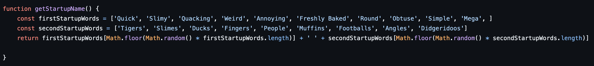

# Web for portfolioproject


- Feedback på portefølje aflevering
  - Overall
    - Gode variabelnavne
    - fedt at nogle af jer bruger rigtig god struktur
    - God brug af funktioner
  
  - `WayBackInput` -> `way-back-input`
  - `class= "Cheat"` -> `class= "cheat"`
  - ``
  - Beskrivende funktionsnavne: `function tal(a, b) {`
  - `avggrades`
  - `let checkt=0`
  - 
  - 
  - 
  - 
  - Iterere et array
    - `for (let moves in island) {`
    - `for (let moves of island) {`
    - ```for(let i = 0; i <island.length; i++){ island[i]}```
    - `island.forEach((element, index) => {})`
  
  - 
  - 
  - 
  
- Lets talk about git
  - [Uploading a project that is already on your computer](04-git#clone-a-project-from-github-down-to-your-computer)
  - [Creating a new project by cloning a repository](04-git#create-a-new-project-locally)
- [Getting value from an input field](11-js-dom-1.md)
- Lav en plan for hvordan du skal lave en webapp
  1. Forstå problemet
  2. Lav mockup
  3. Lav HTML
  4. Lav en implementerings plan/tjekliste over ting du skal
     1. Pseudokode
  5. Kod din plan
- NotebookLM
- Mie kommer på besøg torsdag


