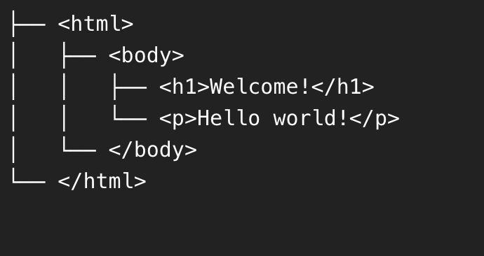
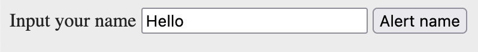

# DOM - Document object model


## Learning Objectives

By the end of this lesson trainees should be able to:

- Define what the DOM is and what it does
- Use query selectors to retrieve elements from the DOM
- Use event listeners to respond to events that happen on the DOM
- Create DOM elements using JavaScript and add them to the DOM
  
- Manipulate DOM elements using JavaScript to change their properties


<!--

## After class considerations

- Videoen til dagens time var ikke god for de studerende. Alt for lang og usammenhængende sagde de
- De var ikke så godt forberedte desværre

-->


## Teacher instruction

- Add eventlistener
- DOM
- Break down the exercises. Focus on which part of the html you are working on! (Selection, inserting, manipulation, event)
- Projekt i næste uge
- Studenterpræsentationer fra 11:30


## Flipped classroom videos

- [Learn DOM Manipulation In 18 Minutes](https://youtu.be/y17RuWkWdn8?si=thNUiO16sP-b3RU0)


## JS in the Browser

Up until now we've been using `console.log` (and a bit of `document.write`) to see the results of our code running, because it allows us to focus  on writing code and seeing the results instantly. But JavaScript was not meant to be run in `console.log`: it was meant to make web pages dynamic.

Lots of websites are powered by JavaScript today, and some (like Facebook)  cannot function at all without it: it's become that important to the  look and feel of the website.


## The DOM

Your webpages are made up of a bunch of HTML elements, nested within each other (parents and children). But JavaScript doesn't know about any of  that.

Thankfully, in JavaScript we have access to this "DOM"  object (Document Object Model) which is actually a representation of our webpage that JavaScript can work with.

Here are two examples, HTML and then the DOM

```html
<html>
  <body>
    <h1>Welcome!</h1>
    <p>Hello world!</p>
  </body>
</html>
```


This is how we would represent the document hierarchy above as a tree of nodes:




## Interacting with the DOM using javascript


There are 4 important things to learn when interacting with the DOM

1. **Accessing DOM elements** (how to select a specific tag)

2. **Manipulating DOM elements** (how to change the tag we selected)
3. **Creating DOM elements** (creating new tags we can insert into the page)
4. **Attaching events** (how we can run code when fx a button is clicked)


### Access DOM elements

The DOM offers a lot of useful functions we can use to find elements on the page. Here are some we'll be using today:

```javascript
// will select the first tag with the classname of main-header
document.querySelector(".main-header");

// will select all the p tags in the page
document.querySelectorAll("p");
```


Both `.querySelector` and `querySelectorAll` accept a CSS selector as an input. 

- `querySelector` selects only the first element it finds
- `querySelectorAll` selects all elements and returns a `NodeList`. `NodeList` can be turned into an array like this: `Array.from(document.querySelectorAll("p"));` 


#### Getting text from element

When you have selected an html element you can then get data from it. Fx the text inside an html element, or the class it currently has

```javascript
const textInsideH1 = document.querySelector('h1').textContent;
```

Here we get the text inside the `h1`


```javascript
const h1Class = document.querySelector('h1').getAttribute('class');
```

Here we get the classname of the `h1`


### Manipulate DOM elements

When a element has been selected it can be changed. Everything about the element can be changed

- The text inside of the tag
- The classnames
- Id's
- Style


Let's try and change the text inside a `p` tag using `innerText` 👇

```javascript
// find the first p tag
const pTag = document.querySelector("p");
pTag.textContent = "How are you?"; // now we can see the text displaying in the browser
```


We can also change the class name of the `p` tag using`.className`

```javascript
// find the first p tag
const pTag = document.querySelector("p");
pTag.setAttribute('class', 'red large');
```

Now the `p` tag only has two class names `red` and `large`


### Inserting DOM elements

There are two ways of inserting DOM elements to your html:


#### First method

We will be inserting DOM elements using the function `insertAdjacentHTML`. `insertAdjacentHTML` takes two arguments:

1. A string representing the position relative to the selected element
2. An html string

````javascript
document.querySelector('h1').insertAdjacentHTML('afterend', `<h2>New products</h2>`);
````

In this example i select an `h1` tag and then insert the `h2` after the `h1` has ended

You can also insert the html before the element ends with `beforeend`. There are more positions, documentation can be found [here](https://developer.mozilla.org/en-US/docs/Web/API/Element/insertAdjacentHTML)


#### Second method

1. Create the element in javascript
2. Change the elements `innerHTML`
3. Insert the element into your html

```javascript
// 1. Create a p tag
const pTag = document.createElement('p');
// 2. Change the ptags innerHTML
pTag.innerHTML = "this text is in the pTAg";
//3. Insert the p tag into html
document.querySelector("body").appendChild(pTag);
```


### Attach events to DOM elements

Once you retrieve an element using `.querySelector`, you can attach an **event** to it. An event is any action that can be performed on that element. For now, we will just use the **click** event:

```javascript
const button = document.querySelector("button");
// when the button is clicked "Something" is logged to the console
button.addEventListener("click", function() {
  console.log("Something");
});
```

You will notice in the example that we passed a second argument to `addEventListener`. That second argument is the **function** that we want to invoke when that event has happened.


## Getting value from an input field

If we have an `input` field and want to get the value (the text) written in the `input` we have to do two things:

1. First select the `input` field using `querySelector`
2. Get the `value` of that input field using `.value` on the selected `input` element


Here is an example:

**HTML**

```html
<body>
  <label for="name">Input your name</label>
  <input type="text" id="name" placeholder="Please write your name">
  <button>Alert name</button>

  <script src="main.js"></script>
</body>
```




**Javascrtipt**

```javascript
const button = document.querySelector("button");
const inputElement = document.querySelector("input");

button.addEventListener("click", () => {
    const valueInputted = inputElement.value;
    console.log(valueInputted); // will log Hello
})
```


## Concrete examples of using the DOM in javascript


### Creating a list of hobbies

Let's create a list of hobbies from javascript into the webpage using the DOM

**html**

```html
<ul></ul>
```

**javascript**

```javascript
// We will assume that the 
const hobbies = ['Biking', 'music', 'food'];
// Select the ul tag
const ulElement = document.querySelector('ul');
// Let's iterate through the array of hobbies
hobbies.forEach(function(hobby) {
  // For each hobby we create a new li tag
  const liElement = document.createElement('li');
	// Now we manipulate the li and change the text to be the hobby
  liElement.innerText = hobby;
  // Now lets add the liElement into the DOM
  ulElement.appendChild(liElement);
});
```


### Creating a select list

Let's instead of adding the hobbies as a list then add them as a `select` tag so we can select one of the hobbies

**html**

```html
<select></select>
```

**javascript**

```javascript
// We will assume that the 
const hobbies = ['Biking', 'music', 'food'];
// Select the ul tag
const selectElement = document.querySelector('select');
// Let's iterate through the array of hobbies
hobbies.forEach(function(hobby) {
  // For each hobby we create a new li tag
  const optionElement = document.createElement('option');
	// Now we manipulate the li and change the text to be the hobby
  optionElement.innerText = hobby;
  // We can set the value of the option. That is normally lower case
  optionElement.value = hobby.toLowerCase();
  // Now lets add the liElement into the DOM
  selectElement.appendChild(optionElement);
});
```

Getting the selected hobby is a bit tricky. [Read here](https://stackoverflow.com/questions/1085801/get-selected-value-in-dropdown-list-using-javascript) to get it working 


## Exercises


### Preparation for exercises

Let's work on the code provided [here](https://github.com/CodeYourFuture/js-exercises/tree/master/week-5/InClass/A-dom-manipulation) 

That means you have to clone [this repo](https://github.com/CodeYourFuture/js-exercises) onto your computer and then find the A-dom-manipulation folder to open in VS code

1. Open a new project in webstorm from the folder `week-5/inClass/A-dom-manipulation`


### 📝 Exercise 1 - level 1

Write JavaScript below that logs:

1. All the `p` tags
2. The first `div` tag
3. The element with id `jumbotron-text`
4. All the `p` tags contained inside the `.primary-content` tag


### 📝 Exercise 2 - level 1

When a user clicks the `ALERT` button, an alert box should pop up with the text "Thanks for visiting Bikes for Refugees!"


### 📝 Exercise 3 - level 1

Write JavaScript below that changes the background colour of the page when the "Change colour" button is clicked.


### 📝 Exercise 4 - level 1

When a user clicks the "Add some text" button, a new paragraph should be added below the buttons that says "Read more below."


### 📝 Exercise 5 - level 2

When the "Larger links!" button is clicked, the text of all links on the page should increase.


### 📝 Exericse 6 - level 2

When clicking the blue add button, take the text written in the input element, and add that text to the DOM. The text should be added using `ul` and `li`


### 📝 Exercise 7 - level 3

Clicking `Donate Now` should show a modal where a user can input some amount they want to donate to the cause. When they written the amount they should be able to click a button that will do the donation. When the donation has been completed. Show a success message and then close the modal.


### 📝 Exercise 8 - level 2

Now its time to work on your portfolio!

Create lightmode/darkmode functionality on your portfolio. When clicking a button the colors of your website should change from being in light mode (light-coloured background, darkish text) to dark mode (darkcolored background and lightcolored text)

Here are some examples: https://webflow.com/made-in-webflow/lightmode


### 📝 Exercise 9 - level 3

Your feature here. Come up with some feature you would like to create!


When you are done you can work on your handin for tuesday


> Taken from https://syllabus.codeyourfuture.io/js-core-2/week-2/lesson


