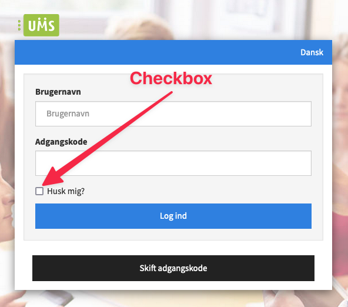

# DOM - Document object model


## Learning objectives

- Input elements
- Events expanded


## Flipped classroom videos

- [Learn HTML forms in 8 minutes 📝](https://www.youtube.com/watch?v=2O8pkybH6po)


## Peer instruction


### Question 1

Assume there is a button in the html page. What will happen when the button is clicked?

```javascript
const button = document.querySelector('button');
button.addEventListener('click', logMessage());

function logMessage() {
  console.log('Message');
}
```

1. The string `logMessage()` will be logged to the console
2. The string `Message` will be logged to the console
3. The string `logMessage` will be logged to the console
4. Nothing
5. Syntax error


## Teacher instruction

- Feedback på portefølje 3

  - God brug af funktioner. Super fedt at se!

  - Det virker til at i har haft det sjovt med opgaven. Der var hvertfald en masse meget forskellig kreative features i har lavet

  - Fedt med sådan noget her:

    ```javascript
    const getCheckBtn = document.querySelector('.check')
    const score = document.querySelector('.score')
    const highscore = document.querySelector('.highscore')
    const correctNumber = document.querySelector('.number')
    const scoreContainer = document.querySelector('.right')
    ```

  - ``````javascript
    const getRandomNumber = () => {
        return Math.floor(Math.random() * 20 + 1)
    }
    
    let randomNumber = getRandomNumber()
    ``````

  - Kommenter jeres kode

  - 

  - `let RNG1`

  - Lækkert med enter tryk! [https://munkeflunke.github.io/project-Mark_I/](https://munkeflunke.github.io/project-Mark_I/)

  - 

  - 

  - `let secretNumber = Math.floor(Math.random() * 20) + 1;`

  - ```javascript
    // Check if guess is between 1 and 20
    if (!guess || guess < 1 || guess > 20) {
        displayMessage('🚫 Please enter a number between 1 and 20!');
        return;
    }
    ```

  - `displayMessage` - [https://github.com/MathiasHC99/Portfolio-3-web-and-data/blob/main/main.js](https://github.com/MathiasHC99/Portfolio-3-web-and-data/blob/main/main.js)

  -  fedt med hints!

- Constructive Alignment

  - De arbejdsopgaver i har i klassen skal alignes med hvordan eksamen kommer til at forløbe
    - I eksamen skal i kode og snakke om den kode. Når jeg kommer ned til jer prøver jeg både at hjælpe, men også at forberede jer på eksamen. 
    - I skal øve det tekniske sprogbrug. Iterere et array, kalde en funktion. Den returnerer et array af objekter. Funktionen har 2 parametre, etc etc. 
    - Kodedelen er efter ChatGPT er kommet mindre vigtig. Det vigtige er hvordan i snakker om den kode i har lavet. Forstår i hvad der sker og hvordan man måske kunne have grebet det anderledes an. 
    - Prøv den eksamenssimulator jeg har lavet: [https://chatgpt.com/g/g-cLrBXP8Zn-ita23-webtechnology-exam-simulator/c/67178e75-5fd0-8008-a8db-94b2b25341af](https://chatgpt.com/g/g-cLrBXP8Zn-ita23-webtechnology-exam-simulator/c/67178e75-5fd0-8008-a8db-94b2b25341af)

- Teach how to get value from different input elements (select, radio, input, etc.)

- Plan and create a bad timer app (mvp). 

- Also show xss
  - ``
  - ``
  - ``


## Forms and input elements

Forms are used to send data from the client to a server. Often times you need to write your name, email, telephonenumber etc.


### Inputs

Inputs are used to get text from a user. This is how an input is defined 👇 Notice that it is selfclosing! Like the `img` tag

```html
<input type="number"/>
```

This is probably the most famous input field ever


There are different types of input fields. One for numbers, text, telephone number, date. See them all [here](https://developer.mozilla.org/en-US/docs/Web/HTML/Element/input#input_types)


### Checkboxes

Checkboxes are used to get a value that can either be `true` or `false`. It is typically used for the remember me functionality

```html
<input type="checkbox">

<!--If the checkbox should be checked-->
<input type="checkbox" checked>
```

 




### Radio buttons

Radio buttons are used to select between a given set of options. 

```html
<input type="radio" id="email" name="contact" value="email">
<label for="email">Email</label>

<input type="radio" id="phone" name="contact" value="phone">
<label for="phone">Phone</label>

<input type="radio" id="mail" name="contact" value="mail">
<label for="mail">Mail</label>
```

The `label` tag shows the text for the radio button. What is important is that the `id` attribute and the `for` attribute matched their value. Otherwise the label is not connected to the radio button. 

Another important thing is that the groups that are together have the same `name` attribute


### Select

Select is also used to select between a given set of options. It is typically used to select country. The difference from the radio buttons is that in select the user has the possibility to select multiple options!

```html
<select name="pets" id="pet-select">
    <option value="">--Please choose an option--</option>
    <option value="dog">Dog</option>
    <option value="cat">Cat</option>
    <option value="hamster">Hamster</option>
    <option value="parrot">Parrot</option>
    <option value="spider">Spider</option>
    <option value="goldfish">Goldfish</option>
</select>
```

It is similar to the `ul` and `li`. Inside of the `select` tag there has to be an `option` tag for each option the user can select. You can give the `option` tag a `value` but you dont have to


### Buttons

Buttons are used for some kind of interactivity. Should not be used as links!

```html
 <button>Click Me!</button> 
```


There are some more form fields but i have covered the most important ones here


## Exercises


### Exercise 1

Tag en funktion i jeres protefølje aflevering og forklar jeres sid makker hvad den kode gør, linje for linje. Sidemanden må meget gerne stille opfølgende spørgsmål. Hvis i ikke kan svare så prøv at finde ud af det sammen vha google eller at spørge ChatGPT.  


### Exercise 2

Brug den her GPT til at få feedback til dit projekt: [https://chatgpt.com/g/g-e86Y0eXNp-webteknologi-web-feedback](https://chatgpt.com/g/g-e86Y0eXNp-webteknologi-web-feedback)

Implementer 2 af de forslag der kom fra GPT'en


## Casetime

You can choose between some different projects. You can define your own or use a project i have created. Its up to you


````
Can you create a interesting, insightful and fun javascript webapp exercise for students in their first year. 

The project should be about: [PROJECT THEME, FX "Making a synthesizer that can run i a browser"]

Difficulty level: [YOUR DIFFICULTY LEVEL 1-3]

Write it in the same style as this:
```
## 🧮 Simple calculator

**Difficulty: level 1**

Create a calculator where a user can input some information and get a result from that information. 

- Maybe a user inputs how far you have to drive to work and the website calculates co2 emissions
- Maybe a caculator where you put in your birthday and the website tells you how many days, seconds, heartbeats, etc you have lived

If you cannot think of any idea then try and ask friends/family if they would like some kind of caluculator that could help them in their life!


### Requirements

- The user should put in some details
- There should be a button that initiates the calculation
- There should be some kind of calculation being done
- Should be deployed


### Inspiration

- [https://www.shouldispeed.com/](https://www.shouldispeed.com/)
- [https://www.timeanddate.com/date/duration.html](https://www.timeanddate.com/date/duration.html?d1=12&m1=3&y1=2025&d2=27&m2=6&y2=2025&ti=on&)


## 🎸 Online musical instrument

**Difficulty: level 3**

Create an online instrument. How the instrument should function or work is up to you. Maybe you press different buttons that play different tones or audioclips. Maybe you use the accellerometer to tilt the phone and play a tone based on that. Maybe you slide your finger up and down? Its up to you


### Requirements

- It should be possible to play different tones/audioclips
- The user should be able to interact with the instrument
- There should be a guide for how to operate the instrument
- Should be deployed


*This task takes some research on playing tones and clips with javascript*


### Inspiration

- [https://splice.com/sounds/beatmaker](https://splice.com/sounds/beatmaker)
- [https://patatap.com/](https://patatap.com/)
- [https://theremin.app/](https://theremin.app/)


## 🎨 Online paint editor

**Difficulty: level 2**

Create an online paint editor. Consider using P5.js!


### Requirements

- It should be possible to select some kind of brush and see what brush you have selected
- It should be possible to paint with that brush
- The brush could be painting with
  - Emojis
  - Color
  - Text
  - Images
  - Your idea here
- Should be deployed


### Inspiration

- [https://kleki.com/](https://kleki.com/)
- [https://jspaint.app/](https://jspaint.app/)


## 🍪 Cookie clicker inspired game

**Difficulty: level 1.5**

Create a game where a user should click a button and get some points over time. The longer the user stays on the page the more points. There are lots of potential features like maybe clicking a key on the keyboard to get more points


### Requirements

- A user should click a button in order to get points
- Over time a user should get more points
- Should be deployed


### Inspiration

- [http://orteil.dashnet.org/cookieclicker/](http://orteil.dashnet.org/cookieclicker/)
- [https://puginarug.com/](https://puginarug.com/)


```
````

Make a plan for how to create this application **before** you start writing any code. I want to see the plan when i come around!


## 📝 Online word automatic save functionality - Level 3

When pressing `ctrl` + `s` on Office.com in a document, the UI will let you know that it autimatically saves your document. Create that functionality. So when `ctrl` + `s` is pressed 

- one Time, show some text that says "we automatically save your document"
- minimum 3 times within 2 seconds show text that says "Wow easy there, we save your document automatically"

The text show be shown, then removed after 2 seconds


## Tab countdown timer

https://www.timer-tab.com/


## 🌍 Personal CO2 Emission Calculator - level 2

Create a web application that allows users to calculate their personal CO2 emissions based on their daily activities. This could be based on the distance they drive, the type of food they consume, their electricity usage, etc.

- Maybe a user inputs how many miles they drive in a week and the type of vehicle they own, and the website calculates their weekly CO2 emissions.
- Maybe a user inputs the type of food they consume in a week (vegetarian, non-vegetarian, vegan) and the website calculates the CO2 emissions based on their diet.
- Maybe a user inputs their monthly electricity bill, and the website estimates their CO2 emissions based on average energy sources.

If you cannot think of any idea, try researching common sources of personal CO2 emissions and see if you can incorporate them into your calculator!


### Requirements

- The user should input details about their daily activities.
- There should be a button that initiates the calculation.
- The application should display the calculated CO2 emissions based on the user's input.


### 📝 Imprecise Calculator - level 3

Create a project that works as a calculator. It should be possible for a user to add numbers via buttons as seen in a classic calculator. BUT the calculator should sometimes give a slightly wrong answer.


**Advanced:**

Make it possible for a user to use the calculator using the keyboard aswell. Remember to foucs on writing good HTML and CSS 


If you are unsure how to start then maybe get ChatGPT to help you **scaffold** this exercise


*Please dont make the app make a fart sound when the equal button is clicked!*

*And please please please dont make the app make different fart sounds when clicking any buttons. It would be childish and it would be below you to create such a feature!*


### Scaffolding prompt

I have this task in my CS class but i am unsure of how to start. Can you help scaffold this exercise? Dont give me any solution

Here is the task:
```
Create a webapp that works as a calculator. It should be possible for a user to add numbers via buttons as seen in a classic calculator. BUT the calculator should sometimes give a slightly wrong answer.
```

