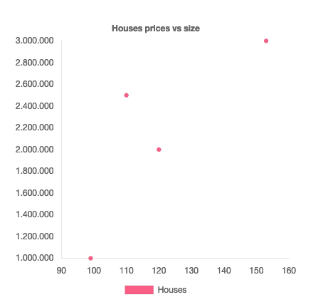

# Visualising data using chart.js

Visualising data in javascript can be done in a lot of different ways. You can do it just using html, you can use [one out of a lot of library](https://www.blog.duomly.com/javascript-data-visualization-libraries/), you can draw on a `canvas` like we did with p5. In some ways data does not need to be visualised, what if some data was connected to sound fx. 

In these lectures we will focus mainly on creating graphs using [chart.js](https://www.chartjs.org/). Chart.js is a javascript library for creating graphs and it has been selected for these reasons

- It sits in the sweetspot between looking pretty and not being to complicated
- It is used and recommended by a lot of developers
- It covers most basic graph usecases

Another really big and popular datavis library is D3. It is not covered in these lectures, but feel free to try it out!


<!--

## After class consideration

- Opgave 6.1 var meget meget sværere end de andre.
- Opgaverne er måske lidt stenet idag. Lidt en koger gang
- Sluttede ret tidligt. De sidste opgaver var der ikke mange der lavede. Altså dem hvor de skulle rekonstruere en visualisering de havde lavet tidligere
- Få kort opgaven ind fra datavis 2 og fjern dataviz 2 gangen. Måske prøve eksamen istedet for

-->


## Learning objectives

- Visualising using Chart.js
- Get json data into javascript


## Teacher instruction

- Today will be a lot of you exploring the chart.js api and documentation
  - This is an essential web developer skill


## Flipped classroom video

- [Getting Started With Chart.js](https://www.youtube.com/watch?v=sE08f4iuOhA)


## Getting started with graph.js


### Setup html

Let's first setup the html so we are ready to use chart.js

```html
<!DOCTYPE html>
<html lang="en">
<head>
    <meta charset="UTF-8"/>
    <meta name="viewport" content="width=device-width, initial-scale=1.0"/>
    <meta http-equiv="X-UA-Compatible" content="ie=edge"/>
    <link rel="stylesheet" href="main.css"/>
    <title>chart.js datavis</title>
    <script src="https://cdn.jsdelivr.net/npm/chart.js@4.4.6/dist/chart.umd.min.js"></script>
</head>
<body>

<main>
    <div>
        <canvas id="chart"></canvas>
    </div>
</main>
<script src="main.js"></script>
</body>
</html>
```

 There are two important things we need to do:

1. Import the chart.js library. That is done here `<script src="https://cdn.jsdelivr.net/npm/chart.js@3.9.1/dist/chart.min.js">` It works exactly like when we import our `main.js` file, the only difference is that the directory of the file is in the cloud. If you want to see the code you can go to `https://cdn.jsdelivr.net/npm/chart.js@3.9.1/dist/chart.min.js`. The code is minified which means it has been changed so the file takes up less space. But the javascript enables us to create the graphs
2. Create a `canvas` html tag for the graphs to go into. Chart.js uses `canvas` to draw the graphs. The `canvas` html object we have worked with when using P5. It is used to draw shapes onto. Wrap the `canvas` in div tags to make it responsive `<canvas id="chart"></canvas>`


### Setup the javascript

```javascript
const ctx = document.querySelector('#chart').getContext('2d');
const chart = new Chart(ctx, {
    type: 'bar',
    data: {
        labels: ['Red', 'Blue', 'Yellow', 'Green', 'Purple', 'Orange'],
        datasets: [{
            data: [12, 19, 3, 5, 2, 3],
        }]
    }
});
```

On the first line we select the `canvas` using `document.querySelector` and get the [context](https://developer.mozilla.org/en-US/docs/Web/API/HTMLCanvasElement/getContext) for the `canvas` so we can draw on it. 

Now we create a new instance of a class called `Chart` (this is a class we get from importing the `chart.min.js`in the `head`). You dont need to understand classes and instances but if you are interested [watch this video](https://www.youtube.com/watch?v=5AWRivBk0Gw). When creating a new Chart, we need to give it two arguments:

1. The context from the canvas so we can draw on the canvas
2. An object that will decide everything about how the graph will be shown


The object has 4 top level keys

- `type`: Decides the type of the graph
- `data`: Decides the data to use
- `options`: Used for things like interaction, legends and a lot more
- `plugins`: Can contain plugins


## Events

To trigger an event when a click occurs use the following code

```javascript
options: {
  onClick: (e) => {
    console.log(e)
  },
}
```


## More things

[In the documentation](https://www.chartjs.org/docs/latest/) it is documented how to do **lots** of things in chart.js. These are things like

- Labels
- Legends
- Scales
- Color
- Background


It does not make sense for me to document everything here since the documentation is pretty good. 

👉 [https://www.chartjs.org/docs/latest/](https://www.chartjs.org/docs/latest/) 👈


There is also a chart.js youtube channel

👉 [https://www.youtube.com/c/ChartJS-tutorials](https://www.youtube.com/c/ChartJS-tutorials) 👈


## 📝 Exercises

Recreate the following graphs. This is an exercise in googling and reading documentation! Help each other in the class aswell!

**Make sure you are reading documentation for version 3!!!**


Try using ChatGPT with browsing or Bing to figure out how to solve problem

```
How do i change the size of my label title in chart.js?
```


### 📝 Exercise 1 - level 1


### 📝 Exercise 2 - level 1


### 📝 Exercise 3 - level 1


### 📝 Exercise 4 - level 1


### 📝 Exercise 5 - level 2


### 📝 Exercise 6 - level 2


### 📝 Exercise 6.1 - level 2

Animate the line two lines from above, so it gets drawn from left to right


### 📝 Exercise 7 - level 3

When clicking a point it should `alert` the size and price of the house. This is quite tricky. Lots of googling here!



### 📝 Exercise 8 - level 2

Using the data from exercise two. Firstly show all countries.


Create two buttons with the text `Show DK and SE` and `Show NO and UK`. 

When clicking on `Show DK and SE` it should make an animation so it only shows the bar charts for Denmark and Sweden. 

When clicking on `Show NO and UK` it should make an animation so it only shows the bar charts for Norway and United Kingdom. 


### 📝 Exercise 9 - level 2

Take one of the visualisations you have created from the data visualisation course and recreate it using chart.js!


function isEven(number) {
       return number % 2 === 0
            
}

