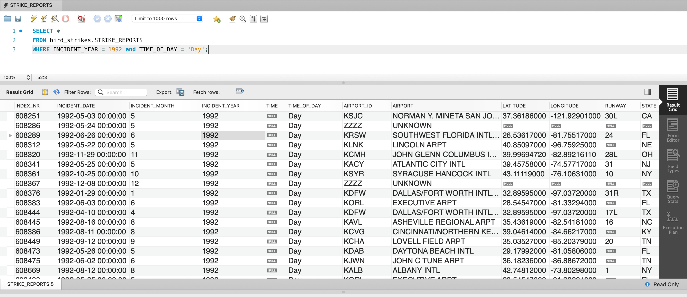
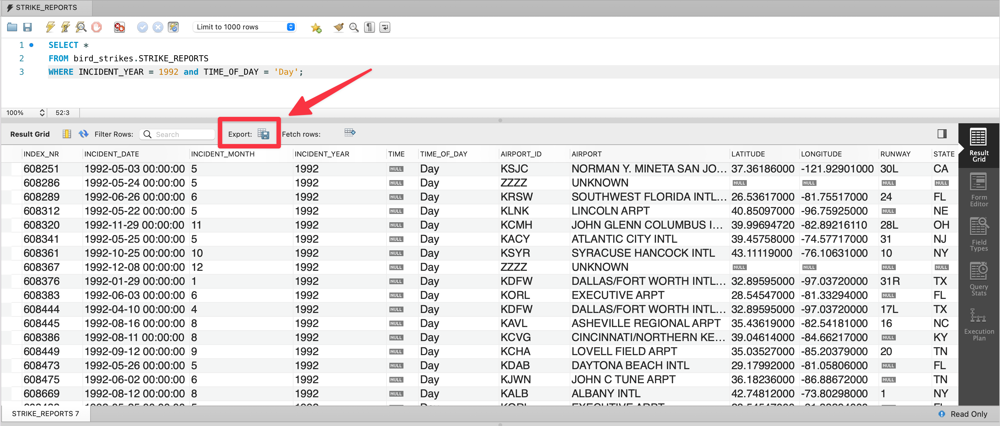
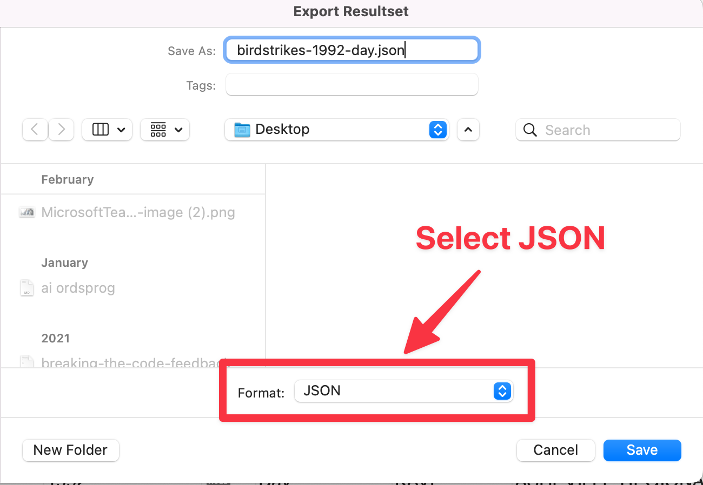
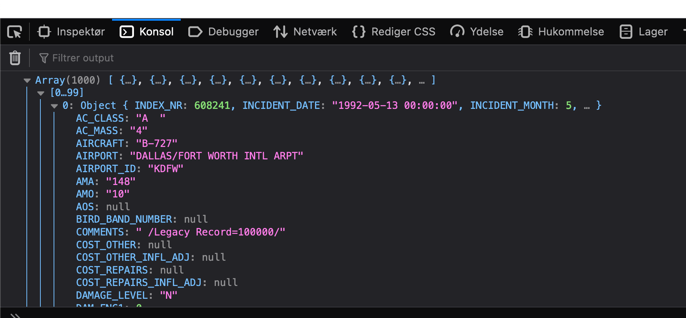

# Getting workbench to javascript


The following is a guide to getting data from MysqlWorkbench to your javascript application.

The code can be found [here](https://github.com/nicklasdean/ITA22F/tree/master/webteknologi/workbench-data-to-javascript)


## Create your query

First you need to create the query that gives you the data to put into javascript. I have created a query here that selects birdstrikes from 1992 that happened during the day from a dataset containing all incidents where birds hit airplanes

```sql
SELECT * 
FROM bird_strikes.STRIKE_REPORTS 
WHERE INCIDENT_YEAR = 1992 and TIME_OF_DAY = 'Day';
```


With that i get the following data:



There are 1392 incidents

```sql
SELECT count(*) 
FROM bird_strikes.STRIKE_REPORTS 
WHERE INCIDENT_YEAR = 1992 and TIME_OF_DAY = 'Day';
```


Now i need to export that data to a json file 👇

Click the `Export` button




Change the format into JSON and save the file




## Copy elements of JSON file

Now open the JSON file in any editor you have. Visual studio code, Webstorm, as long as you open the file. Select all (`cmd` + `a` or `ctrl` + `a`) the and copy the text `(cmd` + `c` or `ctrl` + `c`)


## Get the data into javascript

First create a new project in Webstorm with 3 files:

1. `index.html`
2. `main.js`
3. `data.js` - this file will only contain your data!


The `index.html`should look like this:

```html
<!doctype html>
<html lang="en">
<head>
    <meta charset="UTF-8">
    <meta name="viewport"
          content="width=device-width, user-scalable=no, initial-scale=1.0, maximum-scale=1.0, minimum-scale=1.0">
    <meta http-equiv="X-UA-Compatible" content="ie=edge">
    <title>Document</title>
</head>
<body>
<script src="data.js"></script>
<script src="main.js"></script>
</body>
</html>
```

Notice that the `data.js` file is loaded before the `main.js`. If there are global variables in the `data.js` we can reach them in the `main.js` file!


The `main.js` should look like this

```javascript
console.log(data);
```


### `data.js`

The `data.js` file is the file that will contain your data. First you create a new variable called `data` as `let`. Assign it to be a string literal with the backticks

```javascript
let data = ``;
```

Now inside the backticks you paste the copied json!

It will look weird! Something like this:

```javascript
let data = `[
\t{
\t\t"INDEX_NR" : 608241,
\t\t"INCIDENT_DATE" : "1992-05-13 00:00:00",
\t\t"INCIDENT_MONTH" : 5,
\t\t"INCIDENT_YEAR" : 1992,
```


We have now taken the json from workbench and copied it into a string in javascript. **But** we can't use a string for anything, we need the array of objects so we can create out graphs! To do that scroll all the way to the bottom of the script. Now write the following lines:

```javascript
data = JSON.parse(data);
```

This will transform the string that contained all the JSON into an array of objects!


Now open the html page, jump into the inspector and hopefully you will see the array of objects logged out!



 


