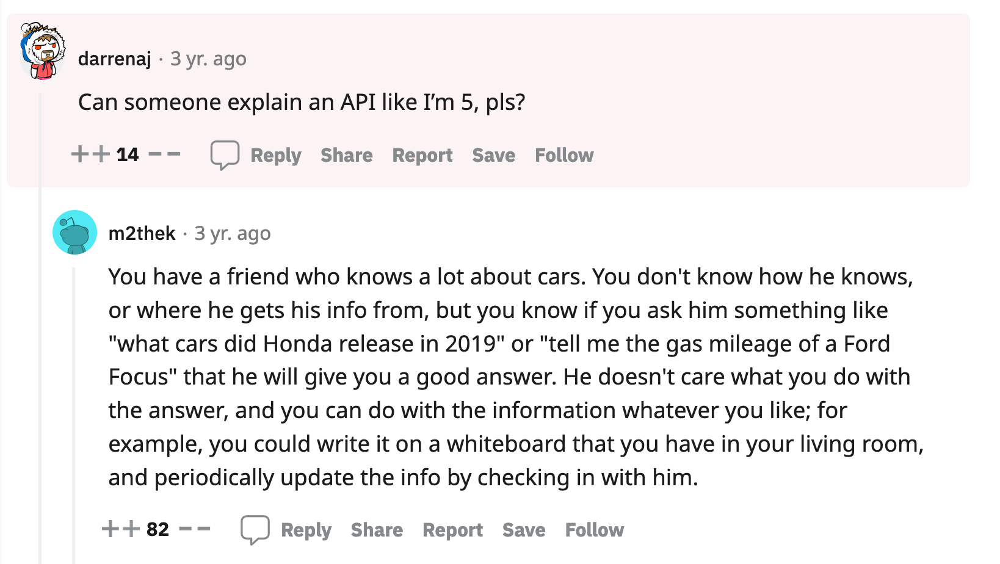
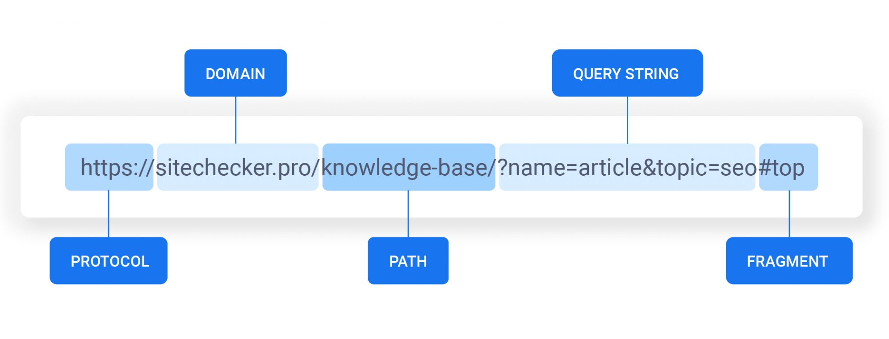

# API, JSON and fetch


## Learning objectives

- JSON
- API's
- `fetch`


## Flipped classroom videos

- [Working with JSON using Javascript](https://youtu.be/ghMR-k5pKjg)
- [Fetching data from API using fetch - Javascript](https://youtu.be/pL_zEzunBKU)


<!--

## After class

- Skide god klasse. Det kørte bare!

-->


## Teacher notes

- Arrays and objects
  - Difference, simmilarities
- Remember to send visualisations you find


## Peer instruction question

### Question 1

Is the following JSON valid?

```json
{
  "name": "Mie",
  "age": 4
  "hobbies": ["Tennis", "guitar"]
}
```

1. Yes
2. No
3. Maybe


### Question 2

What will get logged out:

```javascript
console.log(1)
fetch('https://yesno.wtf/api/')
    .then(response => response.json())
    .then(yesOrNoData => {
        console.log(2);
    });
console.log(3);
```

1. `1, 3, 2`
2. `1, 2, 3`
3. `2, 1, 3`
4. Syntax error


## API

API stands for Application Programming Interface. Programmers use apis to access data/functionality in a simple way. 

Here is an analogy: Electricity socket. You just plug your appliance into the wall and it works. We dont have to worry about the wiring or the complexities of voltage and frequencies. The complexities have been abstracted away.

Here is another analogy:




Web API's are like that, but just for getting data from a server. Let's take an example:

Go to this page: [https://qrng.anu.edu.au/API/jsonI.php?length=1&type=uint8&#8217](https://qrng.anu.edu.au/API/jsonI.php?length=1&type=uint8&#8217). When navigating there you get this JSON

```json
{
  "type":"uint8",
  "length":1,
  "data":[47],
  "success":true
}
```

What this api gives us is a true random number (in the `data` key) by measuring quantum fluctuations of a vacuum in real-time! There is **tons** of complexities in getting that randum number, but i as a developer can just go to [the website](https://qrng.anu.edu.au/API/jsonI.php?length=1&type=uint8&#8217) and get that random number in a very easy way!


There are lots of API's online. Here is a list of some fun/cool/quirky API's

- [https://yesno.wtf/api/](https://yesno.wtf/api/) - An API that will return either yes or no
- [http://deckofcardsapi.com/](http://deckofcardsapi.com/) - An API that will give you different data simulating a deck of cards
- [http://api.open-notify.org/astros.json](http://api.open-notify.org/astros.json) - API showing the number of people in space right now. This does not support https which is a problem when deploying the site!
- [https://dog.ceo/api/breeds/image/random](https://dog.ceo/api/breeds/image/random) - Get a random image of a dog

Here is a **huge** list of public API's: [https://github.com/public-apis/public-apis](https://github.com/public-apis/public-apis)


API's nearly always respond in JSON! So we go to an api website and we get JSON back that we can then use in our application. 


### Urls

The way we interact with an API is through a website or through a url. So let's talk a bit about a url:



When using API's we often use either the path or the query string to access specific parts of the API. This is also called the **endpoint**


#### Paths

Let's take an example of the giphy api. This api is used to get different gifs. The url for their different endpoints are:

- `api.giphy.com/v1/gifs/trending` - gives trending gifs
- `api.giphy.com/v1/gifs/search` - here a user can search for gifs
- `api.giphy.com/v1/gifs/random` - provides a random endpoint

These endpoints all use the path to access different parts of the api


#### Query parameters

Query parameters come after the path and starts with a questionmark `?`. After that the query parameters has a key and a value separated by `=`. Let's take two examples 👇

1. `https://deckofcardsapi.com/api/deck/wa4fc3guk12l/draw/?count=2` - this endpoint has 1 query parameter with the key of `count` and the value of `2`. This indicates how many cards to draw. In this example we draw 2 cards. 
2. `https://www.youtube.com/watch?v=SD6GDiyHmbE&t=2990s`- this endpoint is for YouTube. There are two query parameters. 
   1. The first has a key of `v` and a value of `SD6GDiyHmbE`. This is the id of the youtube video. 
   2. The other query paramter is seperated by `&` is `t` and the value is `2990s` . This indicates the time where the video should start. In this case after 2990 seconds


### Documentation

Reading documentation is a huge part of working with api's. All api's are different and figuring out how to get what we want can sometimes be a tricky task. We must become detectives and get good at reading documentation. 

Here are some examples of documentation for api's:

- [https://developers.giphy.com/docs/api#quick-start-guide](https://developers.giphy.com/docs/api#quick-start-guide)
- [https://deckofcardsapi.com/](https://deckofcardsapi.com/)
- [https://dog.ceo/dog-api/documentation/](https://dog.ceo/dog-api/documentation/)


### Authentication

Often times we need to authenticate ourselves. Meaning we need to create a user so that we can use the api. Fx with the Giphy api we need to create a user, get a token that is only our own token. On every request we make we also send the token along (using query parameters) like this:

`api.giphy.com/v1/gifs/random?api_key=YOUR_TOKEN_HERE` fx `api.giphy.com/v1/gifs/random?api_key=abhjg67asv717yuasd7gyvy7`


## JSON

JSON is a file format just like csv, sql or .xls. It has some rules that must be respected

Here are the most important rules:

- JSON keys require double quotes
- No trailing commas
- In JSON, values must be one of the following data types:
  - String
  - Number
  - Object (JSON object)
  - Array
  - Boolean
  - null


Here is an example of valid JSON

```json
{
  "number": 14, 
  "message": "success", 
  "people": [{
    "name": "Kjell Lindgren", 
    "craft": "ISS"
  }, {
    "name": "Bob Hines", 
    "craft": "ISS"
  }, {
    "name": "Samantha Cristoforetti", 
    "craft": "ISS"
  }, {
    "name": "Jessica Watkins", 
    "craft": "ISS"
  }, {
    "name": "Cai Xuzhe", 
    "craft": "Tiangong"
  }, {
    "name": "Chen Dong", 
    "craft": "Tiangong"
  }, {
    "name": "Liu Yang", 
    "craft": "Tiangong"
  }, {
    "name": "Sergey Prokopyev", 
    "craft": "ISS"
  }, {
    "name": "Dmitry Petelin", 
    "craft": "ISS"
  }, {
    "name": "Frank Rubio", 
    "craft": "ISS"
  }, {
    "name": "Nicole Mann", 
    "craft": "ISS"
  }, {
    "name": "Josh Cassada", 
    "craft": "ISS"
  }, {
    "name": "Koichi Wakata", 
    "craft": "ISS"
  }, {
    "name": "Anna Kikina", 
    "craft": "ISS"
  }]
}
```


### JSON validator

If you have written some JSON and want to make sure that it is valid. Paste the JSON into this website and it will tell if the JSON is valid: [https://jsonlint.com/](https://jsonlint.com/)


### 📝 Exercise 1

Imagine your are running a meal ordering website. Orders come in from the web and we need to store them in a json file. Create a `orders.json` file with two orders that contain at least these things:

- Order name
- Order id
- Price
- List of drinks
- Order extras (fx cheese, lettuce etc.)


### 📝 Exerise 2

Fix this JSON

```json
[
  {
    name: "Peter",
    age: "2"
  }, {
    name: "hans",
    age: 3
  },
]
```


## Fetch

So far we have talked about API's and JSON. Now the question is how we can interact with the API in javascript. To do that we use a method called `fetch`. When calling the `fetch` method we specify the endpoint we want to hit. `fetch` then sends a request to that API and gets back some data. This data is then transformed into a javascript arrar or object so we can work with it in javascript:


```javascript
// sends a request to https://yesno.wtf/api/
fetch('https://yesno.wtf/api/')
    .then(response => response.json())
    .then(yesOrNoData => {
        console.log(yesOrNoData);
        // HERE IS WHERE YOU WRITE YOUR CODE!!!!!!!!
    });
```

Let's go through the different lines:

- `fetch('https://yesno.wtf/api/')` - sends a request 
- `.then(response => response.json())` - takes the data from the server and parses it so we can work with it in javascript
- `.then(yesOrNoData => {` - Here we have our array of objects that we can use in javascript. 

It's not super important that you understand all of this. But what is important is that the line `console.log(yesOrNoData);` will get called when the data has been received from the server. That might take 1 second, but it might also take 10 seconds. We dont know. This is the tricky part of javascript


## 📝 Exercises

In this exercise we will step by step build a movie database website like IMDB. The movies should be fetched from [this api endpoint](https://gist.githubusercontent.com/pankaj28843/08f397fcea7c760a99206bcb0ae8d0a4/raw/02d8bc9ec9a73e463b13c44df77a87255def5ab9/movies.json) 


### 📝 Exercise 1 - level 1

In a browser open up the link to the [api](https://gist.githubusercontent.com/pankaj28843/08f397fcea7c760a99206bcb0ae8d0a4/raw/02d8bc9ec9a73e463b13c44df77a87255def5ab9/movies.json). Describe the data structure of the json that comes from the api


### 📝 Exercise 1.1 - level 1

Now fetch the movies and log them out to the console. 


### 📝 Exercise 1.2 - level 1

Log out how many movies there are


### 📝 Exerise 2 - level 1

Render the following string to the html using the fetched movies array: `6527 movies fetched`


### 📝 Exerise 3 - level 1

Render the first movie in the movies array


### 📝 Exerise 3 - level 1

Render the first movie in the movies array. 

How you do that is up to you. But you could fx just render a string that says

```
71 is a movie from 2014 that is 5940 seconds long. It has a rating of 7.2 out of 41702 votes.
```


### 📝 Exerise 4 - level 2

Now render all the movies in a list using `ul` and `li`


### 📝 Exercise 5 - level 2

Create a button with the text `Get newer movies`. When clicked it should only show movies that came out after 2014. 


### 📝 Exercise 6 - level 3

Create an input element where people can search for a movie. **While** the user writes something the movies should be updated!


### 📝 Exercise 7 - level 3

Create an interface where users can filter the movies in different ways. Fx searching for a movie. Indicating the rating. Only showing movies that are longer or shorter that a specific time. 

Search for inspiration from fx [https://www.boliga.dk/](https://www.boliga.dk/)


### 📝 Exercise 8

Make your movie database website pretty 🎉


### 📝 Exercise 9 

Your feature here. What feature would you like to add to the movie datbase?


